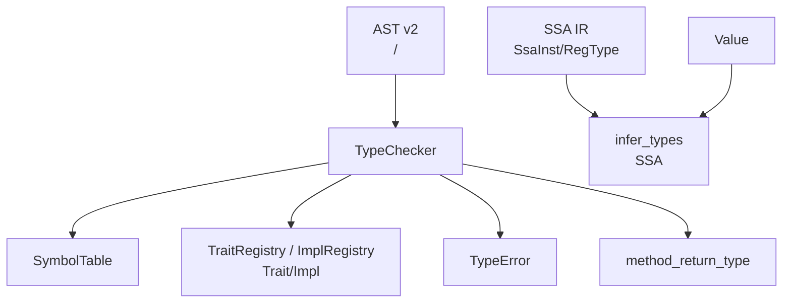
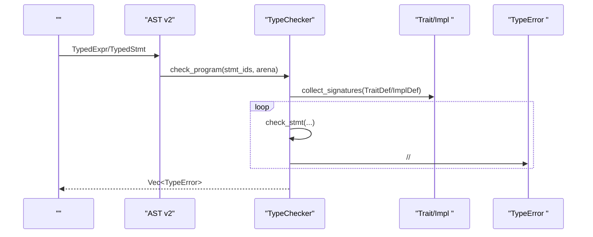
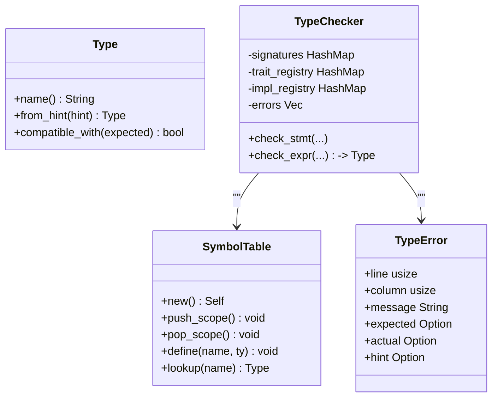
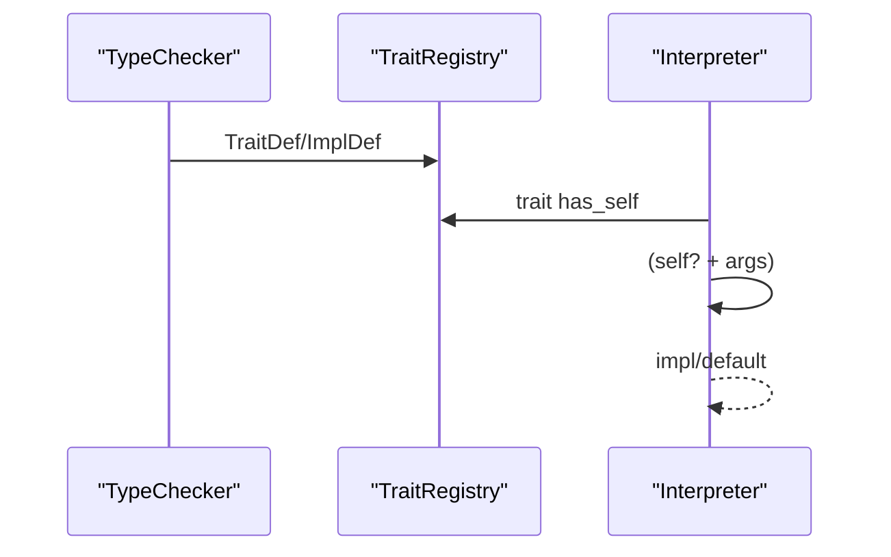
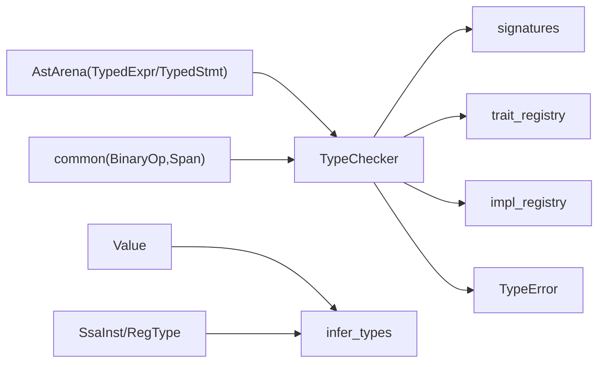

# 

<cite>
****   
- [src/typeck/mod.rs](file://src/typeck/mod.rs)
- [src/typeck/check.rs](file://src/typeck/check.rs)
- [src/mir/typeinfer.rs](file://src/mir/typeinfer.rs)
- [src/ast_v2.rs](file://src/ast_v2.rs)
- [src/value.rs](file://src/value.rs)
- [src/typeck/pregel_check.rs](file://src/typeck/pregel_check.rs)
</cite>

## 
1. [](#)
2. [](#)
3. [](#)
4. [](#)
5. [](#)
6. [](#)
7. [](#)
8. [](#)
9. [](#)
10. [](#)

## 
 Mora Trait 

## 
Mora “typeck”“SSA mir/typeinfer”
- typeck  AST v2 Trait/Impl Pregel 
- mir/typeinfer  SSA  JIT/LLVM 




- [src/typeck/mod.rs:38-111](file://src/typeck/mod.rs#L38-L111)
- [src/typeck/mod.rs:511-548](file://src/typeck/mod.rs#L511-L548)
- [src/typeck/mod.rs:554-572](file://src/typeck/mod.rs#L554-L572)
- [src/typeck/mod.rs:897-956](file://src/typeck/mod.rs#L897-L956)
- [src/mir/typeinfer.rs:17-112](file://src/mir/typeinfer.rs#L17-L112)
- [src/value.rs:143-263](file://src/value.rs#L143-L263)


- [src/typeck/mod.rs:1-111](file://src/typeck/mod.rs#L1-L111)
- [src/typeck/mod.rs:511-572](file://src/typeck/mod.rs#L511-L572)
- [src/mir/typeinfer.rs:1-112](file://src/mir/typeinfer.rs#L1-L112)
- [src/ast_v2.rs:1-156](file://src/ast_v2.rs#L1-L156)
- [src/value.rs:143-263](file://src/value.rs#L143-L263)

## 
-  Type//Trait/ConcreteUnionResultHTTP/AI/MCP  Compose/Partial/Atom/Macro/PromptSection/Document 
-  SymbolTable Any Union
-  TypeCheckerTrait/Impl / check_stmt/check_expr 
-  TypeError/
- SSA  infer_types SSA  + Phi  RegType 


- [src/typeck/mod.rs:38-111](file://src/typeck/mod.rs#L38-L111)
- [src/typeck/mod.rs:511-548](file://src/typeck/mod.rs#L511-L548)
- [src/typeck/mod.rs:554-572](file://src/typeck/mod.rs#L554-L572)
- [src/typeck/mod.rs:408-505](file://src/typeck/mod.rs#L408-L505)
- [src/mir/typeinfer.rs:17-112](file://src/mir/typeinfer.rs#L17-L112)

## 

- AST v2 let/////////with  Trait/Impl 
- SSA//////Phi/JIT 




- [src/typeck/mod.rs:1033-1055](file://src/typeck/mod.rs#L1033-L1055)
- [src/typeck/mod.rs:1057-1146](file://src/typeck/mod.rs#L1057-L1146)
- [src/typeck/check.rs:18-230](file://src/typeck/check.rs#L18-L230)

## 

### 
- StringCharIntFloatBoolNil
- List<T>Dict<K,V>TaskClosureConversationStreamBuiltinAiConfig/AiResult/AiError/AiModuleRouterHttpRequestHttpResponseMcpServerTrait{name, generics}Concrete{name, generics, traits}Union(Vec<Type>)AgentTraitObjectComposePartialAtomMacroPromptSectionDocument
- list<T>dict<K,V>dyn:Trait<...>Foo<Bar<number>>  from_hint  Type 
- Union Result<T,E> List/Dict /Nil  NilTrait 




- [src/typeck/mod.rs:38-111](file://src/typeck/mod.rs#L38-L111)
- [src/typeck/mod.rs:511-548](file://src/typeck/mod.rs#L511-L548)
- [src/typeck/mod.rs:554-572](file://src/typeck/mod.rs#L554-L572)
- [src/typeck/mod.rs:408-505](file://src/typeck/mod.rs#L408-L505)


- [src/typeck/mod.rs:38-111](file://src/typeck/mod.rs#L38-L111)
- [src/typeck/mod.rs:162-255](file://src/typeck/mod.rs#L162-L255)
- [src/typeck/mod.rs:284-348](file://src/typeck/mod.rs#L284-L348)

### AST 
-  Literal  Int/Float/String/Char/Bool/Nil
-  SymbolTable  Any Union
- / number/string Bool Any
-  Any
- List  numberDict  string value String  Char
- // Any 
- /
-  trait  Trait 
- / Closure
-  arm  Union

```mermaid
flowchart TD
Start([" check_expr"]) --> Lit{"?"}
Lit --> || RetLit[""]
Lit --> || Var{"?"}
Var --> || Lookup[""]
Lookup --> Found{"?"}
Found --> || RetVar[""]
Found --> || RetAny[" Any( Union)"]
Var --> || Bin{"?"}
Bin --> || BinCheck[""]
BinCheck --> RetBin[""]
Bin --> || Call{"?"}
Call --> || SigCheck["/"]
SigCheck --> RetCall[" Any"]
Call --> || Index{"?"}
Index --> || IndexCheck["/"]
IndexCheck --> RetIndex[""]
Index --> || ListDict{"/?"}
ListDict --> || ElemCheck["/+"]
ElemCheck --> RetLD[""]
ListDict --> || PipeGroup{"/?"}
PipeGroup --> || RetPG[""]
PipeGroup --> || DynTrait{" trait ?"}
DynTrait --> || RetDT[" Trait "]
DynTrait --> || Match{"?"}
Match --> || MergeArms[" arm  Union"]
MergeArms --> RetMatch[""]
Match --> || Other[""]
Other --> RetOther[" Any "]
```


- [src/typeck/check.rs:894-983](file://src/typeck/check.rs#L894-L983)
- [src/typeck/check.rs:985-1030](file://src/typeck/check.rs#L894-L1030)
- [src/typeck/check.rs:1032-1088](file://src/typeck/check.rs#L1032-L1088)
- [src/typeck/check.rs:1090-1150](file://src/typeck/check.rs#L1090-L1150)
- [src/typeck/check.rs:1152-1222](file://src/typeck/check.rs#L1152-L1222)
- [src/typeck/check.rs:1224-1247](file://src/typeck/check.rs#L1224-L1247)
- [src/typeck/check.rs:1249-1293](file://src/typeck/check.rs#L1249-L1293)


- [src/typeck/check.rs:894-983](file://src/typeck/check.rs#L894-L983)
- [src/typeck/check.rs:985-1030](file://src/typeck/check.rs#L985-L1030)
- [src/typeck/check.rs:1032-1088](file://src/typeck/check.rs#L1032-L1088)
- [src/typeck/check.rs:1090-1150](file://src/typeck/check.rs#L1090-L1150)
- [src/typeck/check.rs:1152-1222](file://src/typeck/check.rs#L1152-L1222)
- [src/typeck/check.rs:1224-1247](file://src/typeck/check.rs#L1224-L1247)
- [src/typeck/check.rs:1249-1293](file://src/typeck/check.rs#L1249-L1293)

### 
-  list<T>/dict<K,V> // map/filter/push/len/get/set/keys/values
-  fallback  StringConversationAiModuleAiConfigRouterMcpServerHttpRequest 
-  Any

```mermaid
flowchart TD
MStart(["method_return_type(receiver, method)"]) --> IsList{"receiver  List<T> ?"}
IsList --> || ListOps["map/filter/push → List<T><br/>reduce/pop/get → Any<br/>len → Float"]
IsList --> || IsDict{"receiver  Dict<K,V> ?"}
IsDict --> || DictOps["get → V|Nil<br/>set → Dict<K,V><br/>keys → List<K><br/>values → List<V><br/>len → Float"]
IsDict --> || Fallback["method_return_type_fallback(...)"]
ListOps --> MEnd[""]
DictOps --> MEnd
Fallback --> MEnd
```


- [src/typeck/mod.rs:897-956](file://src/typeck/mod.rs#L897-L956)


- [src/typeck/mod.rs:897-956](file://src/typeck/mod.rs#L897-L956)

### Trait 
- Trait  trait  has_self 
- Impl  trait where  AST  typeck 
- collect_signatures  TraitDef/ImplDef  trait_registry  impl_registry
- dispatch_trait_method  trait  impl  self task




- [src/typeck/mod.rs:1057-1146](file://src/typeck/mod.rs#L1057-L1146)
- [src/interpreter/trait_dispatch.rs:55-136](file://src/interpreter/trait_dispatch.rs#L55-L136)


- [src/typeck/mod.rs:1057-1146](file://src/typeck/mod.rs#L1057-L1146)
- [src/interpreter/trait_dispatch.rs:55-136](file://src/interpreter/trait_dispatch.rs#L55-L136)

### Pregel 
-  reducer  type_hint Append  list Add  number Merge  NodeId Last 
- from/to  agent @start/@exit map/fan_out  reduce/fan_in
-  goto/Send 

```mermaid
flowchart TD
PStart(["check_orchestrate_pregel"]) --> Collect[" agent (@start/@exit)"]
Collect --> StateCh[" state_schema  reducer "]
StateCh --> Edges[" edge "]
Edges --> Checkpoint[" checkpoint saver "]
Checkpoint --> Interrupts[" interrupt_points "]
Interrupts --> Commands[" Command goto "]
Commands --> Sends[" Send "]
Sends --> Dynamic["(map/reduce)"]
Dynamic --> Unique[" agent "]
Unique --> PEnd[""]
```


- [src/typeck/pregel_check.rs:62-139](file://src/typeck/pregel_check.rs#L62-L139)
- [src/typeck/pregel_check.rs:145-276](file://src/typeck/pregel_check.rs#L145-L276)


- [src/typeck/pregel_check.rs:62-139](file://src/typeck/pregel_check.rs#L62-L139)
- [src/typeck/pregel_check.rs:145-276](file://src/typeck/pregel_check.rs#L145-L276)

### SSA IR 
-  + Phi  50 
- Const/Var/BinaryOp/ListLit/DictLit/Index/IndexAssign/MethodCall/Pipe/Prompt/Copy/Define/Assign/Expr  RegType
- int+int=intfloat  floatbool  bool Any
- /ListLit DictLit  Any AnyIndex  List[T]  T Dict[K,V]+string  Any

```mermaid
flowchart TD
SStart(["infer_types(ssa)"]) --> Init[" types[reg]=Any"]
Init --> Loop{"changed=true && iter<50"}
Loop --> InstPass[" dst  merge"]
InstPass --> PhiPass[" phi  incoming "]
PhiPass --> Update{"types ?"}
Update --> || Loop
Update --> || SEnd["ssa.types=types"]
```


- [src/mir/typeinfer.rs:17-112](file://src/mir/typeinfer.rs#L17-L112)
- [src/mir/typeinfer.rs:170-251](file://src/mir/typeinfer.rs#L170-L251)
- [src/mir/typeinfer.rs:266-302](file://src/mir/typeinfer.rs#L266-L302)


- [src/mir/typeinfer.rs:17-112](file://src/mir/typeinfer.rs#L17-L112)
- [src/mir/typeinfer.rs:170-251](file://src/mir/typeinfer.rs#L170-L251)
- [src/mir/typeinfer.rs:266-302](file://src/mir/typeinfer.rs#L266-L302)

## 
- TypeChecker  AstArena  TypedExpr/TypedStmt  common.BinaryOp/Span 
- TypeChecker  signaturestrait_registryimpl_registrylifetime_envborrow_checkertype_cache 
- SSA  Value  RegType 




- [src/typeck/mod.rs:554-572](file://src/typeck/mod.rs#L554-L572)
- [src/ast_v2.rs:568-632](file://src/ast_v2.rs#L568-L632)
- [src/mir/typeinfer.rs:13-15](file://src/mir/typeinfer.rs#L13-L15)
- [src/value.rs:143-263](file://src/value.rs#L143-L263)


- [src/typeck/mod.rs:554-572](file://src/typeck/mod.rs#L554-L572)
- [src/ast_v2.rs:568-632](file://src/ast_v2.rs#L568-L632)
- [src/mir/typeinfer.rs:13-15](file://src/mir/typeinfer.rs#L13-L15)
- [src/value.rs:143-263](file://src/value.rs#L143-L263)

## 
-  IDE 
-  O(n) 
- SSA 50/
- 

## 
-  trait_registry  unknown type name 
- let/return//// expected/actual 
- 
- with with 
- Pregel reducer  type_hint checkpoint saver / goto/Send 


- [src/typeck/check.rs:233-274](file://src/typeck/check.rs#L233-L274)
- [src/typeck/check.rs:296-317](file://src/typeck/check.rs#L296-L317)
- [src/typeck/check.rs:1032-1088](file://src/typeck/check.rs#L1032-L1088)
- [src/typeck/check.rs:1090-1150](file://src/typeck/check.rs#L1090-L1150)
- [src/typeck/check.rs:1152-1222](file://src/typeck/check.rs#L1152-L1222)
- [src/typeck/check.rs:569-607](file://src/typeck/check.rs#L569-L607)
- [src/typeck/pregel_check.rs:62-139](file://src/typeck/pregel_check.rs#L62-L139)

## 
Mora “ + ” AnyTrait SSA  JIT/

## 

### 
- with Pregel 
- Trait  impl  default Value  Display  panicNaN/Inf//Atom 


- [src/interpreter/trait_dispatch.rs:55-136](file://src/interpreter/trait_dispatch.rs#L55-L136)
- [src/value.rs:297-419](file://src/value.rs#L297-L419)

### 
-  Type  name/from_hint/compatible_with/is_builtin_type_name/is_known_type 
-  Type  method_return_type  fallback 
-  Trait/Impl AST v2  TraitDef/ImplDef collect_signatures  where  typeck 
-  method_return_type  fallback 
-  Pregel  pregel_check ////Send 
- SSA  infer_inst_type  merge_types /


- [src/typeck/mod.rs:38-111](file://src/typeck/mod.rs#L38-L111)
- [src/typeck/mod.rs:162-255](file://src/typeck/mod.rs#L162-L255)
- [src/typeck/mod.rs:284-348](file://src/typeck/mod.rs#L284-L348)
- [src/typeck/mod.rs:897-956](file://src/typeck/mod.rs#L897-L956)
- [src/typeck/mod.rs:1057-1146](file://src/typeck/mod.rs#L1057-L1146)
- [src/typeck/pregel_check.rs:62-139](file://src/typeck/pregel_check.rs#L62-L139)
- [src/mir/typeinfer.rs:170-251](file://src/mir/typeinfer.rs#L170-L251)
- [src/mir/typeinfer.rs:266-302](file://src/mir/typeinfer.rs#L266-L302)