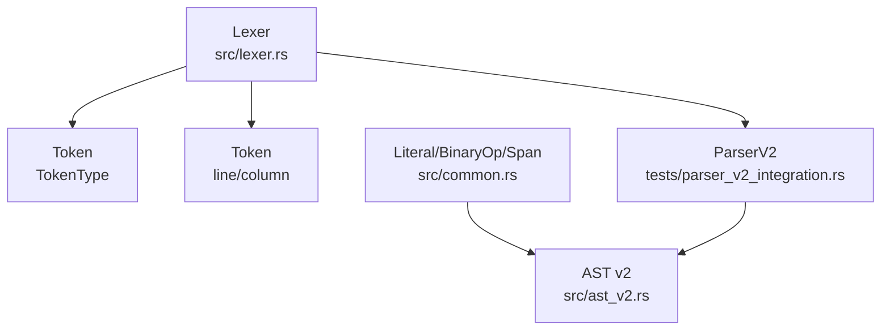
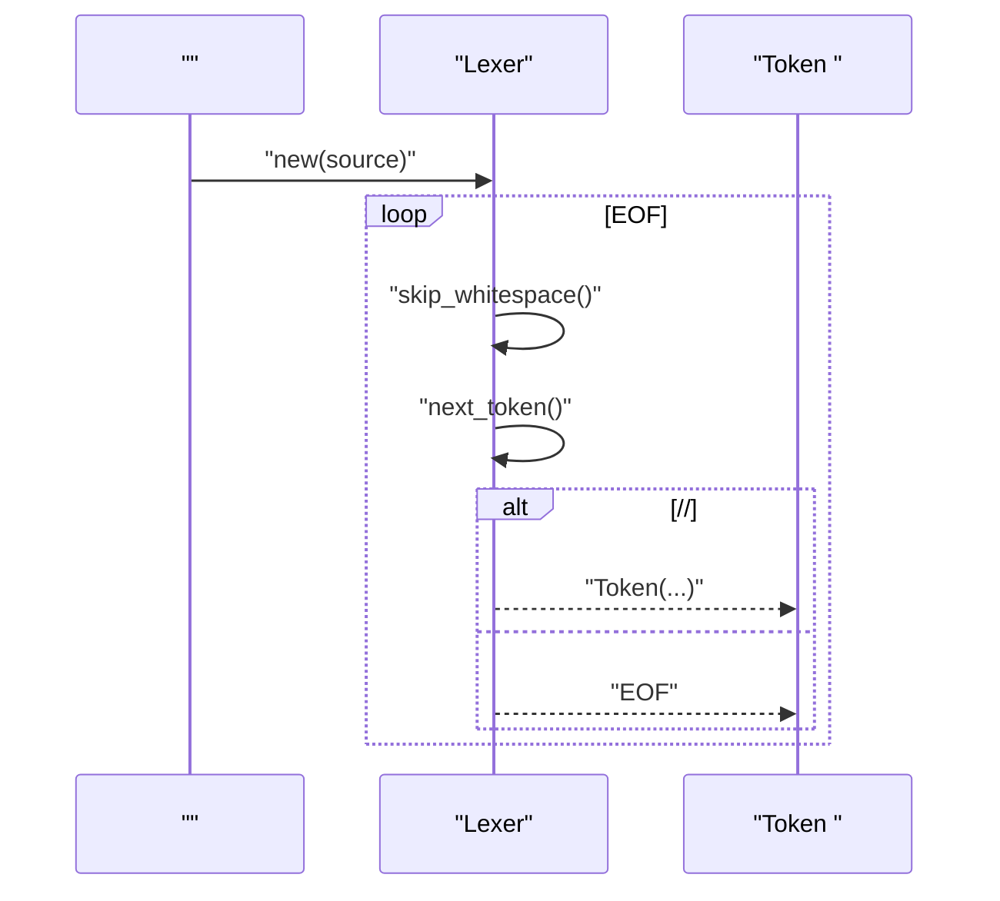
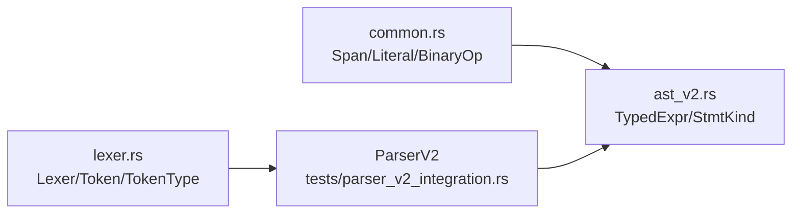

# 

<cite>
****   
- [lexer.rs](file://src/lexer.rs)
- [common.rs](file://src/common.rs)
- [ast_v2.rs](file://src/ast_v2.rs)
- [parser_v2_integration.rs](file://tests/parser_v2_integration.rs)
</cite>

## 
1. 
2. 
3. 
4. 
5. 
6. 
7. 
8. 
9. 
10. 

## 
 Mora 
- AI 
- 
-  i/u/f  p"..."
- 
- Token 
- 

## 
Mora  Token  lexer.rs common.rs AST  ast_v2.rs  tests/parser_v2_integration.rs

- [lexer.rs:1-168](file://src/lexer.rs#L1-L168)
- [parser_v2_integration.rs:1-12](file://tests/parser_v2_integration.rs#L1-L12)
- [common.rs:1-76](file://src/common.rs#L1-L76)
- [ast_v2.rs:1-120](file://src/ast_v2.rs#L1-L120)

- [lexer.rs:1-168](file://src/lexer.rs#L1-L168)
- [parser_v2_integration.rs:1-12](file://tests/parser_v2_integration.rs#L1-L12)
- [common.rs:1-76](file://src/common.rs#L1-L76)
- [ast_v2.rs:1-120](file://src/ast_v2.rs#L1-L120)

## 
- TokenType
- Token TokenType 
- Lexer Token  Error token  panic

- [lexer.rs:1-168](file://src/lexer.rs#L1-L168)

## 
 Lexer::scan_tokens  next_token  EOF 

- [lexer.rs:180-193](file://src/lexer.rs#L180-L193)
- [lexer.rs:267-567](file://src/lexer.rs#L267-L567)

## 

### 
 identifier_from 

- 
  - if, then, end, for, in, return, break, continue, match, do, with, as, into
- 
  - worker, send, receive, transaction, commit, rollback, compensation
- AI 
  - promptprompt section documentdocument section 
  - p"..." 
- 
  - type, enum, struct, trait, impl, where, dyn, Self
- 
  - observe, span, tags, record, trace, metrics, otel, tool
-  I/O
  - save, load, read, write, append, read_bytes, write_bytes
- 
  - orchestrate, edges, loop, max_rounds, exit_when, rounds, state, node, channel, checkpoint, rewind, resume, thread, dynamic, map, reduce, fan_in, fan_out, interrupt, before, after, command, goto, update, add, last, merge
- JIT
  - jit
- 
  - let, task, true, false, nil, import, export, parallel, stream

HTTP GET/POST/PUT/DELETE/PATCH Identifier API 

- [lexer.rs:842-970](file://src/lexer.rs#L842-L970)

### 
- +-*/%
- ==!=>>=<<=
- !not 
- |>
- ->
- ::
- ?Result 
- @ @start/@exit 
- &&mut
- .... rest 
- ( )[ ]{ },:

- [lexer.rs:278-567](file://src/lexer.rs#L278-L567)

### 
- "..."
  - \"\\\n\t\r\0
  -  \t\n\r  Error token
  - 
- 'x'
  -  \'\\\n\t\r\0 
  - 
- 
  - 
  - i/Iu/U i64 f/F
  -  i/u/f  8/16/32/64  10i321.0f64
  -  Error token
- p"..."
  -  p 
  -  PromptString  Token

- [lexer.rs:569-743](file://src/lexer.rs#L569-L743)
- [lexer.rs:745-840](file://src/lexer.rs#L745-L840)

### 
- 
  - 
  -  Token Identifier
- 
  -  ' 
  -  ' 
  - trait/impl 

- [lexer.rs:842-970](file://src/lexer.rs#L842-L970)
- [lexer.rs:489-525](file://src/lexer.rs#L489-L525)

### Token 
-  TokenLetIfThenEndForInWorkerSendReceiveTransactionTypeEnumStructTraitImplWhereDynSelfPromptDocumentOrchestrateLoopMaxRoundsExitWhenRoundsStateNodeChannelCheckpointRewindResumeThreadDynamicMapReduceFanInFanOutInterruptBeforeAfterCommandGotoUpdateAddLastMergeJit 
-  TokenStringCharIntFloatPromptString
-  TokenPlusMinusStarSlashPercentAssignEqualNotEqualGreaterLessGreaterEqualLessEqualPipeBangAtArrowQuestionColonColonDotDotDotDotCommaColonAmpAmpMutLifetime
- LParenRParenLBracketRBracketLBraceRBraceNewlineEOF
- Error(String)

-  demo  lex-only 
  - [parser_v2_integration.rs:43-59](file://tests/parser_v2_integration.rs#L43-L59)
-  trait/impl/dyn legacy  trait_demo.mora
  - [trait_demo.mora:1-24](file://examples/_legacy/trait_demo.mora#L1-L24)
- AI  p"..." legacy  p"..." 
  - [orchestrate_demo.mora:9-18](file://examples/_legacy/orchestrate_demo.mora#L9-L18)

- [lexer.rs:1-154](file://src/lexer.rs#L1-L154)
- [parser_v2_integration.rs:43-59](file://tests/parser_v2_integration.rs#L43-L59)
- [trait_demo.mora:1-24](file://examples/_legacy/trait_demo.mora#L1-L24)
- [orchestrate_demo.mora:9-18](file://examples/_legacy/orchestrate_demo.mora#L9-L18)

### 
-  Error(Token)  panic
- 
  - 
  - /
  - 
  -  |  |>
- 
  -  lex-only 
  -  Error Token line/column
  -  document/prompt 

- [lexer.rs:199-207](file://src/lexer.rs#L199-L207)
- [lexer.rs:569-743](file://src/lexer.rs#L569-L743)
- [lexer.rs:745-840](file://src/lexer.rs#L745-L840)
- [parser_v2_integration.rs:43-59](file://tests/parser_v2_integration.rs#L43-L59)

## 
- Lexer  Span common.rs
- Token  ParserV2  AST v2 ast_v2.rs
-  Lexer  ParserV2

- [common.rs:1-76](file://src/common.rs#L1-L76)
- [ast_v2.rs:1-120](file://src/ast_v2.rs#L1-L120)
- [lexer.rs:1-168](file://src/lexer.rs#L1-L168)
- [parser_v2_integration.rs:1-12](file://tests/parser_v2_integration.rs#L1-L12)

- [common.rs:1-76](file://src/common.rs#L1-L76)
- [ast_v2.rs:1-120](file://src/ast_v2.rs#L1-L120)
- [lexer.rs:1-168](file://src/lexer.rs#L1-L168)
- [parser_v2_integration.rs:1-12](file://tests/parser_v2_integration.rs#L1-L12)

## 
- Lexer  O(n) O(n)  Token 
-  panic Error Token 
- 
- 
  -  Token
  - 

## 
- lex  panic
  -  Error Token 
- p"..." 
  -  p  p 
- document 
  -  Identifier
- 
  -  i/u/f 

- [lexer.rs:569-743](file://src/lexer.rs#L569-L743)
- [lexer.rs:745-840](file://src/lexer.rs#L745-L840)
- [lexer.rs:956-962](file://src/lexer.rs#L956-L962)

## 
Mora 

## 
- 
  - ifthenendforinreturnbreakcontinuematchdowithasinto
  - workersendreceivetransactioncommitrollbackcompensation
  - AI promptdocumentp"..."
  - typeenumstructtraitimplwheredynSelf
  - orchestrateedgesloopmax_roundsexit_whenroundsstatenodechannelcheckpointrewindresumethreaddynamicmapreducefan_infan_outinterruptbeforeaftercommandgotoupdateaddlastmerge
  - JITjit
- 
  - +-*/%
  - ==!=>>=<<=
  - !
  - |>
  - ->
  - ::
  - ?
  - @
  - &&mut
  - ....
  - ( )[ ]{ },:
- 
  - "..."
  - 'x'
  -  i/u/f  10i321.0f64
  - p"..."