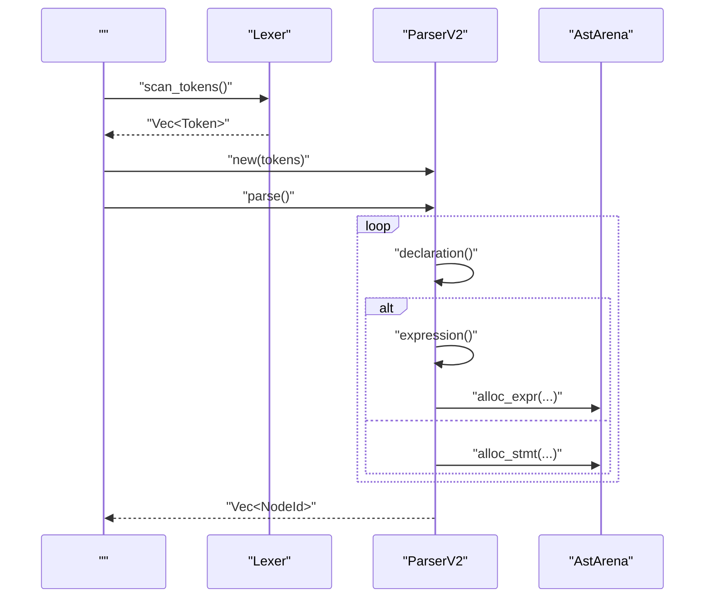
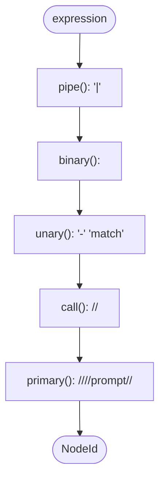
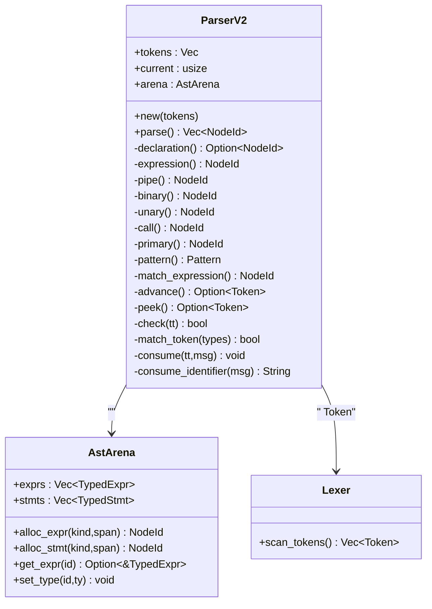

# 

<cite>
****   
- [src/parser_v2/mod.rs](file://src/parser_v2/mod.rs)
- [src/parser_v2/expressions.rs](file://src/parser_v2/expressions.rs)
- [src/parser_v2/statements.rs](file://src/parser_v2/statements.rs)
- [src/ast_v2.rs](file://src/ast_v2.rs)
- [src/lexer.rs](file://src/lexer.rs)
- [tests/parser_v2_integration.rs](file://tests/parser_v2_integration.rs)
</cite>

## 
1. [](#)
2. [](#)
3. [](#)
4. [](#)
5. [](#)
6. [](#)
7. [](#)
8. [](#)
9. [](#)
10. [](#)

## 
 Mora  v2  ParserV2 Token AstArena Token advancepeekmatch_token “”

## 
Mora  v2  src/parser_v2 
- mod.rsParserV2  Token 
- expressions.rs
- statements.rslet/task/if/for/trait/impl/orchestrate 

AST  Arena  ast_v2.rs lexer.rs tests/parser_v2_integration.rs

```mermaid
graph TB
subgraph ""
LEX["Lexer<br/> Token "]
end
subgraph ""
PARSER["ParserV2<br/>"]
EXPR["expressions.rs<br/>"]
STMT["statements.rs<br/>"]
end
subgraph "AST "
AST["ast_v2.rs<br/>ExprKind/StmtKind/AstArena"]
end
LEX --> PARSER
PARSER --> EXPR
PARSER --> STMT
PARSER --> AST
```


- [src/parser_v2/mod.rs:17-45](file://src/parser_v2/mod.rs#L17-L45)
- [src/parser_v2/expressions.rs:1-50](file://src/parser_v2/expressions.rs#L1-L50)
- [src/parser_v2/statements.rs:1-40](file://src/parser_v2/statements.rs#L1-L40)
- [src/ast_v2.rs:560-632](file://src/ast_v2.rs#L560-L632)
- [src/lexer.rs:163-193](file://src/lexer.rs#L163-L193)


- [src/parser_v2/mod.rs:17-45](file://src/parser_v2/mod.rs#L17-L45)
- [src/ast_v2.rs:560-632](file://src/ast_v2.rs#L560-L632)
- [src/lexer.rs:163-193](file://src/lexer.rs#L163-L193)

## 
- ParserV2 Token  AstArena parse() 
- AstArena TypedExpr/TypedStmt  NodeId 
- Lexer Token 


- Lexer token  panic
- ParserV2 AST 
- AstArena


- [src/parser_v2/mod.rs:17-45](file://src/parser_v2/mod.rs#L17-L45)
- [src/ast_v2.rs:560-632](file://src/ast_v2.rs#L560-L632)
- [src/lexer.rs:163-193](file://src/lexer.rs#L163-L193)

## 
Lexer  → ParserV2  →  ExprKind/StmtKind  AstArena →  ID MIR 




- [src/parser_v2/mod.rs:33-45](file://src/parser_v2/mod.rs#L33-L45)
- [src/parser_v2/mod.rs:66-164](file://src/parser_v2/mod.rs#L66-L164)
- [src/parser_v2/expressions.rs:4-37](file://src/parser_v2/expressions.rs#L4-L37)
- [src/ast_v2.rs:587-604](file://src/ast_v2.rs#L587-L604)

## 

### ParserV2 
- 
  - tokens: Vec<Token> Token 
  - current: usize
  - arena: AstArenaAST 
- 
  - new(tokens) current=0 Arena
  - parse() declaration()  ID


-  Token
- consume/consume_identifier 


- [src/parser_v2/mod.rs:17-45](file://src/parser_v2/mod.rs#L17-L45)
- [src/parser_v2/mod.rs:66-164](file://src/parser_v2/mod.rs#L66-L164)

### 
- 
  - expression → pipe → binary → unary → call → primary
  -  match_binary_op  previous_binary_op 
  -  0 - expr 
  -  | 
- 
  - call 
  -  (  Call .method(...)  MethodCall
- 
  - match_expression  pattern  rest when




- [src/parser_v2/expressions.rs:4-80](file://src/parser_v2/expressions.rs#L4-L80)
- [src/parser_v2/expressions.rs:82-154](file://src/parser_v2/expressions.rs#L82-L154)
- [src/parser_v2/expressions.rs:197-232](file://src/parser_v2/expressions.rs#L197-L232)
- [src/parser_v2/expressions.rs:338-439](file://src/parser_v2/expressions.rs#L338-L439)


- [src/parser_v2/expressions.rs:4-80](file://src/parser_v2/expressions.rs#L4-L80)
- [src/parser_v2/expressions.rs:82-154](file://src/parser_v2/expressions.rs#L82-L154)
- [src/parser_v2/expressions.rs:197-232](file://src/parser_v2/expressions.rs#L197-L232)
- [src/parser_v2/expressions.rs:338-439](file://src/parser_v2/expressions.rs#L338-L439)

### 
- declaration()  Token let/task/trait/impl/type/enum/struct/orchestrate/eval/skill/with/parallel/transaction/macro/route/observe/span 
-  let/task  exported 
-  if/for/with/parallel/transaction  Newline  End 
-  where 


- [src/parser_v2/mod.rs:66-164](file://src/parser_v2/mod.rs#L66-L164)
- [src/parser_v2/statements.rs:4-116](file://src/parser_v2/statements.rs#L4-L116)
- [src/parser_v2/statements.rs:130-197](file://src/parser_v2/statements.rs#L130-L197)
- [src/parser_v2/statements.rs:298-364](file://src/parser_v2/statements.rs#L298-L364)
- [src/parser_v2/statements.rs:366-414](file://src/parser_v2/statements.rs#L366-L414)
- [src/parser_v2/statements.rs:416-452](file://src/parser_v2/statements.rs#L416-L452)
- [src/parser_v2/statements.rs:487-503](file://src/parser_v2/statements.rs#L487-L503)
- [src/parser_v2/statements.rs:505-605](file://src/parser_v2/statements.rs#L505-L605)
- [src/parser_v2/statements.rs:607-732](file://src/parser_v2/statements.rs#L607-L732)
- [src/parser_v2/statements.rs:734-831](file://src/parser_v2/statements.rs#L734-L831)
- [src/parser_v2/statements.rs:833-1015](file://src/parser_v2/statements.rs#L833-L1015)

### Token 
- advance() current  TokenO(1)
- peek()/peek_next()/ TokenO(1)
- check(token_type)/match_token(types)/O(k)
- consume()/consume_identifier() Token  panic
- span_of_current()/ Span 
- match_identifier(name)
- peek_after_less_is_identpeek_type_list_can_close /


-  O(1) 
-  Vec 
-  eprintln 


- [src/parser_v2/mod.rs:225-325](file://src/parser_v2/mod.rs#L225-L325)
- [src/parser_v2/mod.rs:327-392](file://src/parser_v2/mod.rs#L327-L392)
- [src/parser_v2/mod.rs:394-467](file://src/parser_v2/mod.rs#L394-L467)

### AstArena 
- 
  - exprs: Vec<TypedExpr>
  - stmts: Vec<TypedStmt>
- 
  - alloc_expr(kind, span) → NodeId
  - alloc_stmt(kind, span) → NodeId
- 
  - get_expr/get_expr_mut/get_stmt
  - set_type/get_type
- 
  - walk_expr 


- 
-  NodeId  MIR 
-  AST 


- [src/ast_v2.rs:560-632](file://src/ast_v2.rs#L560-L632)
- [src/ast_v2.rs:638-706](file://src/ast_v2.rs#L638-L706)

### 
- 
  -  Error token panic
- 
  - consume/consume_identifier 
  -  orchestrate 
- 
  -  eval  given  panic


- [src/lexer.rs:199-207](file://src/lexer.rs#L199-L207)
- [src/parser_v2/mod.rs:273-303](file://src/parser_v2/mod.rs#L273-L303)
- [src/parser_v2/statements.rs:833-1015](file://src/parser_v2/statements.rs#L833-L1015)
- [tests/parser_v2_integration.rs:62-75](file://tests/parser_v2_integration.rs#L62-L75)

## 
- ParserV2 
  - lexer.Token/TokenTypeToken 
  - ast_v2.ExprKind/StmtKind/AstArena/NodeIdAST 
  - common.BinaryOp/Literal/Span
- 
  -  Lexer → ParserV2::new → parse 
  - MIR  NodeId  Arena  AST




- [src/parser_v2/mod.rs:17-45](file://src/parser_v2/mod.rs#L17-L45)
- [src/parser_v2/expressions.rs:4-80](file://src/parser_v2/expressions.rs#L4-L80)
- [src/ast_v2.rs:560-632](file://src/ast_v2.rs#L560-L632)
- [src/lexer.rs:163-193](file://src/lexer.rs#L163-L193)


- [src/parser_v2/mod.rs:17-45](file://src/parser_v2/mod.rs#L17-L45)
- [src/ast_v2.rs:560-632](file://src/ast_v2.rs#L560-L632)
- [src/lexer.rs:163-193](file://src/lexer.rs#L163-L193)

## 
- 
  -  O(n)n  Token 
  -  O(1) 
- 
  - Arena 
  - /
- 
  - 
  -  Arena 
  - 

[]

## 
- 
  -  Error token 
  -  consume/consume_identifier “Parse error: ... at line X”
- 
  - parse_format_string  “Unmatched '{{'”
  -  trait as dyn Trait  dyn 
  - orchestrate  sequential/graph/loop/pregel 
- 
  - 
  -  Token  current 


- [src/parser_v2/mod.rs:273-303](file://src/parser_v2/mod.rs#L273-L303)
- [src/parser_v2/mod.rs:580-649](file://src/parser_v2/mod.rs#L580-L649)
- [src/parser_v2/statements.rs:833-1015](file://src/parser_v2/statements.rs#L833-L1015)
- [tests/parser_v2_integration.rs:62-75](file://tests/parser_v2_integration.rs#L62-L75)

## 
ParserV2  Arena  Token  AstArena  MIR 

[]

## 

### 
1.  lexer.rs  TokenType 
2.  parser_v2/mod.rs  declaration() 
3.  statements.rs  StmtKind 
4.  ast_v2.rs  StmtKind 
5.  tests/parser_v2_integration.rs  panic 


- [src/lexer.rs:1-154](file://src/lexer.rs#L1-L154)
- [src/parser_v2/mod.rs:66-164](file://src/parser_v2/mod.rs#L66-L164)
- [src/parser_v2/statements.rs:1-40](file://src/parser_v2/statements.rs#L1-L40)
- [src/ast_v2.rs:169-441](file://src/ast_v2.rs#L169-L441)
- [tests/parser_v2_integration.rs:1-12](file://tests/parser_v2_integration.rs#L1-L12)

### 
1.  lexer.rs 
2.  expressions.rs  binary/unary/call/primary 
3.  ast_v2.rs  ExprKind 
4.  tests 


- [src/lexer.rs:1-154](file://src/lexer.rs#L1-L154)
- [src/parser_v2/expressions.rs:4-80](file://src/parser_v2/expressions.rs#L4-L80)
- [src/ast_v2.rs:79-155](file://src/ast_v2.rs#L79-L155)
- [tests/parser_v2_integration.rs:1-12](file://tests/parser_v2_integration.rs#L1-L12)

### 
- 
  -  current 
  -  span_of_current 
- 
  - 
  - 
  -  orchestrate


- [src/parser_v2/mod.rs:225-325](file://src/parser_v2/mod.rs#L225-L325)
- [src/parser_v2/statements.rs:833-1015](file://src/parser_v2/statements.rs#L833-L1015)