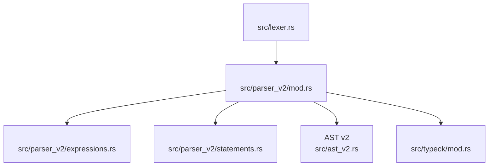
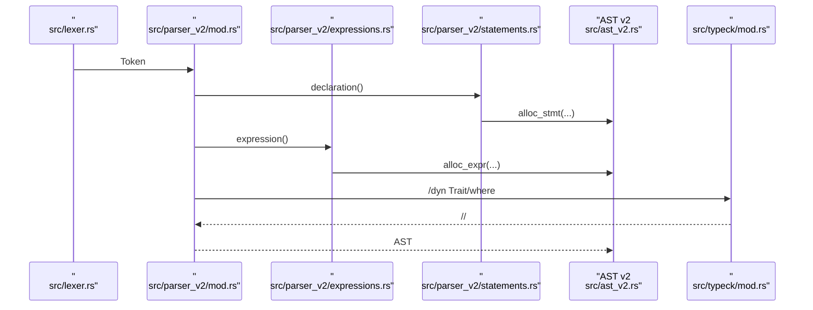
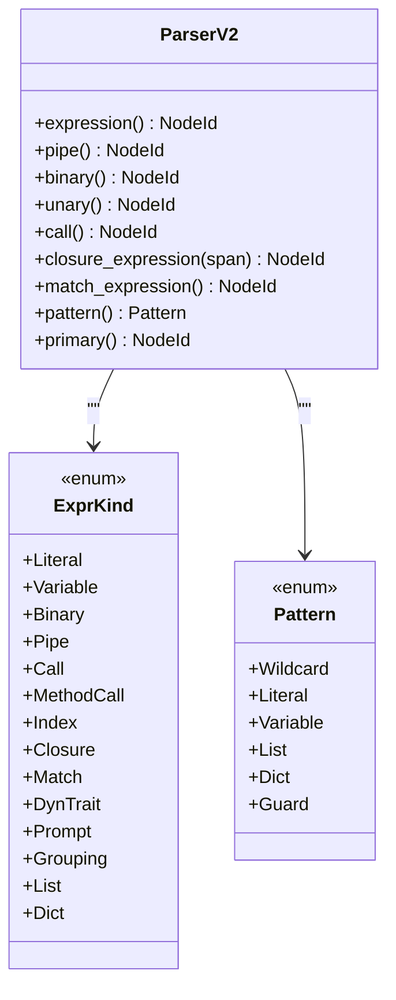
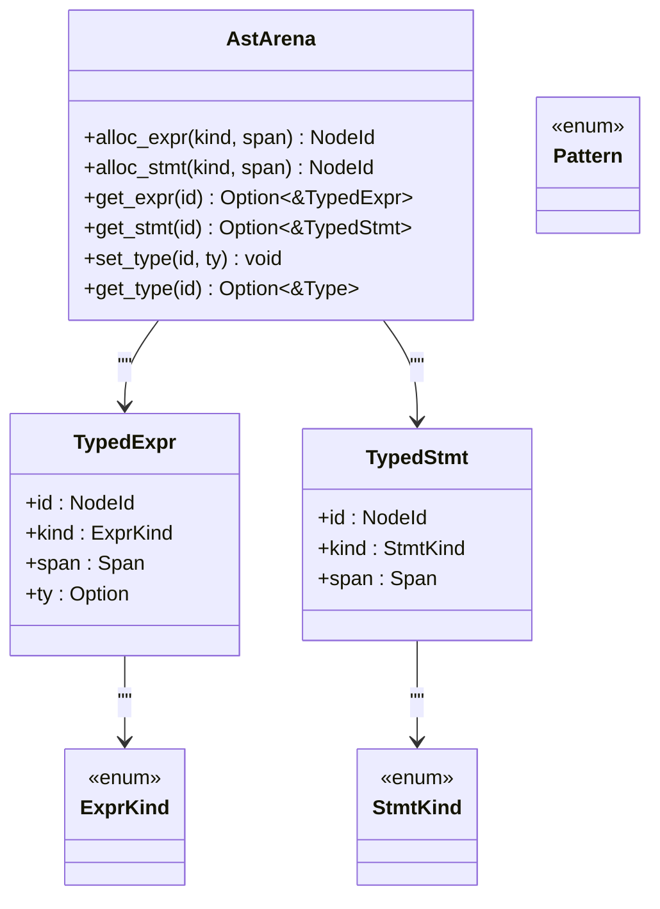
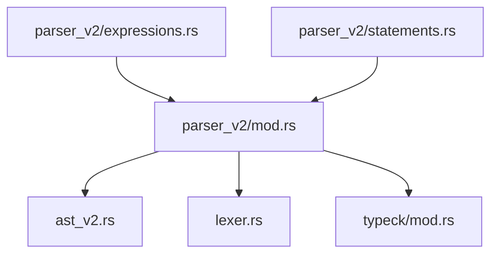

# 

<cite>
****   
- [src/parser_v2/mod.rs](file://src/parser_v2/mod.rs)
- [src/parser_v2/expressions.rs](file://src/parser_v2/expressions.rs)
- [src/parser_v2/statements.rs](file://src/parser_v2/statements.rs)
- [src/ast_v2.rs](file://src/ast_v2.rs)
- [src/lexer.rs](file://src/lexer.rs)
- [src/typeck/mod.rs](file://src/typeck/mod.rs)
</cite>

## 
1. [](#)
2. [](#)
3. [](#)
4. [](#)
5. [](#)
6. [](#)
7. [](#)
8. [](#)
9. [](#)
10. [ BNF](#-bnf)

## 
 Mora  v2 
- 
- AST v2  AST 
- //
- dyn Trait
- /
- 

## 
Mora  src/parser_v2 “ ast_v2”
- parser_v2/mod.rs ParserV2 token where 
- parser_v2/expressions.rs/
- parser_v2/statements.rslet/task/if/for/import/match/with/parallel/transaction/macro/trait/impl/type/enum/struct/orchestrate/eval/skill/prompt/document 
- ast_v2.rsAST v2 NodeIdAstArenaTypedExpr/TypedStmtExprKind/StmtKindPattern 
- lexer.rs Token  token 
- typeck/mod.rsTypeSymbolTableTypeCheckerdyn Trait 




- [src/parser_v2/mod.rs:1-60](file://src/parser_v2/mod.rs#L1-L60)
- [src/parser_v2/expressions.rs:1-60](file://src/parser_v2/expressions.rs#L1-L60)
- [src/parser_v2/statements.rs:1-60](file://src/parser_v2/statements.rs#L1-L60)
- [src/ast_v2.rs:1-120](file://src/ast_v2.rs#L1-L120)
- [src/lexer.rs:1-120](file://src/lexer.rs#L1-L120)
- [src/typeck/mod.rs:1-120](file://src/typeck/mod.rs#L1-L120)


- [src/parser_v2/mod.rs:1-60](file://src/parser_v2/mod.rs#L1-L60)
- [src/ast_v2.rs:1-120](file://src/ast_v2.rs#L1-L120)
- [src/lexer.rs:1-120](file://src/lexer.rs#L1-L120)

## 
-  ParserV2
  -  tokenscurrent AstArena 
  -  parse()  NodeId 
  -  match_token/consume_identifier/span_of_current 
  -  where 
- 
  - expression → pipe → binary → unary → call → primary
  -  as dyn Trait<T>  |//match / p"..."
- 
  -  let/task/if/for/import/match/with/parallel/transaction/macro/trait/impl/type/enum/struct/orchestrate/eval/skill/prompt/document 
  -  AstArena.alloc_stmt  NodeId
- AST v2 
  -  Arena NodeId 
  - TypedExpr/TypedStmt  Span  Type
- 
  - p"..."  'a&/&mut@ ? :: 
  -  Error token  panic
- 
  -  dyn Trait where 


- [src/parser_v2/mod.rs:16-164](file://src/parser_v2/mod.rs#L16-L164)
- [src/parser_v2/expressions.rs:1-120](file://src/parser_v2/expressions.rs#L1-L120)
- [src/parser_v2/statements.rs:1-120](file://src/parser_v2/statements.rs#L1-L120)
- [src/ast_v2.rs:1-160](file://src/ast_v2.rs#L1-L160)
- [src/lexer.rs:1-160](file://src/lexer.rs#L1-L160)
- [src/typeck/mod.rs:1-120](file://src/typeck/mod.rs#L1-L120)

## 
 AST 




- [src/parser_v2/mod.rs:32-45](file://src/parser_v2/mod.rs#L32-L45)
- [src/parser_v2/expressions.rs:4-37](file://src/parser_v2/expressions.rs#L4-L37)
- [src/parser_v2/statements.rs:4-37](file://src/parser_v2/statements.rs#L4-L37)
- [src/ast_v2.rs:588-632](file://src/ast_v2.rs#L588-L632)
- [src/typeck/mod.rs:162-255](file://src/typeck/mod.rs#L162-L255)

## 

###  ParserV2
- 
  -  token  peek/advance/check/match_token/consume 
  -  token let/task/if/for/import/match/with/...
  - parse_generic_paramsparse_type_listparse_where_clauseparse_format_string
- 
  - parse()  NodeId 
  - consume_identifier 
  - parse_format_string  p"..."  ParserV2 

```mermaid
flowchart TD
Start([" parse()"]) --> Loop{" EOF?"}
Loop --> || End([" NodeId "])
Loop --> || CheckNewline{"?"}
CheckNewline --> || Advance[""] --> Loop
CheckNewline --> || Decl["declaration() "] --> Push[""] --> Loop
```


- [src/parser_v2/mod.rs:32-45](file://src/parser_v2/mod.rs#L32-L45)
- [src/parser_v2/mod.rs:66-164](file://src/parser_v2/mod.rs#L66-L164)


- [src/parser_v2/mod.rs:16-164](file://src/parser_v2/mod.rs#L16-L164)
- [src/parser_v2/mod.rs:225-312](file://src/parser_v2/mod.rs#L225-L312)
- [src/parser_v2/mod.rs:394-467](file://src/parser_v2/mod.rs#L394-L467)
- [src/parser_v2/mod.rs:580-649](file://src/parser_v2/mod.rs#L580-L649)

### 
- 
  - as dyn Trait expression  while 
  -  |
  - + - * / % == != > < >= <=
  - -expr  0 - expr
  - 
- 
  - expression as dyn Trait 
  - pipe | 
  - binary previous_binary_op 
  - unary match 
  - call//
  - closure_expression fn(...) -> T { ... } 
  - match_expression match expr with { pattern -> arm; ... } end
  - pattern rest
  - primaryfn p"..." /
- 
  -  <T, U>
  - p"..."  {expr}




- [src/parser_v2/expressions.rs:4-510](file://src/parser_v2/expressions.rs#L4-L510)
- [src/ast_v2.rs:81-155](file://src/ast_v2.rs#L81-L155)
- [src/ast_v2.rs:13-27](file://src/ast_v2.rs#L13-L27)


- [src/parser_v2/expressions.rs:4-120](file://src/parser_v2/expressions.rs#L4-L120)
- [src/parser_v2/expressions.rs:156-195](file://src/parser_v2/expressions.rs#L156-L195)
- [src/parser_v2/expressions.rs:197-232](file://src/parser_v2/expressions.rs#L197-L232)
- [src/parser_v2/expressions.rs:338-439](file://src/parser_v2/expressions.rs#L338-L439)
- [src/parser_v2/expressions.rs:441-508](file://src/parser_v2/expressions.rs#L441-L508)

### 
- 
  - let name: T = expr;
  - task name(params) -> T { ... } end;
  - if expr then ... end;
  - for var in iterable { ... } end;
  - import path;
  - match expr with { pattern -> body; ... } end;
  - With with key = value, ... { ... } end  with jit { ... } end;
  - parallel { worker name { ... } end; ... } end;
  - transaction { ... compensation { ... } end } end;
  - macro name(params) { ... } end;
  - route method path -> target;
  - Trait/Impltrait/impl  = expr  do ... end 
  - type aliasenumstruct
  - orchestrateSequential/Graph/Loop/Pregel
  - Eval/Skill/PromptSection/DocumentSection 
- 
  - let_declaration_exported let  dyn Trait 
  - task_declaration_exported task 
  - if_statement/for_statement
  - match_statement expressions  pattern() 
  - with_statement with jit { ... }  with key=value { ... }
  - parallel_statement/worker_statement worker 
  - transaction_statement
  - trait_statement/impl_statementtrait/impl  where 
  - type_alias_statement/enum_statement/struct_statement
  - route_statement
  - macro_statement
  - orchestrate_statement/eval_statement/skill_statement/prompt_section_statement/document_section_statement

```mermaid
flowchart TD
Start([" statement "]) --> Let{" let?"}
Let --> || LetDecl["let_declaration_exported()"]
Let --> || Task{" task?"}
Task --> || TaskDecl["task_declaration_exported()"]
Task --> || If{" if?"}
If --> || IfStmt["if_statement()"]
If --> || For{" for?"}
For --> || ForStmt["for_statement()"]
For --> || Match{" match?"}
Match --> || MatchStmt["match_statement()"]
Match --> || With{" with?"}
With --> || WithStmt["with_statement()"]
With --> || Parallel{" parallel?"}
Parallel --> || ParStmt["parallel_statement()"]
Parallel --> || Transaction{" transaction?"}
Transaction --> || TransStmt["transaction_statement()"]
Transaction --> || Macro{" macro?"}
Macro --> || MacroStmt["macro_statement()"]
Macro --> || Route{" route?"}
Route --> || RouteStmt["route_statement()"]
Route --> || Trait{" trait/impl?"}
Trait --> || TraitStmt["trait_statement()/impl_statement()"]
Trait --> || Type{" type/enum/struct?"}
Type --> || TypeStmt["type_alias_statement()/enum_statement()/struct_statement()"]
Type --> || Orchestrate{" orchestrate/eval/skill/prompt/document?"}
Orchestrate --> || HighLevel[""]
Orchestrate --> || Assign{"//?"}
Assign --> || AssignStmt["assignment/index_assignment/expression_statement()"]
Assign --> || Error[""]
```


- [src/parser_v2/statements.rs:4-120](file://src/parser_v2/statements.rs#L4-L120)
- [src/parser_v2/statements.rs:130-197](file://src/parser_v2/statements.rs#L130-L197)
- [src/parser_v2/statements.rs:271-364](file://src/parser_v2/statements.rs#L271-L364)
- [src/parser_v2/statements.rs:366-452](file://src/parser_v2/statements.rs#L366-L452)
- [src/parser_v2/statements.rs:454-503](file://src/parser_v2/statements.rs#L454-L503)
- [src/parser_v2/statements.rs:505-732](file://src/parser_v2/statements.rs#L505-L732)
- [src/parser_v2/statements.rs:734-794](file://src/parser_v2/statements.rs#L734-L794)


- [src/parser_v2/statements.rs:4-120](file://src/parser_v2/statements.rs#L4-L120)
- [src/parser_v2/statements.rs:130-197](file://src/parser_v2/statements.rs#L130-L197)
- [src/parser_v2/statements.rs:271-364](file://src/parser_v2/statements.rs#L271-L364)
- [src/parser_v2/statements.rs:366-452](file://src/parser_v2/statements.rs#L366-L452)
- [src/parser_v2/statements.rs:454-503](file://src/parser_v2/statements.rs#L454-L503)
- [src/parser_v2/statements.rs:505-732](file://src/parser_v2/statements.rs#L505-L732)
- [src/parser_v2/statements.rs:734-794](file://src/parser_v2/statements.rs#L734-L794)

### AST v2 
- 
  - Arena 
  - NodeId ID 
  - TypedExpr/TypedStmt  Type
  - Visitor walk_expr 
- 
  - ExprKind trait 
  - StmtKindWith Break/ContinueSpanRecordTokensTrait/ImplWorker/Send/ReceiveEvalSkillPromptSectionDocumentSection
  - Pattern+restwhen 
- 
  - walk_expr  panic




- [src/ast_v2.rs:568-632](file://src/ast_v2.rs#L568-L632)
- [src/ast_v2.rs:81-155](file://src/ast_v2.rs#L81-L155)
- [src/ast_v2.rs:170-441](file://src/ast_v2.rs#L170-L441)
- [src/ast_v2.rs:13-27](file://src/ast_v2.rs#L13-L27)


- [src/ast_v2.rs:1-160](file://src/ast_v2.rs#L1-L160)
- [src/ast_v2.rs:568-632](file://src/ast_v2.rs#L568-L632)
- [src/ast_v2.rs:646-705](file://src/ast_v2.rs#L646-L705)

### 
- 
  - let/task/if/then/end/return/true/false/nil/for/in/import/export/parallel/match/with/save/load/fn/into/as/do/read/write/append/read_bytes/write_bytes/stream/tool/break/continue/route/observe/span/tags/record/trace/metrics/otel/worker/send/receive/transaction/commit/rollback/compensation/macro/orchestrate/edges/loop/max_rounds/exit_when/rounds/eval/skill/expect/tolerance/prompt/document/state/node/channel/checkpoint/rewind/resume/thread/dynamic/map/reduce/fan_in/fan_out/interrupt/before/after/command/goto/update/add/last/merge/jit 
  - + - * / % = == != > < >= <= | ! ? :: & &mut @ . .. , : ( ) [ ] { } 
- 
  - p"..." 
- 
  -  emit Error token panic Error token 
  -  consume/consume_identifier 


- [src/lexer.rs:1-160](file://src/lexer.rs#L1-L160)
- [src/lexer.rs:199-207](file://src/lexer.rs#L199-L207)
- [src/lexer.rs:267-567](file://src/lexer.rs#L267-L567)
- [src/parser_v2/mod.rs:273-303](file://src/parser_v2/mod.rs#L273-L303)

### 
- 
  - let  dyn Trait  dyn Trait<T, U>
  - task/closure 
  - parse_type_name_recursive  "number" → "float"
-  where 
  - parse_generic_params  trait/impl  bound
  - parse_where_clause  where 
- 
  - typeck::Type::from_hint  Type  list<T>/dict<K,V>/result<T,E>/dyn Trait 
  - SymbolTable 
  - TypeChecker trait/impl 


- [src/parser_v2/mod.rs:170-182](file://src/parser_v2/mod.rs#L170-L182)
- [src/parser_v2/mod.rs:394-467](file://src/parser_v2/mod.rs#L394-L467)
- [src/typeck/mod.rs:162-255](file://src/typeck/mod.rs#L162-L255)
- [src/typeck/mod.rs:512-548](file://src/typeck/mod.rs#L512-L548)
- [src/typeck/mod.rs:667-769](file://src/typeck/mod.rs#L667-L769)

## 
- 
  - parser_v2  ast_v2lexerToken typeck
  - expressions.rs  statements.rs  mod.rs consume/match_token/span_of_current
- 
  - common  BinaryOp/Literal/Span/GenericParam 
  - typeck  Type/Signature/SymbolTable 




- [src/parser_v2/mod.rs:1-15](file://src/parser_v2/mod.rs#L1-L15)
- [src/parser_v2/expressions.rs:1-5](file://src/parser_v2/expressions.rs#L1-L5)
- [src/parser_v2/statements.rs:1-5](file://src/parser_v2/statements.rs#L1-L5)


- [src/parser_v2/mod.rs:1-15](file://src/parser_v2/mod.rs#L1-L15)
- [src/parser_v2/expressions.rs:1-5](file://src/parser_v2/expressions.rs#L1-L5)
- [src/parser_v2/statements.rs:1-5](file://src/parser_v2/statements.rs#L1-L5)

## 
- Arena AST 
- NodeId 
- 
- / Error token  eprintln 

[]

## 
- 
  - /lexer  emit Error token
  - string/prompt string  \t\n\r
  - emit Error token 
- 
  - consume/consume_identifier 
  - //consume 
  - parse_format_string  0 
- 
  - 
  - Mora 
  -  where 


- [src/lexer.rs:199-207](file://src/lexer.rs#L199-L207)
- [src/lexer.rs:569-633](file://src/lexer.rs#L569-L633)
- [src/lexer.rs:635-679](file://src/lexer.rs#L635-L679)
- [src/parser_v2/mod.rs:273-303](file://src/parser_v2/mod.rs#L273-L303)
- [src/parser_v2/mod.rs:580-649](file://src/parser_v2/mod.rs#L580-L649)

## 
Mora v2 AST v2 dyn Traitwhere  Arena  NodeId 

[]

##  BNF
BNF 

- 
  - program ::= { newline | declaration }*
- 
  - declaration ::= export? let_declaration
                | export? task_declaration
                | trait_statement
                | impl_statement
                | return_statement
                | if_statement
                | for_statement
                | import_statement
                | break_statement
                | continue_statement
                | commit_statement
                | rollback_statement
                | match_statement
                | with_statement
                | parallel_statement
                | transaction_statement
                | macro_statement
                | route_statement
                | type_alias_statement
                | enum_statement
                | struct_statement
                | orchestrate_statement
                | eval_statement
                | skill_statement
                | save_statement
                | load_statement
                | read_statement
                | write_statement
                | append_statement
                | read_bytes_statement
                | write_bytes_statement
                | stream_statement
                | tool_statement
                | observe_statement
                | span_statement
                | record_tokens_statement
                | prompt_section_statement
                | document_section_statement
                | index_assignment
                | assignment_statement
                | expression_statement
- 
  - let_declaration ::= "let" identifier [":" type_hint] "=" expression
  - type_hint ::= "dyn:" identifier ["<" type_list ">"] | type_name
  - type_name ::= identifier ["<" type_list ">"]
  - type_list ::= type_name { "," type_name }
- 
  - task_declaration ::= "task" identifier ["<" lifetime_params ">] "(" parameters ")" [":" return_type] newline block "end"
  - lifetime_params ::= "'" identifier { "," "'" identifier }
  - parameters ::= parameter { "," parameter }
  - parameter ::= identifier [":" type_hint]
  - return_type ::= identifier
  - block ::= { newline | declaration }*
- 
  - if_statement ::= "if" expression "then" block "end"
  - for_statement ::= "for" identifier [":" type_hint] "in" expression newline block "end"
- 
  - match_statement ::= "match" expression "with" { newline | pattern "->" block } "end"
  - pattern ::= "_" | literal | identifier | "[" pattern { "," pattern } ["," "..." identifier] "]" | "{" dict_pattern_entry { "," dict_pattern_entry } "}"
  - dict_pattern_entry ::= identifier ":" pattern | string ":" pattern
- 
  - expression ::= expression "as" "dyn" identifier ["<" type_list ">"]
               | pipe
  - pipe ::= binary {"|" binary}
  - binary ::= unary {binary_op unary}
  - binary_op ::= "+" | "-" | "*" | "/" | "%" | "==" | "!=" | ">" | "<" | ">=" | "<="
  - unary ::= "match" expression "with" arms "end" | "-" unary | call
  - call ::= primary { "." method_name ["(" args ")"] | "[" expression "]" | "(" args ")" }
  - args ::= expression { "," expression }
  - primary ::= true | false | nil | int | float | char | string | identifier ["<" type_list ">"] | "(" expression ")" | "fn" "(" parameters ")" [":" return_type] newline block "end" | p_string | "[" list_items "]" | "{" dict_entries "}"
  - list_items ::= expression { "," expression }
  - dict_entries ::= dict_entry { "," dict_entry }
  - dict_entry ::= identifier ":" expression | string ":" expression
  - p_string ::= "p\"" string_content "\""
- 
  - with_statement ::= "with" ("jit" "{" block "}" | bindings newline block "end")
  - parallel_statement ::= "parallel" newline { worker_statement | declaration } "end"
  - worker_statement ::= "worker" identifier newline block "end"
  - transaction_statement ::= "transaction" newline { body_statements "compensation" newline { compensation_statements } } "end"
  - macro_statement ::= "macro" identifier "(" identifiers ")" newline block "end"
  - route_statement ::= "route" identifier identifier "->" expression
  - trait_statement ::= "trait" identifier ["<" generic_params ">"] [":" parent_trait { "," parent_trait }] ["where" where_clause] newline { "fn" method_signature ["=" expression | "do" block "end"] } "end"
  - impl_statement ::= "impl" ["<" generic_params ">"] identifier ["<" type_list ">"] "for" identifier ["<" type_list ">"] ["where" where_clause] newline { "fn" method_signature ["=" expression | "do" block "end"] } "end"
  - type_alias_statement ::= "type" identifier ["<" type_list ">"] "=" identifier
  - enum_statement ::= "enum" identifier ["<" type_list ">"] newline { variant } "end"
  - struct_statement ::= "struct" identifier ["<" type_list ">"] newline { field } "end"
  - orchestrate_statement ::= "orchestrate" input_var ":" result_var kind
  - eval_statement ::= "eval" name "given" expression "expects" expression { "," expression } ["tolerance" number] ["replay_path" string]
  - skill_statement ::= "skill" name ["description" string] ["version" string] "requires" string { "," string } newline { task_definition } ["verify" verify_function]
  - prompt_section_statement ::= "prompt" string newline { prompt_set | prompt_read | tail_call } "end"
  - document_section_statement ::= "document" string newline { document_set | document_read } "end"
  - save_statement ::= "save" expression "to" expression
  - load_statement ::= "load" expression "into" identifier
  - read_statement ::= "read" expression "into" identifier
  - write_statement ::= "write" expression "content" expression
  - append_statement ::= "append" expression "content" expression
  - read_bytes_statement ::= "read_bytes" expression "into" identifier
  - write_bytes_statement ::= "write_bytes" expression "content" expression
  - stream_statement ::= "stream" expression "for" identifier newline block "end"
  - tool_statement ::= "tool" name description params return_type body
  - observe_statement ::= "observe" config newline block "end"
  - span_statement ::= "span" name attributes newline block "end"
  - record_tokens_statement ::= "record_tokens" expression "to" expression
  - index_assignment ::= identifier "[" expression "]" "=" expression
  - assignment_statement ::= identifier "=" expression
  - expression_statement ::= expression

[]