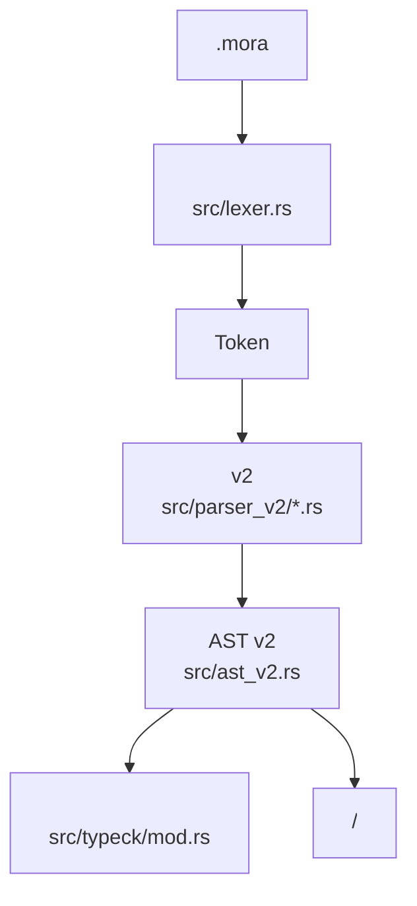
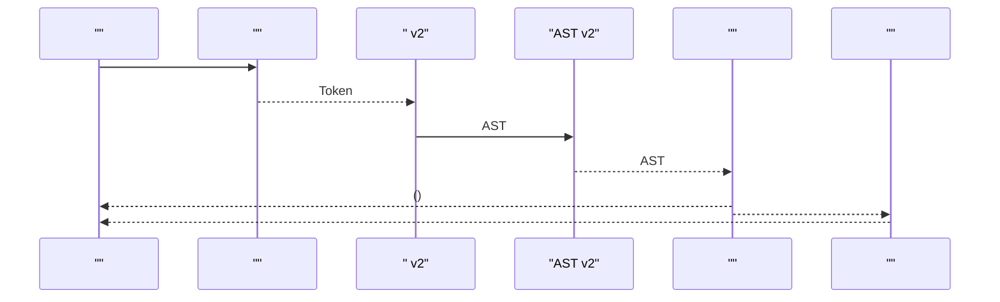
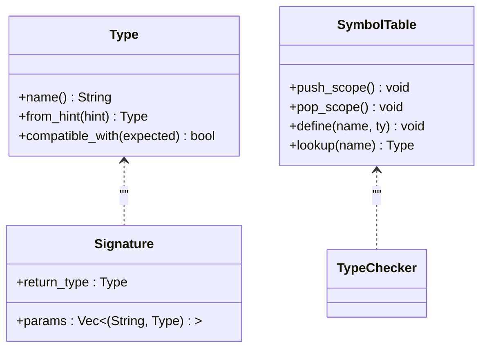
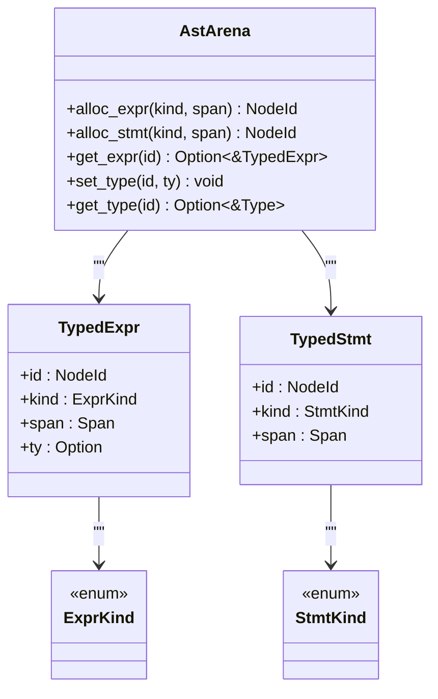
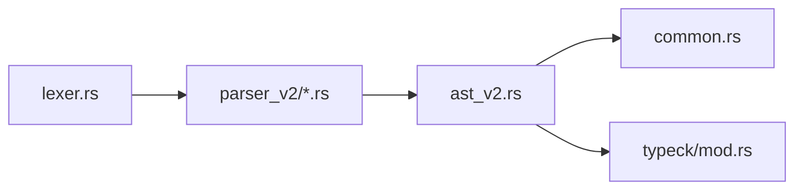

# 

<cite>
****
- [src/lexer.rs](file://src/lexer.rs)
- [src/parser_v2/mod.rs](file://src/parser_v2/mod.rs)
- [src/parser_v2/expressions.rs](file://src/parser_v2/expressions.rs)
- [src/parser_v2/statements.rs](file://src/parser_v2/statements.rs)
- [src/ast_v2.rs](file://src/ast_v2.rs)
- [src/common.rs](file://src/common.rs)
- [src/typeck/mod.rs](file://src/typeck/mod.rs)
- [README.md](file://README.md)
</cite>

## 
1. [](#)
2. [](#)
3. [](#)
4. [](#)
5. [](#)
6. [](#)
7. [](#)
8. [](#)
9. [](#)
10. [BNF ](#bnf-)

## 
Mora  AI-native  LLM HTTP/MCP  Agent  BNF 

## 
-  Token 
-  v2 ast_v2 
- AST v2 Arena  NodeId 
- 
- 




- [src/lexer.rs:1-154](file://src/lexer.rs#L1-L154)
- [src/parser_v2/mod.rs:16-45](file://src/parser_v2/mod.rs#L16-L45)
- [src/ast_v2.rs:566-632](file://src/ast_v2.rs#L566-L632)
- [src/typeck/mod.rs:554-572](file://src/typeck/mod.rs#L554-L572)


- [README.md:315-334](file://README.md#L315-L334)

## 
- 
- 
- 
- AST Arena + NodeId


- [src/lexer.rs:1-154](file://src/lexer.rs#L1-L154)
- [src/parser_v2/mod.rs:66-164](file://src/parser_v2/mod.rs#L66-L164)
- [src/ast_v2.rs:79-155](file://src/ast_v2.rs#L79-L155)
- [src/typeck/mod.rs:37-111](file://src/typeck/mod.rs#L37-L111)

## 
Mora “ →  → AST → ” v2  ast_v2




- [src/lexer.rs:180-193](file://src/lexer.rs#L180-L193)
- [src/parser_v2/mod.rs:33-45](file://src/parser_v2/mod.rs#L33-L45)
- [src/ast_v2.rs:566-632](file://src/ast_v2.rs#L566-L632)
- [src/typeck/mod.rs:554-572](file://src/typeck/mod.rs#L554-L572)

## 

### 
- 
  - if, then, end, for, in, match, with, break, continue
  - let, task, fn, import, export, trait, impl, where, type, enum, struct
  - parallel, worker, transaction, commit, rollback, compensation
  - observe, span, tags, record, trace, metrics, otel, tool
  -  IOroute, save, load, read, write, append, read_bytes, write_bytes, stream
  -  Agent orchestrate, edges, loop, max_rounds, exit_when, rounds
  - Eval/Skilleval, skill, expect, tolerance
  - Prompt/Documentprompt, document
  -  BSPstate, node, channel, checkpoint, rewind, resume, thread, dynamic, map, reduce, fan_in, fan_out, interrupt, before, after, command, send, goto, update, add, last, merge
  - JITjit
  - as, do, return, true, false, nil, Self, dyn
- 
  - +, -, *, /, %
  - ==, !=, >, <, >=, <=
  - =
  - |>
  - !
  - @
  - ->
  - ?
  - ::
  - &, &mut
  - 'a
  - ., ...
  - (), [], {}, ,, :
- 
  - "..." \n, \t, \r, \\, \" 
  - 'x'
  -  i64  f64 i/I/u/U/f/F  32/64
  - true, false
  - nil
  - p"..." AI 
- 
  - 
  - 


- [src/lexer.rs:1-154](file://src/lexer.rs#L1-L154)
- [src/lexer.rs:842-970](file://src/lexer.rs#L842-L970)
- [src/lexer.rs:569-743](file://src/lexer.rs#L569-L743)
- [src/lexer.rs:745-840](file://src/lexer.rs#L745-L840)

### 
- 
  - let name[: TypeHint] = expr
  - name = expr
  - name[index] = expr
- 
  - task name[<'a>,...](params[: Type], ...)[: ReturnType] do ... end
  - fn(params[: Type], ...)[: ReturnType] do ... end
- 
  - if condition then body end
  - for var[: Type] in iterable do body end
  - match expr with pattern -> arm end when 
  - parallel { ... } end
  - with key = value, ... do body end with jit { ... }
  - transaction { body } compensation { comp } end; commit; rollback
- 
  - import "path"
  - export let/task ...
- 
  - trait Name[<T>] { methods } end
  - impl[<T>] Trait<T> for Type[<T>] where T: Bound { methods } end
  - type Alias = Target
  - enum Name[<T>] { V1, V2(Type) } end
  - struct Name[<T>] { field: Type } end
- 
  - tool name(args): T do ... end
  - route METHOD path -> target
- 
  - observe trace/metrics/otel endpoint "url"
  - span "name" tags {...} do ... end
  - record_tokens(input, output)
- 
  - save "path", value
  - load "path", var
  - read/write/append/read_bytes/write_bytes
- 
  - stream 
  - parallel/worker/send/receive
-  Agent 
  - orchestrate { agents, edges, state_schema, checkpoint, interrupt_points }
- 
  - eval name given expects tolerance replay_path
  - skill name description version requires tasks verify


- [src/parser_v2/mod.rs:66-164](file://src/parser_v2/mod.rs#L66-L164)
- [src/parser_v2/statements.rs:4-116](file://src/parser_v2/statements.rs#L4-L116)
- [src/parser_v2/statements.rs:130-197](file://src/parser_v2/statements.rs#L130-L197)
- [src/parser_v2/statements.rs:271-296](file://src/parser_v2/statements.rs#L271-L296)
- [src/parser_v2/statements.rs:298-364](file://src/parser_v2/statements.rs#L298-L364)
- [src/parser_v2/statements.rs:366-452](file://src/parser_v2/statements.rs#L366-L452)
- [src/parser_v2/statements.rs:487-503](file://src/parser_v2/statements.rs#L487-L503)
- [src/parser_v2/statements.rs:505-605](file://src/parser_v2/statements.rs#L505-L605)
- [src/parser_v2/statements.rs:607-732](file://src/parser_v2/statements.rs#L607-L732)
- [src/parser_v2/statements.rs:734-794](file://src/parser_v2/statements.rs#L734-L794)
- [src/parser_v2/statements.rs:796-800](file://src/parser_v2/statements.rs#L796-L800)
- [src/parser_v2/expressions.rs:197-232](file://src/parser_v2/expressions.rs#L197-L232)
- [src/parser_v2/expressions.rs:338-439](file://src/parser_v2/expressions.rs#L338-L439)

### 
- 
  -  ()
  -  -expr
  -  obj.method(...)
  -  obj[index]
  -  func(args...)
  -  + - * / % == != > < >= <=
  -  left |> right
  -  trait  expr as dyn Trait<...>
- 
  - Int/Float
  -  {expr} 
  - [e1, e2, ...]
  - {key: val, ...}
  - fn(x: T): R do ... end
  - p"..."
- 
  -  _
  - 
  - 
  - [head, ..., rest]
  - {k: p, ...}
  - pattern when expr


- [src/parser_v2/expressions.rs:4-37](file://src/parser_v2/expressions.rs#L4-L37)
- [src/parser_v2/expressions.rs:39-80](file://src/parser_v2/expressions.rs#L39-L80)
- [src/parser_v2/expressions.rs:82-154](file://src/parser_v2/expressions.rs#L82-L154)
- [src/parser_v2/expressions.rs:156-195](file://src/parser_v2/expressions.rs#L156-L195)
- [src/parser_v2/expressions.rs:234-336](file://src/parser_v2/expressions.rs#L234-L336)
- [src/parser_v2/expressions.rs:441-508](file://src/parser_v2/expressions.rs#L441-L508)

### 
- 
  - string, char, int, float, bool, nil
- 
  - list<T>, dict<K,V>, result<T,E>
  - union(T1 | T2 | ...)
  - trait/dyn Trait<...>
  - concrete(name, generics, traits)
  - task, closure, conversation, stream, builtin, ai_config, ai_result, ai_error, ai_module, router, http_request, http_response, mcp_server, agent, trait_object, compose, partial, atom, macro, prompt_section, document
- 
  -  AnyUnion([])
  - Union 
  - Result/List/Dict 
  - Nil 
  - 
- 
  -  number  float
  - type Alias = Target
  - dyn:Trait 
- 
  -  Any




- [src/typeck/mod.rs:37-111](file://src/typeck/mod.rs#L37-L111)
- [src/typeck/mod.rs:113-160](file://src/typeck/mod.rs#L113-L160)
- [src/typeck/mod.rs:162-255](file://src/typeck/mod.rs#L162-L255)
- [src/typeck/mod.rs:284-349](file://src/typeck/mod.rs#L284-L349)
- [src/typeck/mod.rs:512-548](file://src/typeck/mod.rs#L512-L548)
- [src/typeck/mod.rs:621-629](file://src/typeck/mod.rs#L621-L629)


- [src/typeck/mod.rs:37-111](file://src/typeck/mod.rs#L37-L111)
- [src/typeck/mod.rs:113-160](file://src/typeck/mod.rs#L113-L160)
- [src/typeck/mod.rs:162-255](file://src/typeck/mod.rs#L162-L255)
- [src/typeck/mod.rs:284-349](file://src/typeck/mod.rs#L284-L349)
- [src/typeck/mod.rs:512-548](file://src/typeck/mod.rs#L512-L548)
- [src/typeck/mod.rs:621-629](file://src/typeck/mod.rs#L621-L629)

### AST  Arena 
-  IDNodeId  Arena  TypedExpr/TypedStmt
-  ExprKindLiteral/Variable/Binary/Pipe/Call/MethodCall/Index/Closure/Match/DynTrait/Prompt/Grouping/List/Dict
-  StmtKindLet/Assign/IndexAssign/TaskDef/If/For/Return/Import/Parallel/Match/Save/Load/ReadFile/WriteFile/AppendFile/ReadBytesFile/WriteBytesFile/Expr/With/StreamFor/ToolDef/Break/Continue/Route/Observe/Span/RecordTokens/TraitDef/ImplDef/Worker/Send/Receive/Transaction/Commit/Rollback/MacroDef/TypeAlias/EnumDef/StructDef/Orchestrate/Eval/SkillDef/PromptSection/PromptSet/PromptRead/DocumentSection/DocumentSet/DocumentRead
- AstVisitor 




- [src/ast_v2.rs:566-632](file://src/ast_v2.rs#L566-L632)
- [src/ast_v2.rs:79-155](file://src/ast_v2.rs#L79-L155)
- [src/ast_v2.rs:169-441](file://src/ast_v2.rs#L169-L441)


- [src/ast_v2.rs:566-632](file://src/ast_v2.rs#L566-L632)
- [src/ast_v2.rs:79-155](file://src/ast_v2.rs#L79-L155)
- [src/ast_v2.rs:169-441](file://src/ast_v2.rs#L169-L441)

## 
-  AST Token
-  Token  ast_v2 
- AST  common  typeck 
-  AST  common




- [src/lexer.rs:1-154](file://src/lexer.rs#L1-L154)
- [src/parser_v2/mod.rs:1-15](file://src/parser_v2/mod.rs#L1-L15)
- [src/ast_v2.rs:1-10](file://src/ast_v2.rs#L1-L10)
- [src/typeck/mod.rs:1-26](file://src/typeck/mod.rs#L1-L26)


- [src/lexer.rs:1-154](file://src/lexer.rs#L1-L154)
- [src/parser_v2/mod.rs:1-15](file://src/parser_v2/mod.rs#L1-L15)
- [src/ast_v2.rs:1-10](file://src/ast_v2.rs#L1-L10)
- [src/typeck/mod.rs:1-26](file://src/typeck/mod.rs#L1-L26)

## 
- Arena 
-  v2  ast_v2
- 
- /MIR  README


- [README.md:10-18](file://README.md#L10-L18)
- [README.md:121-124](file://README.md#L121-L124)

## 
- 
  - / Error token
- 
  - TypeError /
  - 
- 
  -  --check 
  -  MORA_NO_TYPECK=1 


- [src/lexer.rs:199-207](file://src/lexer.rs#L199-L207)
- [src/lexer.rs:569-743](file://src/lexer.rs#L569-L743)
- [src/typeck/mod.rs:408-505](file://src/typeck/mod.rs#L408-L505)
- [README.md:255-274](file://README.md#L255-L274)

## 
Mora Arena+NodeId  AST 

## BNF 

 BNF

```
Program       ::= Declaration*
Declaration   ::= Export? ( LetDecl | TaskDecl | TraitDecl | ImplDecl | TypeAliasDecl | EnumDecl | StructDecl | ImportStmt | RouteStmt | ToolDef | ObserveStmt | SpanStmt | RecordTokensStmt | SaveStmt | LoadStmt | ReadStmt | WriteStmt | AppendStmt | ReadBytesStmt | WriteBytesStmt | StreamStmt | ParallelStmt | TransactionStmt | MacroDef | OrchestrateStmt | EvalStmt | SkillDef | PromptSectionStmt | DocumentSectionStmt | MatchStmt | IfStmt | ForStmt | WithStmt | Break | Continue | Assignment | IndexAssignment | Expression )

LetDecl       ::= 'let' Identifier [':' TypeHint] '=' Expression
TaskDecl      ::= 'task' Identifier ['<' LifetimeList '>'] '(' ParamList [':' ReturnType] ')' Block
Param         ::= Identifier [':' TypeHint]
ParamList     ::= Param (',' Param)*
Block         ::= ('do' Statement* 'end') | '{' Statement* '}'
TypeHint      ::= 'dyn:' Identifier ['<' TypeList '>'] | Identifier ['<' TypeList '>']
TypeList      ::= Type (',' Type)*

TraitDecl     ::= 'trait' Identifier ['<' GenericParams '>'] [':' ParentTraits] ['where' WhereClause] '{' Method* '}'
ParentTraits  ::= Identifier (',' Identifier)*
WhereClause   ::= GenericParam (',' GenericParam)*
GenericParam  ::= Identifier [':' Identifier]

ImplDecl      ::= 'impl' ['<' GenericParams '>'] Identifier ['<' TypeList '>'] 'for' Identifier ['<' TypeList '>'] ['where' WhereClause] '{' FnDef* '}'

TypeAliasDecl ::= 'type' Identifier ['<' TypeList '>'] '=' Identifier
EnumDecl      ::= 'enum' Identifier ['<' TypeList '>'] '{' EnumVariant (',' EnumVariant)* '}'
EnumVariant   ::= Identifier ['(' Type ')']
StructDecl    ::= 'struct' Identifier ['<' TypeList '>'] '{' StructField (',' StructField)* '}'
StructField   ::= Identifier ':' Type

ImportStmt    ::= 'import' Identifier
Export        ::= 'export' (LetDecl | TaskDecl)

RouteStmt     ::= 'route' Identifier Identifier '->' Expression
ToolDef       ::= 'tool' Identifier '(' ParamList [':' ReturnType] ')' Block
ObserveStmt   ::= 'observe' ('trace' | 'metrics' | 'otel' Endpoint)
Endpoint      ::= '"URL"'
SpanStmt      ::= 'span' '"' Identifier '"' ['tags' DictLiteral] 'do' Statement* 'end'
RecordTokensStmt ::= 'record_tokens' Expression ',' Expression
SaveStmt      ::= 'save' Expression ',' Expression
LoadStmt      ::= 'load' Expression ',' Identifier
ReadStmt      ::= 'read' Expression 'into' Identifier
WriteStmt     ::= 'write' Expression ',' Expression
AppendStmt    ::= 'append' Expression ',' Expression
ReadBytesStmt ::= 'read_bytes' Expression 'into' Identifier
WriteBytesStmt ::= 'write_bytes' Expression ',' Expression
StreamStmt    ::= 'stream' Expression 'for' Identifier 'in' Expression 'do' Statement* 'end'

ParallelStmt  ::= 'parallel' Block
TransactionStmt ::= 'transaction' Block ['compensation' Block] 'end'
MacroDef      ::= 'macro' Identifier '(' IdentifierList ')' Block
EvalStmt      ::= 'eval' Identifier 'given' Expression 'expects' ExpressionList ['tolerance' Float] ['replay_path' String]
SkillDef      ::= 'skill' Identifier ['description' String] ['version' String] ['requires' IdentifierList] '{' SkillTask* ['verify' VerifyFn] '}'
PromptSectionStmt ::= 'prompt' '"' Identifier '"' 'do' PromptSectionBody 'end'
DocumentSectionStmt ::= 'document' '"' Identifier '"' 'do' DocumentSectionBody 'end'

MatchStmt     ::= 'match' Expression 'with' MatchArm* 'end'
MatchArm      ::= Pattern '->' Expression
Pattern       ::= '_' | Literal | Identifier | ListPattern | DictPattern
ListPattern   ::= '[' PatternList [',' '...' Identifier] ']'
DictPattern   ::= '{' DictPatternEntry (',' DictPatternEntry)* '}'
DictPatternEntry ::= Identifier | String ':' Pattern

IfStmt        ::= 'if' Expression 'then' Statement* 'end'
ForStmt       ::= 'for' Identifier [':' TypeHint] 'in' Expression 'do' Statement* 'end'
WithStmt      ::= 'with' ConfigBindings 'do' Statement* 'end'
ConfigBinding ::= Identifier '=' Expression
Break         ::= 'break'
Continue      ::= 'continue'
Assignment    ::= Identifier '=' Expression
IndexAssignment ::= Identifier '[' Expression ']' '=' Expression

Expression    ::= PipeExpr
PipeExpr      ::= BinaryExpr ('|>' BinaryExpr)*
BinaryExpr    ::= UnaryExpr (BinOp UnaryExpr)*
UnaryExpr     ::= '-' UnaryExpr | CallExpr
CallExpr      ::= PrimaryExpr ( '.' MethodCall | '(' ArgList? ')' | '[' Expression ']' )*
MethodCall    ::= Identifier '(' ArgList? ')'
ArgList       ::= Expression (',' Expression)*
PrimaryExpr   ::= Literal | Identifier | GroupedExpr | ClosureExpr | PromptString | ListLiteral | DictLiteral
GroupedExpr   ::= '(' Expression ')'
ClosureExpr   ::= 'fn' '(' ParamList [':' ReturnType] ')' Block
PromptString  ::= 'p"' StringContent '"'
ListLiteral   ::= '[' ExpressionList? ']'
DictLiteral   ::= '{' DictEntry (',' DictEntry)* '}'
DictEntry     ::= Identifier | String ':' Expression
ExpressionList ::= Expression (',' Expression)*
DictEntryList ::= DictEntry (',' DictEntry)*

Literal       ::= Number | String | Char | 'true' | 'false' | 'nil'
Number        ::= IntSuffix | FloatSuffix
IntSuffix     ::= DigitSequence ['i'|'I'|'u'|'U'] Width?
FloatSuffix   ::= DigitSequence '.' DigitSequence ['f'|'F'] Width?
Width         ::= '8' | '16' | '32' | '64'
Char          ::= "'" CharEscape "'"
StringContent ::= (Escaped | NonControlChar)*
```


- 
  - let x = 1
  - let s: string = "hello"
  - task add(a: int, b: int): int do return a + b end
- 
  - if cond then body end
  - for item in list do body end
  - match value with pattern -> arm end
- 
  - 1 + 2 * 3
  - data |> transform()
  - fn(x) return x + 1 end
  - p"Hello {name}"
- 
  - type UserId = string
  - trait Container<T> { get(): T }
  - impl<T> Container<T> for MyVec<T> { ... }
- 
  - parallel { worker w1 { ... } } end
  - transaction { ... } compensation { ... } end; commit
- 
  - observe trace
  - span "op" tags {key: val} do ... end
  - tool search(query: string): string do ... end


- [src/parser_v2/mod.rs:66-164](file://src/parser_v2/mod.rs#L66-L164)
- [src/parser_v2/statements.rs:4-116](file://src/parser_v2/statements.rs#L4-L116)
- [src/parser_v2/statements.rs:130-197](file://src/parser_v2/statements.rs#L130-L197)
- [src/parser_v2/statements.rs:271-296](file://src/parser_v2/statements.rs#L271-L296)
- [src/parser_v2/statements.rs:298-364](file://src/parser_v2/statements.rs#L298-L364)
- [src/parser_v2/statements.rs:366-452](file://src/parser_v2/statements.rs#L366-L452)
- [src/parser_v2/statements.rs:487-503](file://src/parser_v2/statements.rs#L487-L503)
- [src/parser_v2/statements.rs:505-605](file://src/parser_v2/statements.rs#L505-L605)
- [src/parser_v2/statements.rs:607-732](file://src/parser_v2/statements.rs#L607-L732)
- [src/parser_v2/statements.rs:734-794](file://src/parser_v2/statements.rs#L734-L794)
- [src/parser_v2/statements.rs:796-800](file://src/parser_v2/statements.rs#L796-L800)
- [src/parser_v2/expressions.rs:4-37](file://src/parser_v2/expressions.rs#L4-L37)
- [src/parser_v2/expressions.rs:39-80](file://src/parser_v2/expressions.rs#L39-L80)
- [src/parser_v2/expressions.rs:82-154](file://src/parser_v2/expressions.rs#L82-L154)
- [src/parser_v2/expressions.rs:156-195](file://src/parser_v2/expressions.rs#L156-L195)
- [src/parser_v2/expressions.rs:197-232](file://src/parser_v2/expressions.rs#L197-L232)
- [src/parser_v2/expressions.rs:234-336](file://src/parser_v2/expressions.rs#L234-L336)
- [src/parser_v2/expressions.rs:338-439](file://src/parser_v2/expressions.rs#L338-L439)
- [src/parser_v2/expressions.rs:441-508](file://src/parser_v2/expressions.rs#L441-L508)
- [src/lexer.rs:842-970](file://src/lexer.rs#L842-L970)
- [src/lexer.rs:569-743](file://src/lexer.rs#L569-L743)
- [src/lexer.rs:745-840](file://src/lexer.rs#L745-L840)
- [src/typeck/mod.rs:162-255](file://src/typeck/mod.rs#L162-L255)
- [src/typeck/mod.rs:284-349](file://src/typeck/mod.rs#L284-L349)