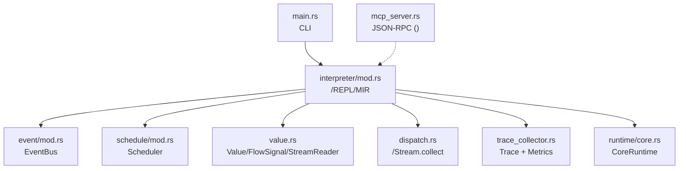
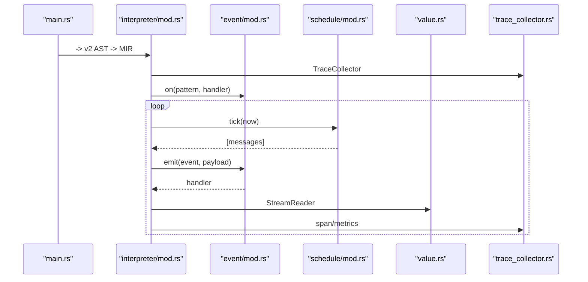
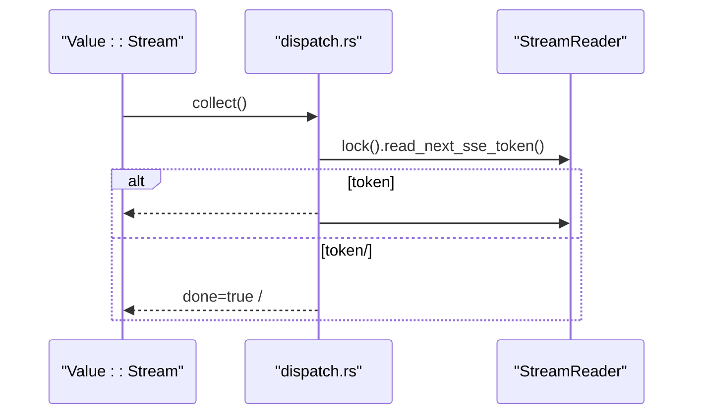
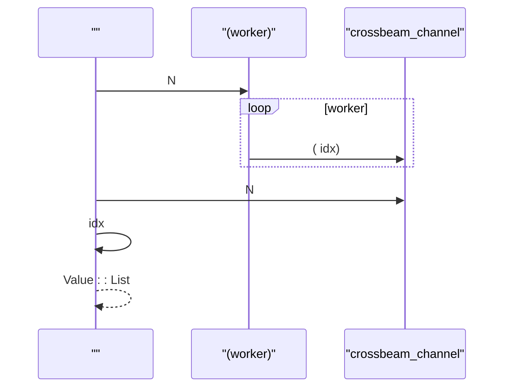
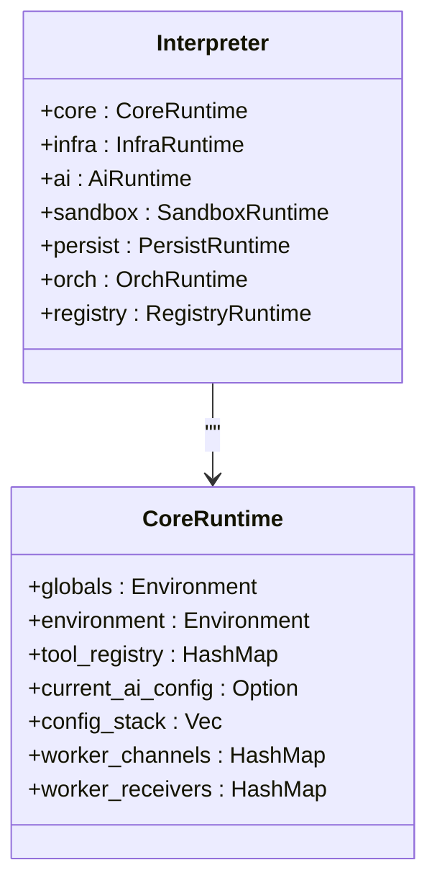
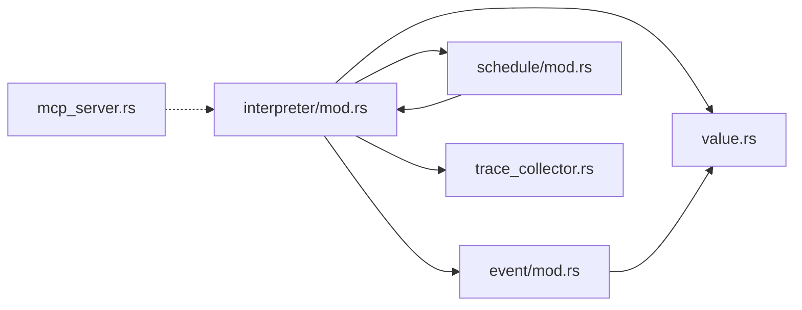

# 

<cite>
****   
- [src/lib.rs](file://src/lib.rs)
- [src/event/mod.rs](file://src/event/mod.rs)
- [src/schedule/mod.rs](file://src/schedule/mod.rs)
- [src/value.rs](file://src/value.rs)
- [src/interpreter/mod.rs](file://src/interpreter/mod.rs)
- [src/interpreter/dispatch.rs](file://src/interpreter/dispatch.rs)
- [src/main.rs](file://src/main.rs)
- [src/trace_collector.rs](file://src/trace_collector.rs)
- [src/runtime/core.rs](file://src/runtime/core.rs)
- [src/mcp_server.rs](file://src/mcp_server.rs)
</cite>

## 
1. [](#)
2. [](#)
3. [](#)
4. [](#)
5. [](#)
6. [](#)
7. [](#)
8. [](#)
9. [](#)
10. [](#)

## 
 Mora 
- FlowSignal 
- 
- StreamReader
- cron
- 
- 
- 
- 

Mora “” cron 

## 

- src/event/mod.rs
- src/schedule/mod.rs
- src/value.rs
- src/interpreter/mod.rs, src/interpreter/dispatch.rs
- /src/main.rs
- src/trace_collector.rs
- src/runtime/core.rs
- MCP src/mcp_server.rs




- [src/main.rs:370-405](file://src/main.rs#L370-L405)
- [src/interpreter/mod.rs:373-440](file://src/interpreter/mod.rs#L373-L440)
- [src/event/mod.rs:68-168](file://src/event/mod.rs#L68-L168)
- [src/schedule/mod.rs:66-208](file://src/schedule/mod.rs#L66-L208)
- [src/value.rs:14-28](file://src/value.rs#L14-L28)
- [src/interpreter/dispatch.rs:959-984](file://src/interpreter/dispatch.rs#L959-L984)
- [src/trace_collector.rs:1-55](file://src/trace_collector.rs#L1-L55)
- [src/runtime/core.rs:14-47](file://src/runtime/core.rs#L14-L47)
- [src/mcp_server.rs:162-237](file://src/mcp_server.rs#L162-L237)


- [src/lib.rs:1-55](file://src/lib.rs#L1-L55)
- [src/main.rs:370-405](file://src/main.rs#L370-L405)

## 
-  EventBus on/off/emit/pattern_count  emit 
-  Scheduler Every/At  Jobtick  JSON
-  Value/FlowSignal/StreamReader return/break/continue/interrupt BufReader
-  Interpreter CoreRuntime/Infra/AI/Sandbox/Persist/Orch/Registry  facade REPLMIR 
-  TraceCollector Span  Metrics OpenTelemetry Collector  JSON
- MCP  tokio  JSON-RPC 


- [src/event/mod.rs:28-66](file://src/event/mod.rs#L28-L66)
- [src/schedule/mod.rs:25-57](file://src/schedule/mod.rs#L25-L57)
- [src/value.rs:14-28](file://src/value.rs#L14-L28)
- [src/value.rs:583-614](file://src/value.rs#L583-L614)
- [src/interpreter/mod.rs:214-271](file://src/interpreter/mod.rs#L214-L271)
- [src/trace_collector.rs:1-55](file://src/trace_collector.rs#L1-L55)
- [src/mcp_server.rs:162-237](file://src/mcp_server.rs#L162-L237)

## 
Mora  CLI  MIR  StreamReader  IO  TraceCollector 




- [src/main.rs:370-405](file://src/main.rs#L370-L405)
- [src/interpreter/mod.rs:373-440](file://src/interpreter/mod.rs#L373-L440)
- [src/event/mod.rs:119-168](file://src/event/mod.rs#L119-L168)
- [src/schedule/mod.rs:176-208](file://src/schedule/mod.rs#L176-L208)
- [src/value.rs:14-28](file://src/value.rs#L14-L28)
- [src/trace_collector.rs:1-55](file://src/trace_collector.rs#L1-L55)

## 

### 
- exactprefixinterior
- emit 
  - exactO(1) 
  - prefixO(segments) 
  - interior
- RwLock emit  handlers 

```mermaid
flowchart TD
Start(["emit(event, payload)"]) --> Exact[" exact[event]"]
Exact --> Prefix[":  segments  prefix[seg0..segN]"]
Prefix --> Interior[":  interior "]
Interior --> Snapshot[" Handler "]
Snapshot --> Invoke[" handler(event, payload)"]
Invoke --> End([""])
```


- [src/event/mod.rs:119-168](file://src/event/mod.rs#L119-L168)
- [src/event/mod.rs:230-253](file://src/event/mod.rs#L230-L253)
- [src/event/mod.rs:263-302](file://src/event/mod.rs#L263-L302)


- [src/event/mod.rs:28-66](file://src/event/mod.rs#L28-L66)
- [src/event/mod.rs:68-108](file://src/event/mod.rs#L68-L108)
- [src/event/mod.rs:119-168](file://src/event/mod.rs#L119-L168)
- [src/event/mod.rs:230-253](file://src/event/mod.rs#L230-L253)
- [src/event/mod.rs:263-302](file://src/event/mod.rs#L263-L302)

### FlowSignal 
- FlowSignal None/Return/Break/Continue/Interrupt
- Interrupt before/after channels 
-  MIR  Result<Option<Value>, String> 

```mermaid
classDiagram
class FlowSignal {
+None
+Return(Value)
+Break
+Continue
+Interrupt{node, when, channels}
+into_value() Value
+is_return() bool
}
```


- [src/value.rs:583-614](file://src/value.rs#L583-L614)


- [src/value.rs:583-614](file://src/value.rs#L583-L614)

### StreamReader
- StreamReader  BufReader<Box<dyn Read + Send + Sync>> lock  reader
- Stream  StreamReader  done dispatch  collect  token 




- [src/value.rs:14-28](file://src/value.rs#L14-L28)
- [src/interpreter/dispatch.rs:959-984](file://src/interpreter/dispatch.rs#L959-L984)


- [src/value.rs:14-28](file://src/value.rs#L14-L28)
- [src/interpreter/dispatch.rs:959-984](file://src/interpreter/dispatch.rs#L959-L984)

### cron
- JobKindEvery/ At
- add/list/remove/ticktick  jobs delete_after_run 
-  JSON best-effort

```mermaid
flowchart TD
Add["add(name, kind, message, interval_s|at_epoch)"] --> Validate{""}
Validate --> || Insert[" job "]
Validate --> || Err[""]
Tick["tick(now)"] --> Scan[" jobs "]
Scan --> Fire[" messages  last_run_epoch"]
Fire --> Cleanup{"delete_after_run ?"}
Cleanup --> || Remove[" job"]
Cleanup --> || Keep[" job"]
Remove --> Save[""]
Keep --> Save
```


- [src/schedule/mod.rs:96-148](file://src/schedule/mod.rs#L96-L148)
- [src/schedule/mod.rs:176-208](file://src/schedule/mod.rs#L176-L208)
- [src/schedule/mod.rs:216-248](file://src/schedule/mod.rs#L216-L248)


- [src/schedule/mod.rs:25-57](file://src/schedule/mod.rs#L25-L57)
- [src/schedule/mod.rs:96-148](file://src/schedule/mod.rs#L96-L148)
- [src/schedule/mod.rs:176-208](file://src/schedule/mod.rs#L176-L208)
- [src/schedule/mod.rs:216-248](file://src/schedule/mod.rs#L216-L248)

### 
- builtins  thread::spawn  workercrossbeam_channel 
-  AtomicBool  kill 
- worker  channel  emit 




- [src/interpreter/builtins.rs:2217-2262](file://src/interpreter/builtins.rs#L2217-L2262)
- [src/interpreter/builtins.rs:2330-2367](file://src/interpreter/builtins.rs#L2330-L2367)


- [src/interpreter/builtins.rs:2217-2262](file://src/interpreter/builtins.rs#L2217-L2262)
- [src/interpreter/builtins.rs:2330-2367](file://src/interpreter/builtins.rs#L2330-L2367)

### 
- CLI  REPL  MIR orchestratePregel  reducer
-  tick jobs kind  last_run_epoch/at_epoch  delete_after_run

```mermaid
flowchart TD
LoopStart[""] --> Orchestrate["orchestrate :  next_nodes"]
Orchestrate --> ApplyWrite["apply_write(state, value)  reducer"]
ApplyWrite --> Checkpoint["checkpoint  step "]
Checkpoint --> ScheduleTick["scheduler.tick(now) "]
ScheduleTick --> EmitEvents["emit "]
EmitEvents --> LoopEnd["/"]
```


- [src/interpreter/orchestrate_v2.rs:322-351](file://src/interpreter/orchestrate_v2.rs#L322-L351)
- [src/schedule/mod.rs:176-208](file://src/schedule/mod.rs#L176-L208)


- [src/interpreter/orchestrate_v2.rs:322-351](file://src/interpreter/orchestrate_v2.rs#L322-L351)
- [src/schedule/mod.rs:176-208](file://src/schedule/mod.rs#L176-L208)

### 
- CoreRuntime AI  worker 
-  parking_lot::Mutex  Arc Interpreter  facade 
-  RwLock  emit  Mutex  jobs 




- [src/runtime/core.rs:14-47](file://src/runtime/core.rs#L14-L47)
- [src/interpreter/mod.rs:214-271](file://src/interpreter/mod.rs#L214-L271)


- [src/runtime/core.rs:14-47](file://src/runtime/core.rs#L14-L47)
- [src/interpreter/mod.rs:214-271](file://src/interpreter/mod.rs#L214-L271)

### 
- //CLI  record/replay/diff/stats/timeline/export  AI/web  .mora/recordings/*.jsonl Markdown/JSONL
- TraceCollector Span  MetricsToken 
- 
  -  trace stats 
  -  snapshot diff 


- [src/main.rs:425-487](file://src/main.rs#L425-L487)
- [src/main.rs:489-541](file://src/main.rs#L489-L541)
- [src/main.rs:543-595](file://src/main.rs#L543-L595)
- [src/main.rs:634-678](file://src/main.rs#L634-L678)
- [src/trace_collector.rs:1-55](file://src/trace_collector.rs#L1-L55)

### 
- 
  - /
  - /
- 
  - pattern+payload
  - 
  -  trace/span  metrics
  -  checkpoint  interrupt 

[]

## 
- 
-  Value  payload 
-  emit 
- MCP  JSON-RPC 




- [src/interpreter/mod.rs:373-440](file://src/interpreter/mod.rs#L373-L440)
- [src/event/mod.rs:28-66](file://src/event/mod.rs#L28-L66)
- [src/schedule/mod.rs:66-208](file://src/schedule/mod.rs#L66-L208)
- [src/value.rs:14-28](file://src/value.rs#L14-L28)
- [src/trace_collector.rs:1-55](file://src/trace_collector.rs#L1-L55)
- [src/mcp_server.rs:162-237](file://src/mcp_server.rs#L162-L237)


- [src/interpreter/mod.rs:373-440](file://src/interpreter/mod.rs#L373-L440)
- [src/event/mod.rs:28-66](file://src/event/mod.rs#L28-L66)
- [src/schedule/mod.rs:66-208](file://src/schedule/mod.rs#L66-L208)
- [src/value.rs:14-28](file://src/value.rs#L14-L28)
- [src/trace_collector.rs:1-55](file://src/trace_collector.rs#L1-L55)
- [src/mcp_server.rs:162-237](file://src/mcp_server.rs#L162-L237)

## 
-  emitv0.41  O(segments)  O(patterns × segments) 
- collect  token done 
-  idx 
- TraceCollector 

[]

## 
- 
  -  pattern exact/prefix/interior on  off 
  -  emit  handler
- 
  -  is_done  read_next_sse_token  reader  EOF 
- 
  -  add interval_s/at_epoch now  tick 
- 
  -  kill 


- [src/event/mod.rs:119-168](file://src/event/mod.rs#L119-L168)
- [src/interpreter/dispatch.rs:959-984](file://src/interpreter/dispatch.rs#L959-L984)
- [src/schedule/mod.rs:176-208](file://src/schedule/mod.rs#L176-L208)
- [src/interpreter/builtins.rs:2330-2367](file://src/interpreter/builtins.rs#L2330-L2367)

## 
Mora  cron FlowSignal TraceCollector 

[]

## 
- 
  -  pattern 
  -  worker  channel  emit 
  -  checkpoint  interrupt 
  -  schedule.add 
  -  trace stats  timeline 

[]