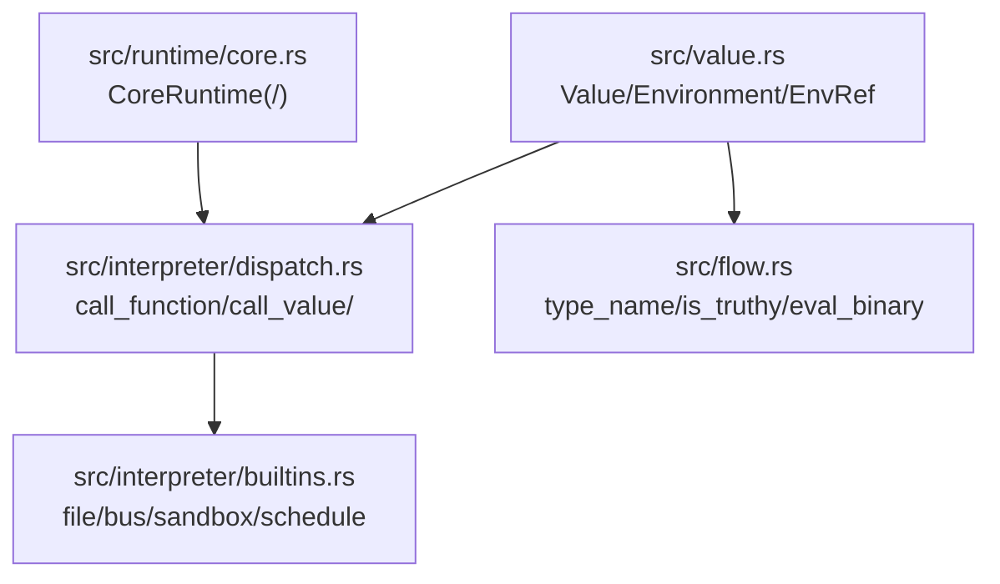
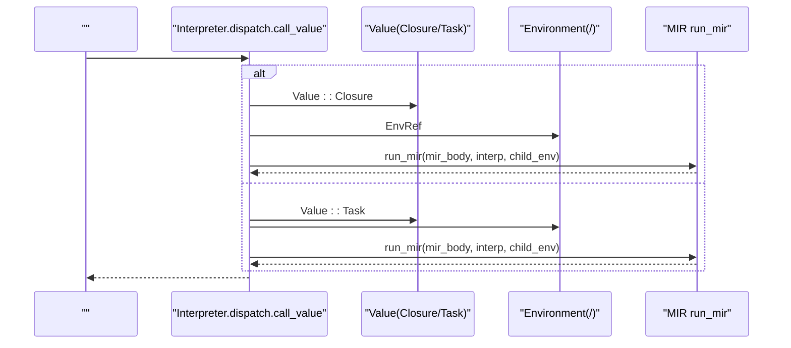
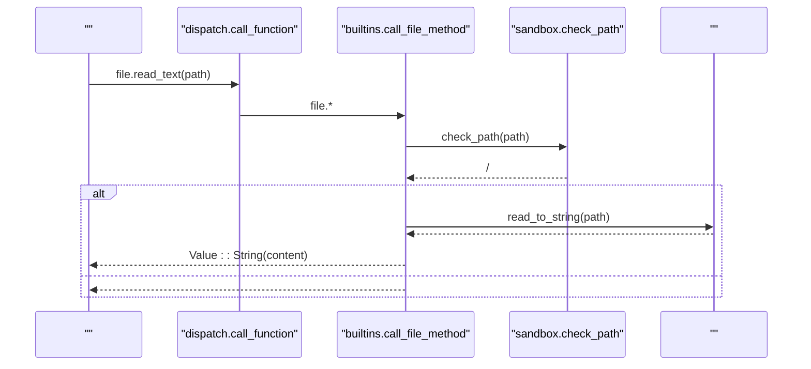
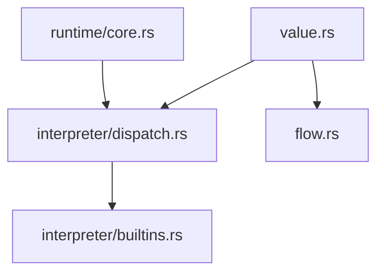

# 

<cite>
****   
- [src/value.rs](file://src/value.rs)
- [src/interpreter/dispatch.rs](file://src/interpreter/dispatch.rs)
- [src/interpreter/builtins.rs](file://src/interpreter/builtins.rs)
- [src/flow.rs](file://src/flow.rs)
- [src/runtime/core.rs](file://src/runtime/core.rs)
</cite>

## 
1. [](#)
2. [](#)
3. [](#)
4. [](#)
5. [](#)
6. [](#)
7. [](#)
8. [](#)
9. [](#)
10. [](#)

## 
 Mora  Value ///Builtin

## 

- src/value.rs Value EnvironmentEnvRef StreamReader FlowSignal 
- src/interpreter/dispatch.rs///
- src/interpreter/builtins.rs API  filebussandboxschedule 
- src/flow.rs
- src/runtime/core.rsCoreRuntime 




- [src/value.rs:142-263](file://src/value.rs#L142-L263)
- [src/interpreter/dispatch.rs:1096-1154](file://src/interpreter/dispatch.rs#L1096-L1154)
- [src/interpreter/builtins.rs:16-256](file://src/interpreter/builtins.rs#L16-L256)
- [src/flow.rs:307-387](file://src/flow.rs#L307-L387)
- [src/runtime/core.rs:17-47](file://src/runtime/core.rs#L17-L47)


- [src/value.rs:142-263](file://src/value.rs#L142-L263)
- [src/interpreter/dispatch.rs:1096-1154](file://src/interpreter/dispatch.rs#L1096-L1154)
- [src/interpreter/builtins.rs:16-256](file://src/interpreter/builtins.rs#L16-L256)
- [src/flow.rs:307-387](file://src/flow.rs#L307-L387)
- [src/runtime/core.rs:17-47](file://src/runtime/core.rs#L17-L47)

## 
- Value 
- Environment
- EnvRef
- BuiltinKind
- CoreRuntime


- [src/value.rs:142-263](file://src/value.rs#L142-L263)
- [src/value.rs:117-140](file://src/value.rs#L117-L140)
- [src/value.rs:43-115](file://src/value.rs#L43-L115)
- [src/runtime/core.rs:17-47](file://src/runtime/core.rs#L17-L47)

## 
Mora “ + ” Value “” dispatch  Value  API 




- [src/interpreter/dispatch.rs:1096-1154](file://src/interpreter/dispatch.rs#L1096-L1154)
- [src/value.rs:170-180](file://src/value.rs#L170-L180)
- [src/value.rs:154-169](file://src/value.rs#L154-L169)

## 

### Value 
- StringCharIntFloatBoolNil
- List(Vec<Value>)Dict(HashMap<String, Value>)
- Task{mir_body}, Tool{mir_body}, Closure{env, mir_body}
- ConversationStreamAgentAiConfigRouterHttpRequestMcpServerTraitObjectComposePartialAtomMacroPromptSectionDocument
- Builtin(BuiltinKind)


-  Arc/Mutex  Router.routesAtomStream.doneStreamReader
- MIR  Arc<MirFunction> 
-  EnvRef(Box<Environment>)  Send

```mermaid
classDiagram
class Value {
+String
+Char
+Int
+Float
+Bool
+Nil
+List(Vec~Value~)
+Dict(HashMap~String, Value~)
+Task{mir_body}
+Tool{mir_body}
+Closure{env, mir_body}
+Builtin(BuiltinKind)
+Conversation
+Stream{reader, done}
+Agent
+AiConfig
+Router{routes}
+HttpRequest
+McpServer
+TraitObject
+Compose(Vec~Value~)
+Partial(Box~Value~, Vec~Value~)
+Atom(Arc~Mutex~Value~~)
+Macro
+PromptSection
+Document
}
class EnvRef {
+Box~Environment~
+from_arc_mutex(parent)
+env()
}
class Environment {
+values
+exports
+parent
+define(name, value, exported)
+get(name)
+assign(name, value)
+move_variable(name)
+borrow_variable(name)
+iter()
}
Value --> EnvRef : "Closure.env"
EnvRef --> Environment : ""
```


- [src/value.rs:142-263](file://src/value.rs#L142-L263)
- [src/value.rs:117-140](file://src/value.rs#L117-L140)
- [src/value.rs:462-581](file://src/value.rs#L462-L581)


- [src/value.rs:142-263](file://src/value.rs#L142-L263)
- [src/value.rs:117-140](file://src/value.rs#L117-L140)
- [src/value.rs:462-581](file://src/value.rs#L462-L581)

### 
- 
  - 
  -  Atom  Arc<Mutex<Value>> 
  -  Stream  StreamReader  Arc<Mutex<bool>> 
  -  Router  Arc<Mutex<Vec<(method,path,handler)>>>
- 
  - Value  Clone Arc 
  - / push/pop/take/drop
- 
  - PartialEq  Document  metadata
  -  Int/Float


- [src/value.rs:265-295](file://src/value.rs#L265-L295)
- [src/flow.rs:99-171](file://src/flow.rs#L99-L171)

### 
- Display
  -  Float  NaN/Inf panic
  - List/Dict 
- JSON 
  -  Value::List  JSON 
  -  flow  JSON 


- [src/value.rs:297-459](file://src/value.rs#L297-L459)
- [src/compress/mod.rs:268-287](file://src/compress/mod.rs#L268-L287)

### String Interning
- 
  -  intern 
  -  String 
- 
  - Arc<RwLock<HashMap<String, Arc<String>>>> Value::String  Arc<String>
  - 
  - LRU 

[]

### Builtin
- 
  -  BuiltinKind Display 
  -  file.*bus.*sandbox.*
- 
  -  call_function  printrangelencomposepartialatomswapdereftype_ofis_instancemethods_ofcompress 
  -  call_file_methodcall_event_methodcall_sandbox_methodcall_schedule_method 
- 
  -  sandbox.check_path 
  - sandbox.key/check_call/revoke audit_emit/audit_flush/audit_verify 




- [src/interpreter/dispatch.rs:32-120](file://src/interpreter/dispatch.rs#L32-L120)
- [src/interpreter/builtins.rs:16-120](file://src/interpreter/builtins.rs#L16-L120)


- [src/value.rs:43-115](file://src/value.rs#L43-L115)
- [src/interpreter/dispatch.rs:32-200](file://src/interpreter/dispatch.rs#L32-L200)
- [src/interpreter/builtins.rs:16-256](file://src/interpreter/builtins.rs#L16-L256)

### 
- 
  -  EnvRef Arc<Mutex<Environment>> 
- 
  -  EnvRef  MIR 
- 
  - Task  environment  MIR 

```mermaid
flowchart TD
Start([" call_value"]) --> MatchClosure{" Value::Closure?"}
MatchClosure --> || CloneEnv[" EnvRef "]
CloneEnv --> BindParams[""]
BindParams --> RunMir["run_mir(mir_body, interp, child_env)"]
RunMir --> Return([""])
MatchClosure --> || MatchTask{" Value::Task?"}
MatchTask --> || CloneCurrentEnv[""]
CloneCurrentEnv --> BindParamsTask[""]
BindParamsTask --> RunMirTask["run_mir(mir_body, interp, child_env)"]
RunMirTask --> Return
MatchTask --> || Error[" -> "]
```


- [src/interpreter/dispatch.rs:1096-1154](file://src/interpreter/dispatch.rs#L1096-L1154)
- [src/value.rs:117-140](file://src/value.rs#L117-L140)


- [src/interpreter/dispatch.rs:1096-1154](file://src/interpreter/dispatch.rs#L1096-L1154)
- [src/value.rs:117-140](file://src/value.rs#L117-L140)

### 
- 
  - type_name/value_type_name get_methods_for_value 
- 
  - is_truthy  Nil/Bool/Float/String/List/Dict 
- 
  - eval_binary Int+IntFloat+Float
- 
  -  API 
  - 
  - 


- [src/flow.rs:307-387](file://src/flow.rs#L307-L387)
- [src/flow.rs:99-200](file://src/flow.rs#L99-L200)

### 
- 
  -  Arc  Router.routesAtomStreamReaderMIR  Mutex/parking_lot::Mutex 
-  GC
  -  Rust  RAII 
- 
  -  Value  Atom Display 
  -  parking_lot::Mutex
  -  Dict/List Arc 


- [src/value.rs:142-263](file://src/value.rs#L142-L263)
- [src/value.rs:297-459](file://src/value.rs#L297-L459)

## 
- 
  - dispatch  value  flow
  - builtins  interpreter  sandbox/infra/persist 
  - runtime/core 
- 
  - tokio  HTTP/MCP 
  - parking_lot 
  - crossbeam_channel  worker 




- [src/value.rs:142-263](file://src/value.rs#L142-L263)
- [src/interpreter/dispatch.rs:1096-1154](file://src/interpreter/dispatch.rs#L1096-L1154)
- [src/interpreter/builtins.rs:16-256](file://src/interpreter/builtins.rs#L16-L256)
- [src/flow.rs:307-387](file://src/flow.rs#L307-L387)
- [src/runtime/core.rs:17-47](file://src/runtime/core.rs#L17-L47)


- [src/value.rs:142-263](file://src/value.rs#L142-L263)
- [src/interpreter/dispatch.rs:1096-1154](file://src/interpreter/dispatch.rs#L1096-L1154)
- [src/interpreter/builtins.rs:16-256](file://src/interpreter/builtins.rs#L16-L256)
- [src/flow.rs:307-387](file://src/flow.rs#L307-L387)
- [src/runtime/core.rs:17-47](file://src/runtime/core.rs#L17-L47)

## 
- 
  -  Arc 
- 
  -  Mutex 
- 
  - Display 
- 
  - 

[]

## 
- 
  -  len  list/string/dict
  -  bus.emit  string 
  -  sandbox.check_path 
- 
  -  methods_of 
  -  type_of 
  -  sandbox.audit_emit/audit_flush/audit_verify 


- [src/interpreter/dispatch.rs:106-120](file://src/interpreter/dispatch.rs#L106-L120)
- [src/interpreter/builtins.rs:260-327](file://src/interpreter/builtins.rs#L260-L327)
- [src/interpreter/builtins.rs:331-527](file://src/interpreter/builtins.rs#L331-L527)

## 
Mora  Value  BuiltinKind  EnvRef  MIR  Arc/Mutex  GC

[]

## 
- 
  -  Value 
  -  Value 
  - 
- 
  - [src/value.rs:142-295](file://src/value.rs#L142-L295)
  - [src/value.rs:297-459](file://src/value.rs#L297-L459)
  - /[src/interpreter/dispatch.rs:1096-1154](file://src/interpreter/dispatch.rs#L1096-L1154)
  - [src/interpreter/builtins.rs:16-256](file://src/interpreter/builtins.rs#L16-L256)
  - [src/flow.rs:307-387](file://src/flow.rs#L307-L387)
  - [src/runtime/core.rs:17-47](file://src/runtime/core.rs#L17-L47)