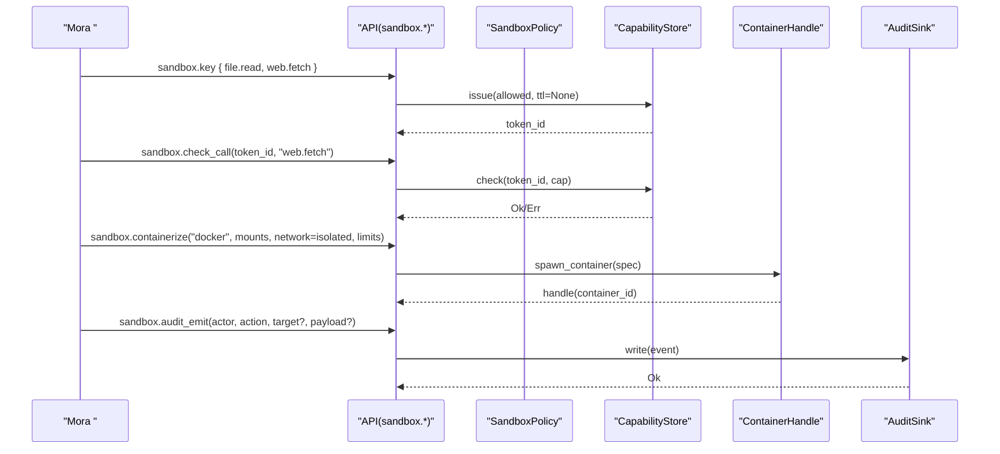
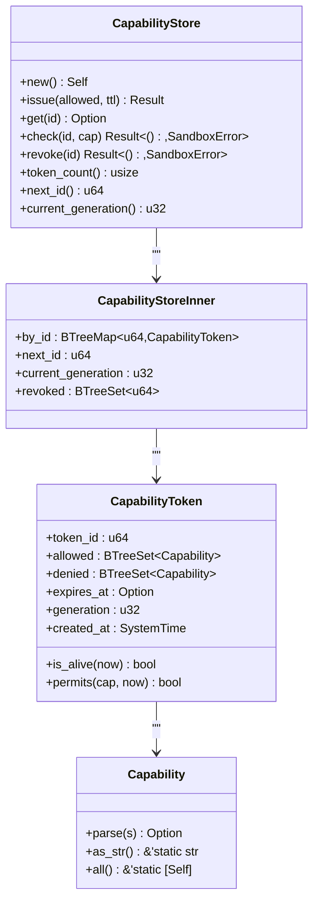
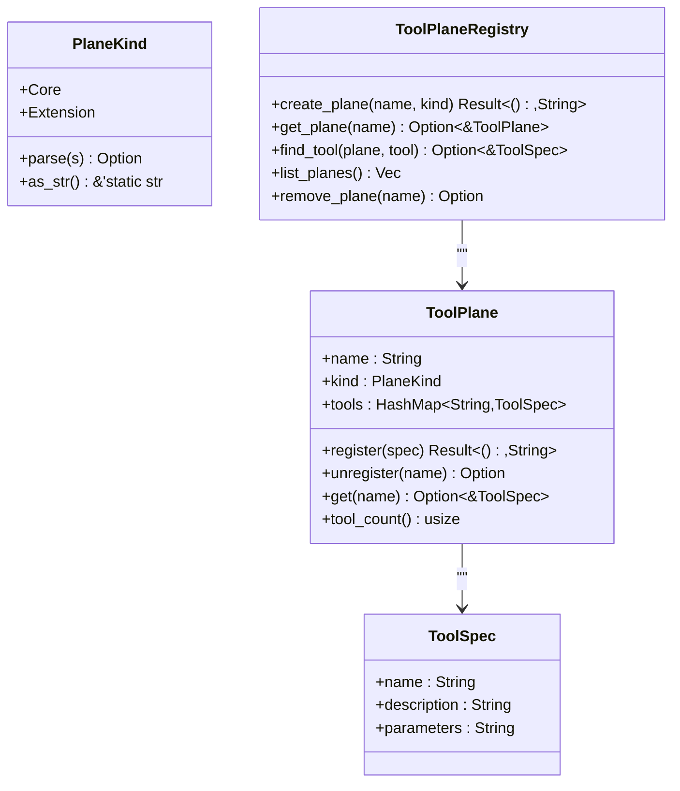
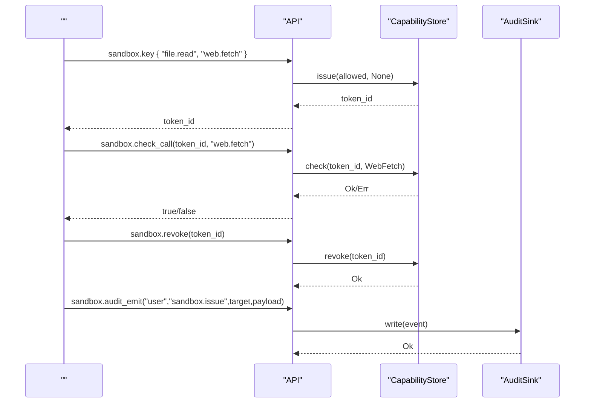

# 

<cite>
****   
- [src/sandbox/mod.rs](file://src/sandbox/mod.rs)
- [src/sandbox/capability.rs](file://src/sandbox/capability.rs)
- [src/sandbox/container.rs](file://src/sandbox/container.rs)
- [src/toolplane/mod.rs](file://src/toolplane/mod.rs)
- [src/audit/mod.rs](file://src/audit/mod.rs)
- [src/runtime/sandbox.rs](file://src/runtime/sandbox.rs)
- [src/interpreter/builtins.rs](file://src/interpreter/builtins.rs)
</cite>

## 
1. [](#)
2. [](#)
3. [](#)
4. [](#)
5. [](#)
6. [](#)
7. [](#)
8. [](#)
9. [](#)
10. [](#)

## 
 Mora  v0.33–v0.52 
- CapabilityStore 
- Docker 
-  ToolPlane 
- 
- sandbox.key / sandbox.check_call / sandbox.revoke
- SHA-256 JSONL 
- 

## 

- src/sandbox
- src/toolplane
- src/audit
- src/runtime/sandbox
- src/interpreter/builtins API

```mermaid
graph TB
subgraph ""
SP["SandboxPolicy<br/>"]
CS["CapabilityStore<br/>"]
CT["ContainerSpec/Handle<br/>"]
end
subgraph ""
TP["ToolPlaneRegistry<br/>Core/Extension "]
end
subgraph ""
AUD["AuditSink(JSONL+SHA-256)"]
end
subgraph ""
SR["SandboxRuntime<br/>//"]
end
subgraph ""
BI["Interpreter Builtins<br/>sandbox.* "]
end
BI --> SP
BI --> CS
BI --> CT
BI --> TP
BI --> AUD
SR --> SP
SR --> CS
SR --> CT
SR --> TP
```


- [src/sandbox/mod.rs:36-143](file://src/sandbox/mod.rs#L36-L143)
- [src/sandbox/capability.rs:203-317](file://src/sandbox/capability.rs#L203-L317)
- [src/sandbox/container.rs:118-196](file://src/sandbox/container.rs#L118-L196)
- [src/toolplane/mod.rs:99-149](file://src/toolplane/mod.rs#L99-L149)
- [src/audit/mod.rs:205-385](file://src/audit/mod.rs#L205-L385)
- [src/runtime/sandbox.rs:13-35](file://src/runtime/sandbox.rs#L13-L35)
- [src/interpreter/builtins.rs:374-527](file://src/interpreter/builtins.rs#L374-L527)


- [src/sandbox/mod.rs:36-143](file://src/sandbox/mod.rs#L36-L143)
- [src/sandbox/capability.rs:203-317](file://src/sandbox/capability.rs#L203-L317)
- [src/sandbox/container.rs:118-196](file://src/sandbox/container.rs#L118-L196)
- [src/toolplane/mod.rs:99-149](file://src/toolplane/mod.rs#L99-L149)
- [src/audit/mod.rs:205-385](file://src/audit/mod.rs#L205-L385)
- [src/runtime/sandbox.rs:13-35](file://src/runtime/sandbox.rs#L13-L35)
- [src/interpreter/builtins.rs:374-527](file://src/interpreter/builtins.rs#L374-L527)

## 
- SandboxPolicy allow/deny  Builtin  fs_root 
- CapabilityStore
- ContainerSpec/Handle Docker 
- ToolPlaneRegistry Core  Extension
- AuditSinkJSONL + SHA-256 
- SandboxRuntime


- [src/sandbox/mod.rs:36-143](file://src/sandbox/mod.rs#L36-L143)
- [src/sandbox/capability.rs:203-317](file://src/sandbox/capability.rs#L203-L317)
- [src/sandbox/container.rs:118-196](file://src/sandbox/container.rs#L118-L196)
- [src/toolplane/mod.rs:99-149](file://src/toolplane/mod.rs#L99-L149)
- [src/audit/mod.rs:205-385](file://src/audit/mod.rs#L205-L385)
- [src/runtime/sandbox.rs:13-35](file://src/runtime/sandbox.rs#L13-L35)

## 
Mora “ +  +  + ”
- SandboxPolicy  allow/deny  fs_root  builtin 
- CapabilityStore  token  TTL 
- ContainerSpec/Handle  Docker CPU/
- AuditSink 




- [src/interpreter/builtins.rs:374-527](file://src/interpreter/builtins.rs#L374-L527)
- [src/sandbox/capability.rs:203-317](file://src/sandbox/capability.rs#L203-L317)
- [src/sandbox/container.rs:345-396](file://src/sandbox/container.rs#L345-L396)
- [src/audit/mod.rs:274-385](file://src/audit/mod.rs#L274-L385)

## 

### CapabilityStore 
- 
  - Agent 
  -  allowed/denied generation
  -  Arc<RwLock> revoke  generation
  - deny  → alive  → allowed 
- 
  - issue token_id expires_at current_generation
  - check get + permits revoked  generation  TokenNotFound
  - revoke revoked  current_generation token
- 
  -  O(log N)BTreeMap/BTreeSet RwLock 
  - revoke  O(1) check  O(log N)




- [src/sandbox/capability.rs:22-98](file://src/sandbox/capability.rs#L22-L98)
- [src/sandbox/capability.rs:108-138](file://src/sandbox/capability.rs#L108-L138)
- [src/sandbox/capability.rs:203-317](file://src/sandbox/capability.rs#L203-L317)


- [src/sandbox/capability.rs:22-98](file://src/sandbox/capability.rs#L22-L98)
- [src/sandbox/capability.rs:108-138](file://src/sandbox/capability.rs#L108-L138)
- [src/sandbox/capability.rs:203-317](file://src/sandbox/capability.rs#L203-L317)

### Docker
- 
  -  Isolated--network=none Host
  - host_path:container_path[:mode] ro/rw
  - CPU --cpus/--memory
  -  alpine:latest
- 
  - spawn_container spec → docker run -d →  container_id
  - exec/exec_with_timeoutdocker exec 
  - destroy/Drop docker rm -fbest-effort 
- 
  - generate_container_name + 

```mermaid
flowchart TD
Start([""]) --> Validate[" ContainerSpec"]
Validate --> CheckDocker{"docker CLI ?"}
CheckDocker --> || ErrDocker[": daemon "]
CheckDocker --> || BuildArgs[" docker run "]
BuildArgs --> Run[" docker run -d ... sleep infinity"]
Run --> Success{"?"}
Success --> || ErrRun[": docker run "]
Success --> Handle[" ContainerHandle"]
Handle --> Exec["exec/exec_with_timeout(cmd)"]
Exec --> Timeout{"?"}
Timeout --> || Kill["kill "] --> ErrTimeout[""]
Timeout --> || Out[" exit_code/stdout/stderr"]
Handle --> Destroy["destroy()/Drop "]
Destroy --> End([""])
ErrDocker --> End
ErrRun --> End
ErrTimeout --> End
Out --> End
```


- [src/sandbox/container.rs:118-196](file://src/sandbox/container.rs#L118-L196)
- [src/sandbox/container.rs:345-396](file://src/sandbox/container.rs#L345-L396)
- [src/sandbox/container.rs:246-326](file://src/sandbox/container.rs#L246-L326)
- [src/sandbox/container.rs:398-411](file://src/sandbox/container.rs#L398-L411)


- [src/sandbox/container.rs:118-196](file://src/sandbox/container.rs#L118-L196)
- [src/sandbox/container.rs:345-396](file://src/sandbox/container.rs#L345-L396)
- [src/sandbox/container.rs:246-326](file://src/sandbox/container.rs#L246-L326)
- [src/sandbox/container.rs:398-411](file://src/sandbox/container.rs#L398-L411)

### ToolPlane
- 
  - Core aisandbox
  - Extension/
- 
  - create_plane/register/unregister/find_tool 
- 
  -  Core 




- [src/toolplane/mod.rs:21-44](file://src/toolplane/mod.rs#L21-L44)
- [src/toolplane/mod.rs:46-97](file://src/toolplane/mod.rs#L46-L97)
- [src/toolplane/mod.rs:99-149](file://src/toolplane/mod.rs#L99-L149)


- [src/toolplane/mod.rs:21-44](file://src/toolplane/mod.rs#L21-L44)
- [src/toolplane/mod.rs:46-97](file://src/toolplane/mod.rs#L46-L97)
- [src/toolplane/mod.rs:99-149](file://src/toolplane/mod.rs#L99-L149)

### 
- 
  - SandboxPolicy.check_path ..  fs_root  fs_root 
- 
  -  Capability  WebFetch/WebSearch 
- 
  -  Capability  ExecBash/ExecParallel  docker exec

```mermaid
flowchart TD
A[": //"] --> B{"?"}
B --> || C["<br/>//CPU&"]
B --> || D[""]
D --> E{"SandboxPolicy.check_builtin(name)"}
E --> || F[""]
E --> || G{"CapabilityStore.check(token, cap)"}
G --> || H[""]
G --> || I{"check_path(path) ?"}
I --> || J[""]
I --> || K[""]
```


- [src/sandbox/mod.rs:82-143](file://src/sandbox/mod.rs#L82-L143)
- [src/sandbox/capability.rs:203-317](file://src/sandbox/capability.rs#L203-L317)
- [src/sandbox/container.rs:118-196](file://src/sandbox/container.rs#L118-L196)


- [src/sandbox/mod.rs:82-143](file://src/sandbox/mod.rs#L82-L143)
- [src/sandbox/capability.rs:203-317](file://src/sandbox/capability.rs#L203-L317)
- [src/sandbox/container.rs:118-196](file://src/sandbox/container.rs#L118-L196)

### 
- 
  -  Capability 
- 
  - sandbox.key TTL=None
  - sandbox.check_call
  - sandbox.revoke generation
- 
  - sandbox.audit_emit actor/action/target/payload/token_id




- [src/interpreter/builtins.rs:374-527](file://src/interpreter/builtins.rs#L374-L527)
- [src/sandbox/capability.rs:203-317](file://src/sandbox/capability.rs#L203-L317)
- [src/audit/mod.rs:274-385](file://src/audit/mod.rs#L274-L385)


- [src/interpreter/builtins.rs:374-527](file://src/interpreter/builtins.rs#L374-L527)
- [src/sandbox/capability.rs:203-317](file://src/sandbox/capability.rs#L203-L317)
- [src/audit/mod.rs:274-385](file://src/audit/mod.rs#L274-L385)

### 
-  tokenprev_hashhash
-  JSON  prev/hashverify_chain 
- JsonlAuditSink  last_hash

```mermaid
flowchart TD
W["write(event)"] --> Seal[" self.hash = SHA-256(canonical + prev)"]
Seal --> Append[" JSON "]
Append --> Update[" last_hash "]
V["verify_chain()"] --> Read[""]
Read --> ReCalc[" hash"]
ReCalc --> Compare{"stored == computed ?"}
Compare --> || Fail[" HashMismatch/ChainBroken"]
Compare --> || Next[""]
Next --> Done[""]
```


- [src/audit/mod.rs:274-385](file://src/audit/mod.rs#L274-L385)


- [src/audit/mod.rs:274-385](file://src/audit/mod.rs#L274-L385)

## 
- 
  - SandboxPolicy  CapabilityStore 
  - ContainerHandle  Spec Handle 
  - ToolPlaneRegistry  SandboxRuntime  Arc<Mutex<>> 
- 
  - Docker CLI docker 
  - sha2
- 
  - 

```mermaid
graph LR
POL["SandboxPolicy"] --> CAP["CapabilityStore"]
POL --> FS[""]
CAP --> AUD["AuditSink()"]
CTR["ContainerHandle"] --> DOCK["Docker CLI"]
SR["SandboxRuntime"] --> POL
SR --> CAP
SR --> CTR
SR --> TP["ToolPlaneRegistry"]
BI["Builtins"] --> SR
```


- [src/runtime/sandbox.rs:13-35](file://src/runtime/sandbox.rs#L13-L35)
- [src/sandbox/mod.rs:36-143](file://src/sandbox/mod.rs#L36-L143)
- [src/sandbox/capability.rs:203-317](file://src/sandbox/capability.rs#L203-L317)
- [src/sandbox/container.rs:345-396](file://src/sandbox/container.rs#L345-L396)
- [src/toolplane/mod.rs:99-149](file://src/toolplane/mod.rs#L99-L149)
- [src/interpreter/builtins.rs:374-527](file://src/interpreter/builtins.rs#L374-L527)


- [src/runtime/sandbox.rs:13-35](file://src/runtime/sandbox.rs#L13-L35)
- [src/sandbox/mod.rs:36-143](file://src/sandbox/mod.rs#L36-L143)
- [src/sandbox/capability.rs:203-317](file://src/sandbox/capability.rs#L203-L317)
- [src/sandbox/container.rs:345-396](file://src/sandbox/container.rs#L345-L396)
- [src/toolplane/mod.rs:99-149](file://src/toolplane/mod.rs#L99-L149)
- [src/interpreter/builtins.rs:374-527](file://src/interpreter/builtins.rs#L374-L527)

## 
- 
  - BTreeSet/BTreeMap  O(log N)  check 
  - CapabilityStore  RwLock
  - AuditSink flush  I/O 
- 
  - Capability 
  - ToolPlane 
  - ContainerBackend  Gondolin/OpenShell 

[]

## 
- 
  -  Capability::parse 
  -  TTL 
  - / revoke  generation 
  -  fs_root  ..
  - Docker  docker CLI 
  -  audit_verify 
- 
  -  sandbox.token_count  current_generation 
  -  sandbox.container_info 
  -  sandbox.audit_flush  sandbox.audit_verify 


- [src/sandbox/capability.rs:140-194](file://src/sandbox/capability.rs#L140-L194)
- [src/sandbox/mod.rs:108-143](file://src/sandbox/mod.rs#L108-L143)
- [src/sandbox/container.rs:345-396](file://src/sandbox/container.rs#L345-L396)
- [src/audit/mod.rs:333-385](file://src/audit/mod.rs#L333-L385)

## 
Mora “ +  +  + ”CapabilityStore ToolPlane  AI 

[]

## 
- 
  -  strict/permissive 
  -  fs_root
- 
  - 
  -  TTL
  -  revoke 
- 
  -  host
  - 
  -  CPU/
- 
  -  flush  verify
  - 
- 
  -  cgroup 
  - 

[]