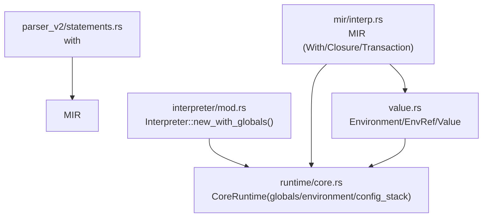
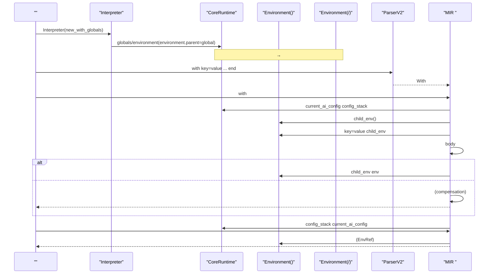
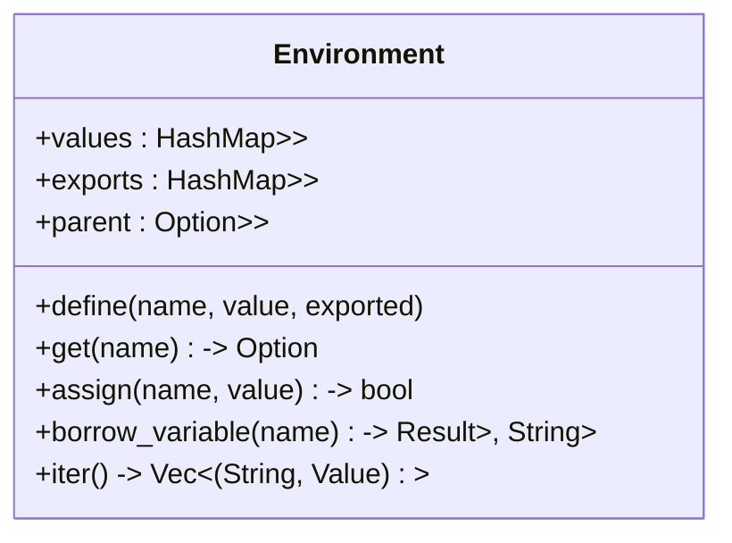
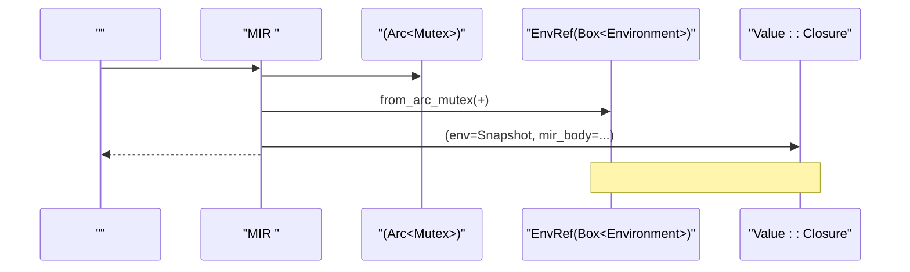
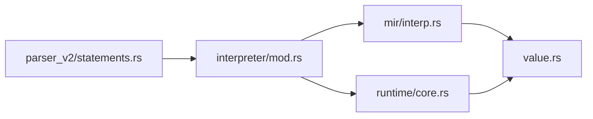

# 

<cite>
****
- [src/value.rs](file://src/value.rs)
- [src/runtime/core.rs](file://src/runtime/core.rs)
- [src/interpreter/mod.rs](file://src/interpreter/mod.rs)
- [src/mir/interp.rs](file://src/mir/interp.rs)
- [src/parser_v2/statements.rs](file://src/parser_v2/statements.rs)
</cite>

## 
1. [](#)
2. [](#)
3. [](#)
4. [](#)
5. [](#)
6. [](#)
7. [](#)
8. [](#)
9. [](#)
10. [](#)

## 
 Mora  Environment with 

## 

- value.rs
-  globals/environment/config_stack runtime/core.rs
- interpreter/mod.rs
- MIR with/transaction mir/interp.rs
- with  With parser_v2/statements.rs




- [src/value.rs:461-581](file://src/value.rs#L461-L581)
- [src/runtime/core.rs:14-47](file://src/runtime/core.rs#L14-L47)
- [src/interpreter/mod.rs:461-476](file://src/interpreter/mod.rs#L461-L476)
- [src/parser_v2/statements.rs:340-364](file://src/parser_v2/statements.rs#L340-L364)
- [src/mir/interp.rs:327-342](file://src/mir/interp.rs#L327-L342)


- [src/value.rs:461-581](file://src/value.rs#L461-L581)
- [src/runtime/core.rs:14-47](file://src/runtime/core.rs#L14-L47)
- [src/interpreter/mod.rs:461-476](file://src/interpreter/mod.rs#L461-L476)
- [src/parser_v2/statements.rs:340-364](file://src/parser_v2/statements.rs#L340-L364)
- [src/mir/interp.rs:327-342](file://src/mir/interp.rs#L327-L342)

## 
- Environment values/exports  parent  define/get/assign/borrow_variable 
- EnvRef Box<Environment>
- CoreRuntime globalsenvironmentconfig_stackwith 
- Interpreter  new_with_globals  parent “→”


- [src/value.rs:461-581](file://src/value.rs#L461-L581)
- [src/value.rs:117-140](file://src/value.rs#L117-L140)
- [src/runtime/core.rs:14-47](file://src/runtime/core.rs#L14-L47)
- [src/interpreter/mod.rs:461-476](file://src/interpreter/mod.rs#L461-L476)

## 
 with /




- [src/interpreter/mod.rs:461-476](file://src/interpreter/mod.rs#L461-L476)
- [src/parser_v2/statements.rs:340-364](file://src/parser_v2/statements.rs#L340-L364)
- [src/mir/interp.rs:327-342](file://src/mir/interp.rs#L327-L342)
- [src/mir/interp.rs:173-179](file://src/mir/interp.rs#L173-L179)
- [src/value.rs:117-140](file://src/value.rs#L117-L140)

## 

### Environment 
- 
  - valuesArc<Mutex<Value>>
  - exports
  - parent
- 
  - get(name) None
  - assign(name, value) false
  - borrow_variable/borrow_variable_mut Arc<Mutex<Value>>
- 
  - / O(1) + O(h) h  O(1)
- 
  -  Mutex 




- [src/value.rs:461-581](file://src/value.rs#L461-L581)


- [src/value.rs:461-581](file://src/value.rs#L461-L581)

### 
-  CoreRuntime.globals 
- Interpreter.new_with_globals  Environment parent  globals“→”
- globals  Arc<Mutex<...>>


- [src/runtime/core.rs:14-47](file://src/runtime/core.rs#L14-L47)
- [src/interpreter/mod.rs:461-476](file://src/interpreter/mod.rs#L461-L476)

### with 
- parser_v2/statements.rs  with key=value,... end  With  bindings  body
- MIR 
  -  with current_ai_config  config_stack child_env 
  -  body child_env 
  -  body  compensation 
  -  with config_stack  current_ai_config
- current_ai_config  with 

```mermaid
flowchart TD
Start([" with"]) --> SaveCfg[" current_ai_config  config_stack"]
SaveCfg --> NewChild[" child_env  key=value"]
NewChild --> ExecBody[" body"]
ExecBody --> Ok{"?"}
Ok --> || Merge[" child_env  env"]
Ok --> || Comp[" compensation "]
Comp --> Rollback[""]
Merge --> RestoreCfg[" config_stack  current_ai_config"]
RestoreCfg --> End([" with"])
```


- [src/parser_v2/statements.rs:340-364](file://src/parser_v2/statements.rs#L340-L364)
- [src/mir/interp.rs:327-342](file://src/mir/interp.rs#L327-L342)
- [src/runtime/core.rs:14-47](file://src/runtime/core.rs#L14-L47)


- [src/parser_v2/statements.rs:340-364](file://src/parser_v2/statements.rs#L340-L364)
- [src/mir/interp.rs:327-342](file://src/mir/interp.rs#L327-L342)
- [src/runtime/core.rs:14-47](file://src/runtime/core.rs#L14-L47)

### 
- MIR  EnvRef::from_arc_mutex  EnvRef
- EnvRef  Box<Environment>
-  EnvRefEnvRef 
- EnvRef  Send Environment  Send-safe Arc/Mutex 




- [src/mir/interp.rs:173-179](file://src/mir/interp.rs#L173-L179)
- [src/value.rs:117-140](file://src/value.rs#L117-L140)


- [src/mir/interp.rs:173-179](file://src/mir/interp.rs#L173-L179)
- [src/value.rs:117-140](file://src/value.rs#L117-L140)

### 
-  AI API KeyBase URL
- CoreRuntime.config_stack / with  AiConfig  with 
- CoreRuntime.current_ai_config  with 


- [src/interpreter/mod.rs:22-33](file://src/interpreter/mod.rs#L22-L33)
- [src/runtime/core.rs:14-47](file://src/runtime/core.rs#L14-L47)

### 
- Environment.values/exports  Arc<Mutex<Value>> 
- globals  environment  Arc 
- EnvRef  Environment
- stress_tests  LRU 


- [src/value.rs:461-581](file://src/value.rs#L461-L581)
- [src/value.rs:117-140](file://src/value.rs#L117-L140)
- [src/stress_tests.rs:343-371](file://src/stress_tests.rs#L343-L371)

## 
- interpreter/mod.rs  runtime/core.rs  CoreRuntime  globals/environment/config_stack
- parser_v2/statements.rs  with  AST  MIR 
- mir/interp.rs  with  Environment  EnvRef CoreRuntime 
- value.rs 




- [src/parser_v2/statements.rs:340-364](file://src/parser_v2/statements.rs#L340-L364)
- [src/interpreter/mod.rs:461-476](file://src/interpreter/mod.rs#L461-L476)
- [src/mir/interp.rs:327-342](file://src/mir/interp.rs#L327-L342)
- [src/runtime/core.rs:14-47](file://src/runtime/core.rs#L14-L47)
- [src/value.rs:461-581](file://src/value.rs#L461-L581)


- [src/parser_v2/statements.rs:340-364](file://src/parser_v2/statements.rs#L340-L364)
- [src/interpreter/mod.rs:461-476](file://src/interpreter/mod.rs#L461-L476)
- [src/mir/interp.rs:327-342](file://src/mir/interp.rs#L327-L342)
- [src/runtime/core.rs:14-47](file://src/runtime/core.rs#L14-L47)
- [src/value.rs:461-581](file://src/value.rs#L461-L581)

## 
-  with  get/assign 
-  Environment
- Environment  Mutex 
- config_stack  push/pop  O(1) with 

[]

## 
- Environment.get  None
- Environment.assign  false let  var 
- EnvRef  Atom 
- with  transaction  compensation 


- [src/value.rs:506-525](file://src/value.rs#L506-L525)
- [src/mir/interp.rs:327-342](file://src/mir/interp.rs#L327-L342)

## 
Mora  Environment  parent  EnvRef CoreRuntime with 

[]

## 
- 
  - 
  - EnvRef 
  - / with 

[]