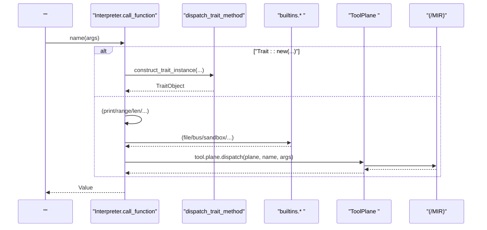
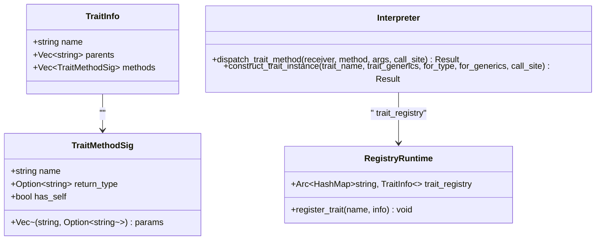
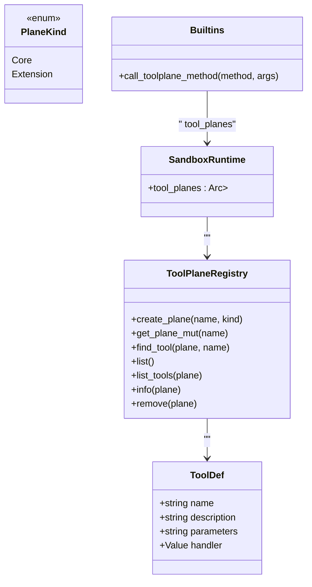
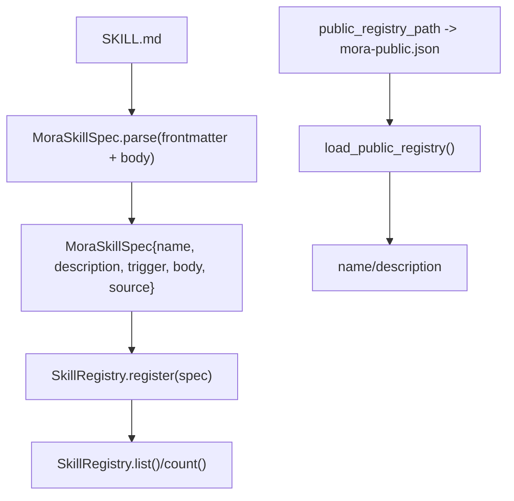
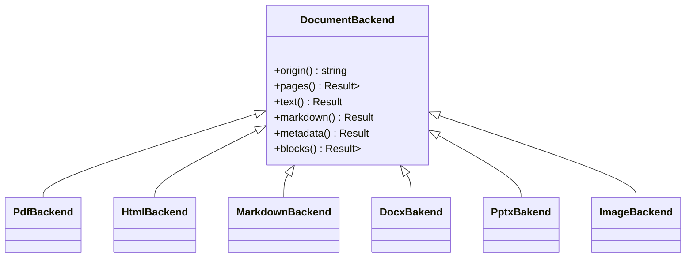
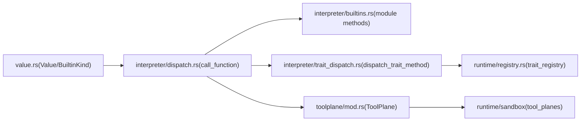

# 

<cite>
****   
- [src/interpreter/mod.rs](file://src/interpreter/mod.rs)
- [src/interpreter/dispatch.rs](file://src/interpreter/dispatch.rs)
- [src/interpreter/builtins.rs](file://src/interpreter/builtins.rs)
- [src/interpreter/trait_dispatch.rs](file://src/interpreter/trait_dispatch.rs)
- [src/runtime/mod.rs](file://src/runtime/mod.rs)
- [src/runtime/core.rs](file://src/runtime/core.rs)
- [src/runtime/registry.rs](file://src/runtime/registry.rs)
- [src/value.rs](file://src/value.rs)
- [src/skill/mod.rs](file://src/skill/mod.rs)
- [src/toolplane/mod.rs](file://src/toolplane/mod.rs)
</cite>

## 
1. [](#)
2. [](#)
3. [](#)
4. [](#)
5. [](#)
6. [](#)
7. [](#)
8. [](#)
9. [](#)
10. [](#)

## 
 Mora 
- 
- Trait 
- ToolRegistry/ToolPlane
- Skill
- 
- 
- 
- 

## 
Mora “ + Facade ” Interpreter  FacadeCoreRegistryInfraAiSandboxPersistOrch god object 

```mermaid
graph TB
subgraph ""
I["Interpreter"]
end
subgraph "Facad "
C["CoreRuntime<br/>globals/environment/tool_registry/config_stack/channels"]
R["RegistryRuntime<br/>trait_registry/impl_table/mock/ccr/memory"]
A["AiRuntime<br/>model_routes/token_usage/trace/context_window/speculative/cache_warmer"]
S["SandboxRuntime<br/>capabilities/container/tool_planes"]
P["PersistRuntime<br/>audit_sink/checkpoint"]
O["OrchRuntime<br/>"]
F["InfraRuntime<br/>//"]
end
I --> C
I --> R
I --> A
I --> S
I --> P
I --> O
I --> F
```


- [src/runtime/mod.rs:1-22](file://src/runtime/mod.rs#L1-L22)
- [src/runtime/core.rs:1-32](file://src/runtime/core.rs#L1-L32)
- [src/runtime/registry.rs:1-37](file://src/runtime/registry.rs#L1-L37)
- [src/runtime/ai.rs:1-25](file://src/runtime/ai.rs#L1-L25)


- [src/runtime/mod.rs:1-22](file://src/runtime/mod.rs#L1-L22)
- [src/runtime/core.rs:1-32](file://src/runtime/core.rs#L1-L32)
- [src/runtime/registry.rs:1-37](file://src/runtime/registry.rs#L1-L37)
- [src/runtime/ai.rs:1-25](file://src/runtime/ai.rs#L1-L25)

## 
- 
  - Value  Task/Closure/Tool/Builtin/TraitObject BuiltinKind 
  - Environment  CoreRuntime 
- 
  - ToolDef  AI  Schema
  - ToolPlane  Core/Extension /
-  Facade
  - CoreRuntime/with worker channels
  - RegistryRuntimeTrait Impl Mock CCR 
  - AiRuntimeToken Trace
  - SandboxRuntime
  - PersistRuntime
  - OrchRuntime
  - InfraRuntime


- [src/value.rs:43-115](file://src/value.rs#L43-L115)
- [src/interpreter/mod.rs:312-342](file://src/interpreter/mod.rs#L312-L342)
- [src/toolplane/mod.rs:1-292](file://src/toolplane/mod.rs#L1-L292)
- [src/runtime/core.rs:1-32](file://src/runtime/core.rs#L1-L32)
- [src/runtime/registry.rs:1-37](file://src/runtime/registry.rs#L1-L37)
- [src/runtime/ai.rs:1-25](file://src/runtime/ai.rs#L1-L25)

## 
 call_function TraitObject  trait_dispatch builtins  BuiltinKind  ToolPlane 




- [src/interpreter/dispatch.rs:31-65](file://src/interpreter/dispatch.rs#L31-L65)
- [src/interpreter/dispatch.rs:460-464](file://src/interpreter/dispatch.rs#L460-L464)
- [src/interpreter/builtins.rs:16-257](file://src/interpreter/builtins.rs#L16-L257)
- [src/interpreter/builtins.rs:1325-1341](file://src/interpreter/builtins.rs#L1325-L1341)
- [src/toolplane/mod.rs:1-292](file://src/toolplane/mod.rs#L1-L292)

## 

### 
-  BuiltinKind
  -  BuiltinKind 
-  call_function
  -  Trait::new print/range/len/compose/partial/atom/swap/deref/type_of/is_instance/methods_of
  -  TraitObject trait_dispatch 
-  builtins.*
  - file.* sandbox.check_path 
  - bus.* emit/off/count/subscribe/publish
  - sandbox.*spawn/exec/info/clear
  - schedule.* add/list
  - tool.plane.*

```mermaid
flowchart TD
Start([" call_function"]) --> CheckTraitNew{" 'Trait::new' ?"}
CheckTraitNew --> || Construct["construct_trait_instance(...)"]
Construct --> Return1[" TraitObject"]
CheckTraitNew --> || Builtins{"?"}
Builtins --> || HandleBuiltins[" print/range/len/..."]
HandleBuiltins --> Return2[""]
Builtins --> || ModuleMethod{"?"}
ModuleMethod --> |TraitObject| DispatchTrait["dispatch_trait_method(...)"]
DispatchTrait --> Return3[""]
ModuleMethod --> || ModuleDispatch["builtins.* "]
ModuleDispatch --> Return4[""]
```


- [src/interpreter/dispatch.rs:31-65](file://src/interpreter/dispatch.rs#L31-L65)
- [src/interpreter/dispatch.rs:460-464](file://src/interpreter/dispatch.rs#L460-L464)
- [src/interpreter/builtins.rs:16-257](file://src/interpreter/builtins.rs#L16-L257)
- [src/interpreter/builtins.rs:1325-1341](file://src/interpreter/builtins.rs#L1325-L1341)


- [src/value.rs:43-115](file://src/value.rs#L43-L115)
- [src/interpreter/dispatch.rs:31-65](file://src/interpreter/dispatch.rs#L31-L65)
- [src/interpreter/dispatch.rs:460-464](file://src/interpreter/dispatch.rs#L460-L464)
- [src/interpreter/builtins.rs:16-257](file://src/interpreter/builtins.rs#L16-L257)
- [src/interpreter/builtins.rs:1325-1341](file://src/interpreter/builtins.rs#L1325-L1341)

### Trait 
- TraitInfo  TraitMethodSig
  -  trait  trait has_self  dispatch  receiver
- 
  - collect_parent_traits parents BFS  trait 
  - collect_required_methods trait
-  dispatch_trait_method
  -  impl__impl_Trait_TraitGen_ForType_ForGen_Method__impl_Trait_TraitGen_Method
  -  has_self  receiver
-  construct_trait_instance
  -  TraitObject




- [src/interpreter/mod.rs:312-342](file://src/interpreter/mod.rs#L312-L342)
- [src/interpreter/trait_dispatch.rs:1-178](file://src/interpreter/trait_dispatch.rs#L1-L178)
- [src/runtime/registry.rs:1-57](file://src/runtime/registry.rs#L1-L57)


- [src/interpreter/mod.rs:312-342](file://src/interpreter/mod.rs#L312-L342)
- [src/interpreter/trait_dispatch.rs:1-178](file://src/interpreter/trait_dispatch.rs#L1-L178)
- [src/runtime/registry.rs:1-57](file://src/runtime/registry.rs#L1-L57)

### ToolRegistry/ToolPlane
- ToolDef
  -  JSON Schema MIR 
- ToolPlane 
  - PlaneKind::Core Extension/
  -  create_plane/register/unregister/list/list_tools/info/find/remove 
- 
  - builtins.tool.plane.*  SandboxRuntime  tool_planes 




- [src/interpreter/mod.rs:312-342](file://src/interpreter/mod.rs#L312-L342)
- [src/toolplane/mod.rs:1-292](file://src/toolplane/mod.rs#L1-L292)
- [src/interpreter/builtins.rs:1325-1341](file://src/interpreter/builtins.rs#L1325-L1341)


- [src/interpreter/mod.rs:312-342](file://src/interpreter/mod.rs#L312-L342)
- [src/toolplane/mod.rs:1-292](file://src/toolplane/mod.rs#L1-L292)
- [src/interpreter/builtins.rs:1325-1341](file://src/interpreter/builtins.rs#L1325-L1341)

### Skill
- SKILL.md 
  - YAML frontmatternamedescriptiontrigger+ Markdown body
  - 
- SkillRegistry
  - /+ mora-public.json
  -  register/unregister/get/list/count/set_public_registry/load_public_registry 
- 
  -  builtin skill.list / skill.find / skill.load / skill.install / skill.uninstall 




- [src/skill/mod.rs:1-174](file://src/skill/mod.rs#L1-L174)
- [src/skill/mod.rs:176-183](file://src/skill/mod.rs#L176-L183)


- [src/skill/mod.rs:1-174](file://src/skill/mod.rs#L1-L174)
- [src/skill/mod.rs:176-183](file://src/skill/mod.rs#L176-L183)

### 
- 
  - type_of(value)
  - is_instance(value, type_name)
  - methods_of(value)
- 
  - compose(f1, f2, ...)
  - partial(fn, args...)
- 
  - atom(value)/swap(atom, fn)/deref(atom)
- 
  - compose_prompt(...) prompt section
  - Plan Plan::new 


- [src/interpreter/dispatch.rs:161-185](file://src/interpreter/dispatch.rs#L161-L185)
- [src/interpreter/dispatch.rs:115-131](file://src/interpreter/dispatch.rs#L115-L131)
- [src/interpreter/dispatch.rs:132-160](file://src/interpreter/dispatch.rs#L132-L160)
- [src/interpreter/dispatch.rs:335-400](file://src/interpreter/dispatch.rs#L335-L400)

### 
- DocumentBackend
  -  IRpages()  page_no/width/height/blocks
  - text()/markdown()/metadata() Markdown 
  - pdf/html/markdown/docx/pptx/image
- sandbox.containerize
  -  docker/gondolin/openshell  ContainerSpec 
  - container_exec 
  - container_info/container_clear 




- [src/document/backend/pdf.rs:33-84](file://src/document/backend/pdf.rs#L33-L84)
- [src/document/backend/pptx.rs:126-143](file://src/document/backend/pptx.rs#L126-L143)
- [src/document/backend/markdown.rs:38-72](file://src/document/backend/markdown.rs#L38-L72)
- [src/document/backend/image.rs:203-239](file://src/document/backend/image.rs#L203-L239)


- [src/document/backend/pdf.rs:33-84](file://src/document/backend/pdf.rs#L33-L84)
- [src/document/backend/pptx.rs:126-143](file://src/document/backend/pptx.rs#L126-L143)
- [src/document/backend/markdown.rs:38-72](file://src/document/backend/markdown.rs#L38-L72)
- [src/document/backend/image.rs:203-239](file://src/document/backend/image.rs#L203-L239)
- [src/interpreter/builtins.rs:528-722](file://src/interpreter/builtins.rs#L528-L722)

### 
- bus.*
  - emit/off/count/subscribe/publish LSP/HTTP/MCP 
- schedule.*
  - add(listen every/at)
- persist.audit_sink
  - audit_emit/audit_flush/audit_verify 
- MCP/HTTP 
  - McpServer::new/Router::new 


- [src/interpreter/builtins.rs:259-327](file://src/interpreter/builtins.rs#L259-L327)
- [src/interpreter/builtins.rs:727-800](file://src/interpreter/builtins.rs#L727-L800)
- [src/interpreter/builtins.rs:466-527](file://src/interpreter/builtins.rs#L466-L527)
- [src/interpreter/dispatch.rs:295-300](file://src/interpreter/dispatch.rs#L295-L300)

## 
-  Facade
  - Interpreter  Core/Registry/Ai/Sandbox/Persist/Orch/Infra Facade 
- 
  - Value  BuiltinKind 
- Trait  Impl
  - TraitInfo/TraitMethodSig  RegistryRuntime.trait_registry 
- 
  - ToolPlaneRegistry  SandboxRuntime.tool_planes 




- [src/value.rs:43-115](file://src/value.rs#L43-L115)
- [src/interpreter/dispatch.rs:31-65](file://src/interpreter/dispatch.rs#L31-L65)
- [src/interpreter/builtins.rs:16-257](file://src/interpreter/builtins.rs#L16-L257)
- [src/interpreter/trait_dispatch.rs:1-178](file://src/interpreter/trait_dispatch.rs#L1-L178)
- [src/runtime/registry.rs:1-57](file://src/runtime/registry.rs#L1-L57)
- [src/toolplane/mod.rs:1-292](file://src/toolplane/mod.rs#L1-L292)


- [src/value.rs:43-115](file://src/value.rs#L43-L115)
- [src/interpreter/dispatch.rs:31-65](file://src/interpreter/dispatch.rs#L31-L65)
- [src/interpreter/builtins.rs:16-257](file://src/interpreter/builtins.rs#L16-L257)
- [src/interpreter/trait_dispatch.rs:1-178](file://src/interpreter/trait_dispatch.rs#L1-L178)
- [src/runtime/registry.rs:1-57](file://src/runtime/registry.rs#L1-L57)
- [src/toolplane/mod.rs:1-292](file://src/toolplane/mod.rs#L1-L292)

## 
- 
  -  BuiltinKind 
- 
  - trait_registry  Arc<HashMap> clone--
- 
  -  Mutex 
- 
  - batch_chat  AIStream 
- 
  - compress/crush_json 
- 
  - sandbox.containerize  CPU/

[]

## 
- Trait 
  -  impl 
- 
  - “unknown method”
- 
  - sandbox.check_path/check_builtin /
- 
  - audit_verify  flush 
- 
  - container_exec  exit_code/stdout/stderr/elapsed_ms stderr 


- [src/interpreter/trait_dispatch.rs:129-136](file://src/interpreter/trait_dispatch.rs#L129-L136)
- [src/interpreter/builtins.rs:255-256](file://src/interpreter/builtins.rs#L255-L256)
- [src/interpreter/builtins.rs:331-373](file://src/interpreter/builtins.rs#L331-L373)
- [src/interpreter/builtins.rs:523-527](file://src/interpreter/builtins.rs#L523-L527)
- [src/interpreter/builtins.rs:625-666](file://src/interpreter/builtins.rs#L625-L666)

## 
Mora “ + Facade  +  + Trait  + ” ToolPlaneDocumentBackendsandbox  skill 

[]

## 
- 
  - FacadeCore/Registry/Ai/Sandbox/Persist/Orch/Infra
  - TraitObject trait  for_type/for_generics/trait_name/trait_generics
  - ToolPlaneCore/Extension 
  - Skill SKILL.md 

[]