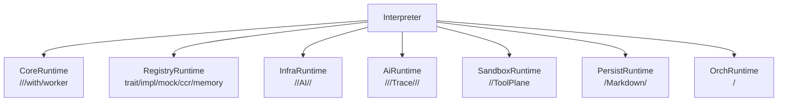
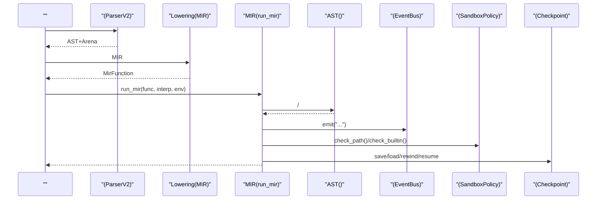
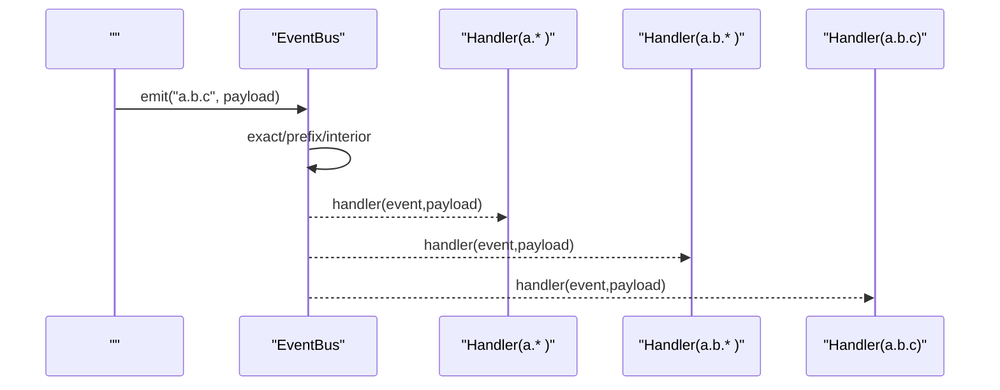
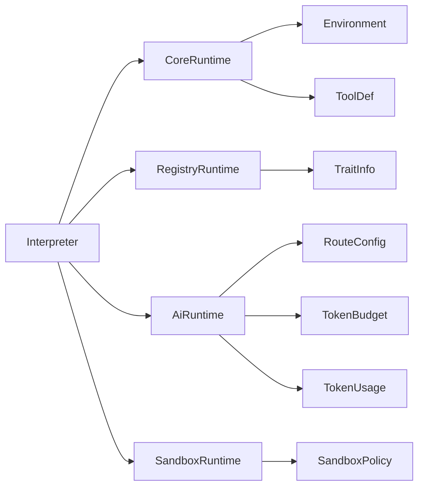

# 

<cite>
****
- [src/runtime/mod.rs](file://src/runtime/mod.rs)
- [src/value.rs](file://src/value.rs)
- [src/interpreter/mod.rs](file://src/interpreter/mod.rs)
- [src/mir/interp.rs](file://src/mir/interp.rs)
- [src/flow.rs](file://src/flow.rs)
- [src/event/mod.rs](file://src/event/mod.rs)
- [src/sandbox/mod.rs](file://src/sandbox/mod.rs)
- [src/runtime/core.rs](file://src/runtime/core.rs)
- [src/runtime/sandbox.rs](file://src/runtime/sandbox.rs)
- [src/runtime/ai.rs](file://src/runtime/ai.rs)
- [src/runtime/registry.rs](file://src/runtime/registry.rs)
- [src/checkpoint/mod.rs](file://src/checkpoint/mod.rs)
- [src/schedule/mod.rs](file://src/schedule/mod.rs)
- [src/trace_collector.rs](file://src/trace_collector.rs)
</cite>

## 
1. [](#)
2. [](#)
3. [](#)
4. [](#)
5. [](#)
6. [](#)
7. [](#)
8. [](#)
9. [](#)
10. [](#)

## 
 Mora 
- 
- 
- 
- 
- 
- 
- 

## 
Mora “ + Facade ” Interpreter  FacadeCoreRuntimeRegistryRuntimeInfraRuntimeAiRuntimeSandboxRuntimePersistRuntimeOrchRuntime




- [src/interpreter/mod.rs:214-235](file://src/interpreter/mod.rs#L214-L235)
- [src/runtime/mod.rs:1-22](file://src/runtime/mod.rs#L1-L22)


- [src/interpreter/mod.rs:214-235](file://src/interpreter/mod.rs#L214-L235)
- [src/runtime/mod.rs:1-22](file://src/runtime/mod.rs#L1-L22)

## 
-  ValueAgentHTTP Trait /
-  Environment///
- MIR  run_mir pc  AST 
-  EventBus
-  SandboxPolicybuiltin /
-  CheckpointPregel BSP 
-  Schedulercron  JSON
- TraceCollector OpenTelemetry JSON


- [src/value.rs:143-263](file://src/value.rs#L143-L263)
- [src/value.rs:462-581](file://src/value.rs#L462-L581)
- [src/mir/interp.rs:18-696](file://src/mir/interp.rs#L18-L696)
- [src/event/mod.rs:40-202](file://src/event/mod.rs#L40-L202)
- [src/sandbox/mod.rs:36-143](file://src/sandbox/mod.rs#L36-L143)
- [src/checkpoint/mod.rs:34-279](file://src/checkpoint/mod.rs#L34-L279)
- [src/schedule/mod.rs:49-249](file://src/schedule/mod.rs#L49-L249)
- [src/trace_collector.rs:46-222](file://src/trace_collector.rs#L46-L222)

## 
 MIR 




- [src/interpreter/mod.rs:36-42](file://src/interpreter/mod.rs#L36-L42)
- [src/mir/interp.rs:18-696](file://src/mir/interp.rs#L18-L696)
- [src/event/mod.rs:119-168](file://src/event/mod.rs#L119-L168)
- [src/sandbox/mod.rs:82-143](file://src/sandbox/mod.rs#L82-L143)
- [src/checkpoint/mod.rs:316-346](file://src/checkpoint/mod.rs#L316-L346)

## 

### 
-  ValueTask/Tool/Closure IOAgentRouterTraitObjectCompose/PartialAtomMacroPromptSectionDocument 
- Value  PartialEq  Display AtomRouterDisplay 
- 
  -  Arc<Mutex<Value>> 
  -  EnvRef
  -  GCRust  + Arc/Mutex  Document backend Arc<dyn Trait> 
- Int  Float  Rust 

```mermaid
classDiagram
class Value {
+String
+Char
+Int
+Float
+Bool
+Nil
+List(Vec~Value~)
+Dict(HashMap~String,Value~)
+Task{mir_body}
+Tool{mir_body}
+Closure{env,mir_body}
+Builtin
+Conversation
+Stream
+Agent
+AiConfig
+Router
+HttpRequest
+McpServer
+TraitObject
+Compose
+Partial
+Atom
+Macro
+PromptSection
+Document
}
class Environment {
+values : HashMap~String,Arc<Mutex<Value>>~
+exports : HashMap~String,Arc<Mutex<Value>>~
+parent : Option<Arc<Mutex<Environment>>>
+define(name,value,exported)
+get(name) -> Option<Value>
+assign(name,value) -> bool
+move_variable(name) -> Result<Value,String>
+borrow_variable(name) -> Result<Arc<Mutex<Value>>,String>
+iter() -> Vec<(String,Value)>
}
class EnvRef {
+from_arc_mutex(parent)
+env() -> &Environment
}
Value --> EnvRef : ""
Environment --> Value : ""
```


- [src/value.rs:143-263](file://src/value.rs#L143-L263)
- [src/value.rs:462-581](file://src/value.rs#L462-L581)
- [src/value.rs:117-140](file://src/value.rs#L117-L140)


- [src/value.rs:143-263](file://src/value.rs#L143-L263)
- [src/value.rs:265-459](file://src/value.rs#L265-L459)
- [src/value.rs:462-581](file://src/value.rs#L462-L581)
- [src/flow.rs:99-237](file://src/flow.rs#L99-L237)

### 
-  Environment  values  exports  parent 
- 
  - define
  - get/assign
  - move_variable/borrow_variable/borrow_variable_mut
- EnvRef 

```mermaid
flowchart TD
Start([""]) --> Define["define(name,value,exported)"]
Define --> Get{"get(name)?"}
Get --> || ReturnVal[""]
Get --> || ParentCheck{"?"}
ParentCheck --> || RecurGet["parent.get(name)"]
ParentCheck --> || NotFound["None"]
Assign["assign(name,value)"] --> Found{"name?"}
Found --> || Update[""]
Found --> || ParentAssign["parent.assign(name,value)"]
```


- [src/value.rs:498-581](file://src/value.rs#L498-L581)


- [src/value.rs:462-581](file://src/value.rs#L462-L581)
- [src/value.rs:117-140](file://src/value.rs#L117-L140)

### 
-  SandboxPolicy
  - builtin /deny  allow
  -  fs_root .. 
  - 
  -  CapabilityStore pattern-based /
- SandboxRuntime  ContainerHandle Docker Drop 

```mermaid
flowchart TD
Start([""]) --> CheckBuiltin["check_builtin(name)"]
CheckBuiltin --> Deny{"deny?"}
Deny --> || ErrDeny[": deny"]
Deny --> || AllowEmpty{"allow?"}
AllowEmpty --> || ErrStrict[": strict"]
AllowEmpty --> || MatchAllow["allow?"]
MatchAllow --> || ErrNotIn[": allow"]
MatchAllow --> || PathCheck["check_path(path)"]
PathCheck --> RootOK{"fs_root?"}
RootOK --> || ErrEscape[": "]
RootOK --> || OK[""]
```


- [src/sandbox/mod.rs:82-143](file://src/sandbox/mod.rs#L82-L143)


- [src/sandbox/mod.rs:36-143](file://src/sandbox/mod.rs#L36-L143)
- [src/runtime/sandbox.rs:13-42](file://src/runtime/sandbox.rs#L13-L42)

### 
-  EventBus
  - exactprefixinterior
  - emit  handler
  - v0.41  O(segments) 
- 
  - send/receive  worker_channels  worker_receivers 
  - schedule.tick  cron  agent




- [src/event/mod.rs:119-168](file://src/event/mod.rs#L119-L168)
- [src/event/mod.rs:263-302](file://src/event/mod.rs#L263-L302)


- [src/event/mod.rs:40-202](file://src/event/mod.rs#L40-L202)
- [src/mir/interp.rs:344-359](file://src/mir/interp.rs#L344-L359)
- [src/schedule/mod.rs:174-208](file://src/schedule/mod.rs#L174-L208)

### 
-  FlowSignalReturn/Break/Continue/Interrupt AST MIR  pc 
- Transaction  compensation
-  Checkpoint
  - channel_valuesversions_seenpending_sends 
  - rewind resume 
-  Scheduler Every/At  JSONtick 

```mermaid
flowchart TD
Start([""]) --> Body["body"]
Body --> Ok{"?"}
Ok --> || Merge[""]
Ok --> || Comp["compensation"]
Comp --> Rollback[""]
Merge --> End([""])
```


- [src/mir/interp.rs:324-343](file://src/mir/interp.rs#L324-L343)


- [src/value.rs:583-614](file://src/value.rs#L583-L614)
- [src/mir/interp.rs:324-343](file://src/mir/interp.rs#L324-L343)
- [src/checkpoint/mod.rs:316-346](file://src/checkpoint/mod.rs#L316-L346)
- [src/schedule/mod.rs:174-208](file://src/schedule/mod.rs#L174-L208)

### 
- 
  -  BuiltinKind 
  - [src/interpreter/mod.rs:373-440](file://src/interpreter/mod.rs#L373-L440)
- Trait/Impl 
  - RegistryRuntime  trait_registry  impl_table
  - [src/runtime/registry.rs:13-57](file://src/runtime/registry.rs#L13-L57)
- 
  - CheckpointSaver trait  MemorySaver  SqliteSaver
  - [src/checkpoint/mod.rs:285-306](file://src/checkpoint/mod.rs#L285-L306)
- 
  - ContainerBackend  Docker 
  - [src/sandbox/mod.rs:28-34](file://src/sandbox/mod.rs#L28-L34)


- [src/interpreter/mod.rs:373-440](file://src/interpreter/mod.rs#L373-L440)
- [src/runtime/registry.rs:13-57](file://src/runtime/registry.rs#L13-L57)
- [src/checkpoint/mod.rs:285-306](file://src/checkpoint/mod.rs#L285-L306)
- [src/sandbox/mod.rs:28-34](file://src/sandbox/mod.rs#L28-L34)

### 
- TraceCollector
  - / span Token 
  -  JSON  OpenTelemetry Collector
  - [src/trace_collector.rs:46-222](file://src/trace_collector.rs#L46-L222)
- 
  - intern_string  LRU 
  - [src/interpreter/mod.rs:638-653](file://src/interpreter/mod.rs#L638-L653)
- 
  - v0.41  O(segments) 
  - [src/event/mod.rs:649-689](file://src/event/mod.rs#L649-L689)


- [src/trace_collector.rs:46-222](file://src/trace_collector.rs#L46-L222)
- [src/interpreter/mod.rs:638-653](file://src/interpreter/mod.rs#L638-L653)
- [src/event/mod.rs:649-689](file://src/event/mod.rs#L649-L689)

## 
- Interpreter  Facade pub(crate)  crate
- CoreRuntime /AI worker 
- AiRuntime Token Trace
- RegistryRuntime  trait/impl/mock/ccr/memory 
- SandboxRuntime  ToolPlane 




- [src/interpreter/mod.rs:214-235](file://src/interpreter/mod.rs#L214-L235)
- [src/runtime/core.rs:14-47](file://src/runtime/core.rs#L14-L47)
- [src/runtime/ai.rs:15-40](file://src/runtime/ai.rs#L15-L40)
- [src/runtime/registry.rs:13-37](file://src/runtime/registry.rs#L13-L37)
- [src/runtime/sandbox.rs:13-35](file://src/runtime/sandbox.rs#L13-L35)


- [src/interpreter/mod.rs:214-235](file://src/interpreter/mod.rs#L214-L235)
- [src/runtime/core.rs:14-47](file://src/runtime/core.rs#L14-L47)
- [src/runtime/ai.rs:15-40](file://src/runtime/ai.rs#L15-L40)
- [src/runtime/registry.rs:13-37](file://src/runtime/registry.rs#L13-L37)
- [src/runtime/sandbox.rs:13-35](file://src/runtime/sandbox.rs#L13-L35)

## 
- O(segments) 
- LRU 
- 
-  JSON  serde 

## 
- 
  - index_value/index_assign_value 
  - eval_binary/numeric_op  Int/Float 
  - SandboxPolicy.check_path  ..  fs_root 
  -  bucket  interior 
- 
  -  TraceCollector  span  export_otel_json 
  -  checkpoint.rewind/resume 
  -  REPL  mir_eval_expr 


- [src/mir/interp.rs:698-779](file://src/mir/interp.rs#L698-L779)
- [src/flow.rs:99-237](file://src/flow.rs#L99-L237)
- [src/sandbox/mod.rs:108-143](file://src/sandbox/mod.rs#L108-L143)
- [src/event/mod.rs:263-302](file://src/event/mod.rs#L263-L302)
- [src/trace_collector.rs:189-222](file://src/trace_collector.rs#L189-L222)
- [src/checkpoint/mod.rs:316-346](file://src/checkpoint/mod.rs#L316-L346)

## 
Mora  Facade Trait/Impl  TraceCollector 

## 
- 
  - parse_code → lower_program → run_mir
  - Interpreter::new  BuiltinKind 
  - Transaction 
  -  APIrewind/resume 


- [src/interpreter/mod.rs:36-42](file://src/interpreter/mod.rs#L36-L42)
- [src/interpreter/mod.rs:373-440](file://src/interpreter/mod.rs#L373-L440)
- [src/mir/interp.rs:324-343](file://src/mir/interp.rs#L324-L343)
- [src/checkpoint/mod.rs:316-346](file://src/checkpoint/mod.rs#L316-L346)