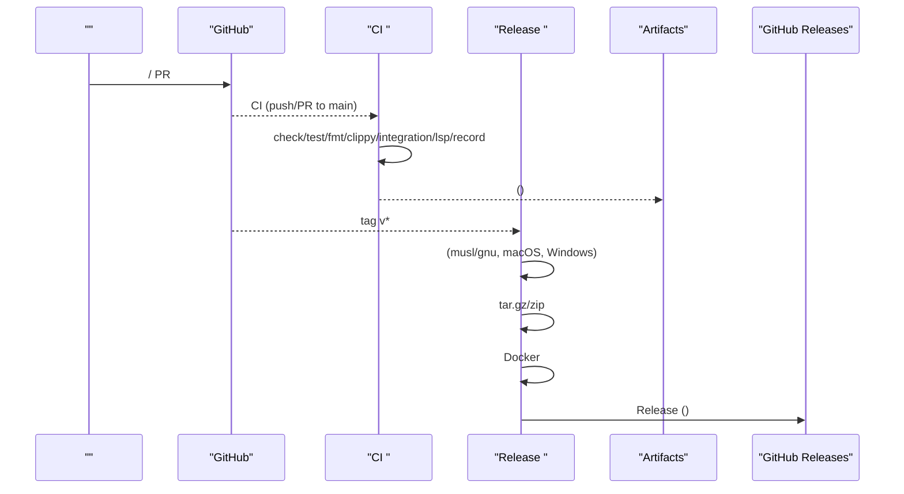
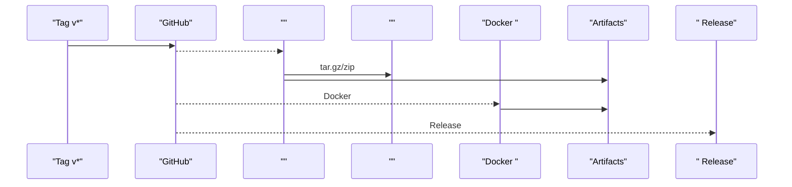
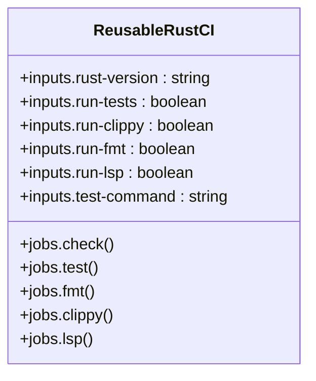
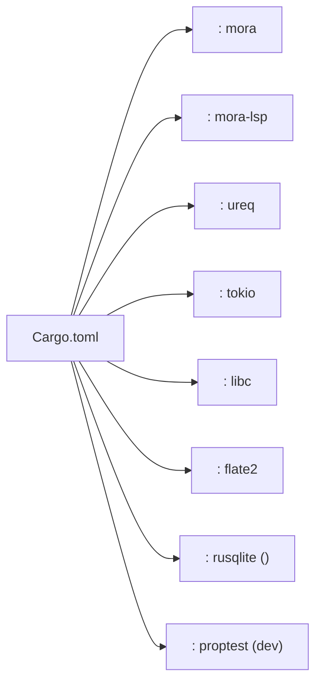

# CI/CD 

<cite>
****
- [ci.yml](file://.github/workflows/ci.yml)
- [release.yml](file://.github/workflows/release.yml)
- [reusable-rust-ci.yml](file://.github/workflows/reusable-rust-ci.yml)
- [Cargo.toml](file://Cargo.toml)
- [Dockerfile](file://Dockerfile)
</cite>

## 
1. [](#)
2. [](#)
3. [](#)
4. [](#)
5. [](#)
6. [](#)
7. [](#)
8. [](#)
9. [](#)
10. [](#)
11. [](#)
12. [](#)

## 
 Mora  CI/CD  CI

## 
Mora  CI/CD  .github/workflows 
-  CI  push/PR  mainClippy LSP 
-  tag v*  GitHub Release
-  Rust CI check/test/fmt/clippy/LSP

```mermaid
graph TB
subgraph "GitHub Actions"
CI["CI <br/>push/PR to main"]
REL["Release <br/>tag v* / workflow_dispatch"]
RUS["Reusable Rust CI<br/>workflow_call"]
end
subgraph ""
BIN["mora CLI"]
LSP["mora-lsp "]
ZIP["(.tar.gz/.zip)"]
DOCK["Docker ()"]
end
CI --> BIN
CI --> LSP
CI --> |"/"| BIN
CI --> |"LSP "| LSP
REL --> BIN
REL --> LSP
REL --> ZIP
REL --> DOCK
REL --> |" Release "| ZIP
```


- [ci.yml:1-213](file://.github/workflows/ci.yml#L1-L213)
- [release.yml:1-201](file://.github/workflows/release.yml#L1-L201)
- [reusable-rust-ci.yml:1-183](file://.github/workflows/reusable-rust-ci.yml#L1-L183)


- [ci.yml:1-213](file://.github/workflows/ci.yml#L1-L213)
- [release.yml:1-201](file://.github/workflows/release.yml#L1-L201)
- [reusable-rust-ci.yml:1-183](file://.github/workflows/reusable-rust-ci.yml#L1-L183)

## 
-  CI 
  - push/PR  main
  - checktest OS + stable/nightlyfmtclippyintegrationlsp smoke testrecord CLI 
  - fail-fast: false actions/cache  cargo  target
- 
  -  v* 
  - Linux musl/gnumacOS arm64/x64Windows x64 tar.gz/zip Docker  SHA-256  GitHub Release 
-  Rust CI 
  -  workflow_call rust-versionrun-testsrun-clippyrun-fmtrun-lsptest-command
  -  checktest OSfmtclippy lsp smoke test


- [ci.yml:1-213](file://.github/workflows/ci.yml#L1-L213)
- [release.yml:1-201](file://.github/workflows/release.yml#L1-L201)
- [reusable-rust-ci.yml:1-183](file://.github/workflows/reusable-rust-ci.yml#L1-L183)

## 
 Release 




- [ci.yml:1-213](file://.github/workflows/ci.yml#L1-L213)
- [release.yml:1-201](file://.github/workflows/release.yml#L1-L201)

## 

###  CI ci.yml
- 
  - push/PR  main
  -  backtrace
- 
  - checkstable rustfmt/clippy cargo  target cargo check --all-targets
  - test ubuntu/windows/macosRust  nightly on ubuntu
  - fmt
  - clippy-D warnings
  - integration release 
  - lsp mora-lsp  lsp_smoke
  - record mora  record list  snapshot /
- 
  -  fail-fast: false
- 
  -  runner.os  Cargo.lock  key 

```mermaid
flowchart TD
Start([""]) --> Checkout[""]
Checkout --> Toolchain[" Rust "]
Toolchain --> Cache[" ~/.cargo/registry, ~/.cargo/git, target"]
Cache --> Check["cargo check --all-targets"]
Check --> TestLib["cargo test --lib"]
TestLib --> TestAll["cargo test --all-targets"]
TestAll --> Fmt["cargo fmt --check"]
Fmt --> Clippy["cargo clippy --all-targets --all-features -- -D warnings"]
Clippy --> BuildBin["cargo build --release --bin mora"]
BuildBin --> Integration[""]
Integration --> LSPBuild[" mora-lsp  lsp_smoke"]
LSPBuild --> LSPRun[" LSP "]
LSPRun --> RecordTest["record list  snapshot "]
RecordTest --> End([""])
```


- [ci.yml:1-213](file://.github/workflows/ci.yml#L1-L213)


- [ci.yml:1-213](file://.github/workflows/ci.yml#L1-L213)

### release.yml
- 
  -  v*  workflow_dispatch
  - contents: write Release 
- 
  - x86_64-unknown-linux-gnux86_64-unknown-linux-muslaarch64-apple-darwinx86_64-apple-darwinx86_64-pc-windows-msvc
  -  mora  mora-lsp musl  musl-tools
- 
  -  zipWindows tar.gzUnix artifacts
- Docker 
  -  docker/setup-buildx-action  docker/build-push-action  push 
  -  tar.gz  artifact 
- 
  -  artifacts SHA-256  softprops/action-gh-release  Release 




- [release.yml:1-201](file://.github/workflows/release.yml#L1-L201)


- [release.yml:1-201](file://.github/workflows/release.yml#L1-L201)

###  Rust CI reusable-rust-ci.yml
- 
  - rust-version stable
  - run-tests/run-clippy/run-fmt/run-lsp
  - test-command cargo test --lib
- 
  - check toolchain cargo/target cargo check --all-targets
  - test OS ubuntu/windows/macos
  - fmt
  - clippy
  - lsp LSP 
- 
  -  workflow_call  Rust 




- [reusable-rust-ci.yml:1-183](file://.github/workflows/reusable-rust-ci.yml#L1-L183)


- [reusable-rust-ci.yml:1-183](file://.github/workflows/reusable-rust-ci.yml#L1-L183)

## 
- 
  - morasrc/main.rsmora-lspsrc/bin/lsp.rs
  - ureqHTTP tokio HTTP/MCP server libcSO_REUSEADDRflate2rusqlite checkpoint-sqlite proptest
  - checkpoint-sqlitejit inkwell
- 
  - edition=2024MSRV  ureq 
  - build.rs  MORAGIT_VERSION  env!() 




- [Cargo.toml:1-102](file://Cargo.toml#L1-L102)


- [Cargo.toml:1-102](file://Cargo.toml#L1-L102)

## 
- 
  -  actions/cache@v4  ~/.cargo/registry~/.cargo/git  target 
  -  runner.os  Cargo.lock restore-keys 
- 
  -  fail-fast: false
- 
  -  musl  musl-tools
  - Docker  builder  musl-dev
- 
  -  feature  actions/cache/save  restore 
  -  CI  cargo target 


- [ci.yml:1-213](file://.github/workflows/ci.yml#L1-L213)
- [release.yml:1-201](file://.github/workflows/release.yml#L1-L201)
- [Dockerfile:1-42](file://Dockerfile#L1-L42)

## 
- 
  - 
- 
  -  CI cargo audit cargo-audit
  -  semgrep  codespell 
  -  run-security-checks
- 
  -  job
  - exit code != 0
  - 

[]

## 
- 
  -  GitHub Releases 
  - Docker 
- 
  -  CI “/”job
  - Kubernetes/Helm
- 
  -  Release 

[]

## 
- 
  -  workflow_call  reusable-rust-ci.yml rust-versionrun-testsrun-clippyrun-fmtrun-lsptest-command 
  - 
- 
  -  ci.yml  job securitybenchdoc-gen needs 
  -  release.yml  cosign SBOM 
  -  run-benchrun-docsrun-security


- [reusable-rust-ci.yml:1-183](file://.github/workflows/reusable-rust-ci.yml#L1-L183)

## 
- 
  -  dtolnay/rust-toolchain  components  targets 
  -  cache key  restore-keys 
  - Windows .exe
  - musl  musl-tools  musl
- 
  -  CI  step 
  - 
  -  LSP  mora-lsp 


- [ci.yml:1-213](file://.github/workflows/ci.yml#L1-L213)
- [release.yml:1-201](file://.github/workflows/release.yml#L1-L201)

## 
Mora  CI/CD  CI  Release  Rust 