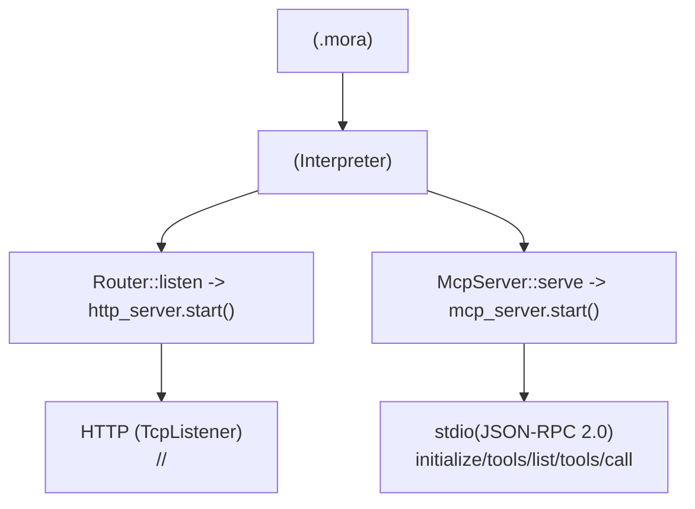
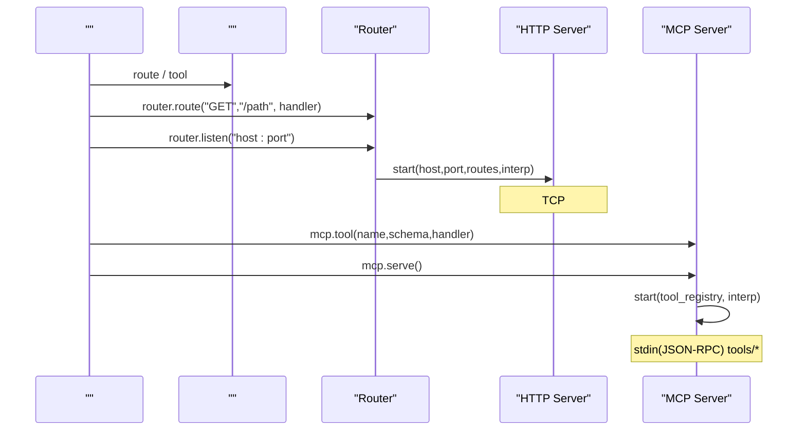
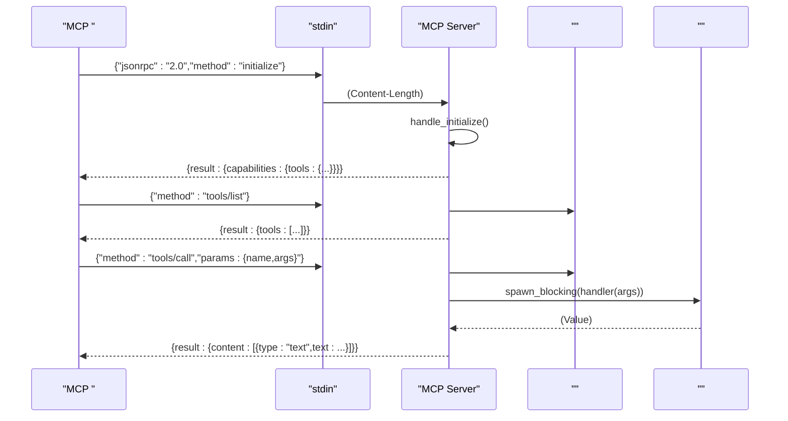
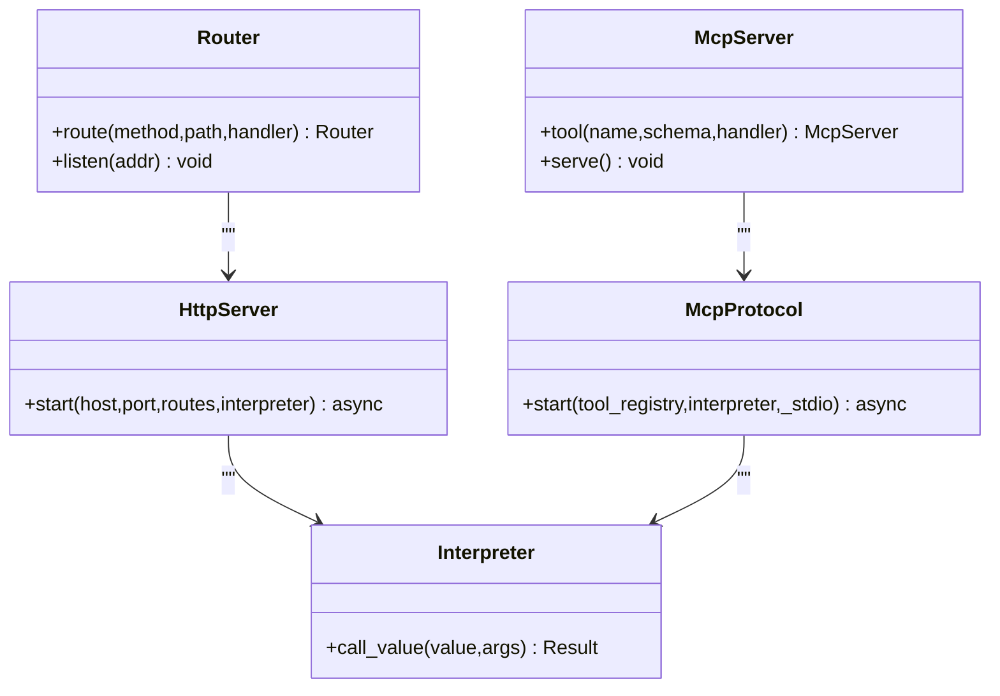

# HTTP  MCP 

<cite>
****   
- [src/http_server.rs](file://src/http_server.rs)
- [src/mcp_server.rs](file://src/mcp_server.rs)
- [src/interpreter/dispatch.rs](file://src/interpreter/dispatch.rs)
- [README.md](file://README.md)
</cite>

## 
1. [](#)
2. [](#)
3. [](#)
4. [](#)
5. [](#)
6. [](#)
7. [](#)
8. [](#)
9. [](#)
10. [](#)
11. [](#)
12. [](#)
13. [](#)

## 
 Mora  HTTP  MCP 
- HTTP CORS 
- MCP JSON-RPC over stdio
- NginxHAProxy
- 
- 
- 
- 

## 
Mora  HTTP  MCP  API HTTP  tokio  I/OMCP  JSON-RPC 2.0  stdin/stdout  Content-Length 




- [src/interpreter/dispatch.rs:1016-1035](file://src/interpreter/dispatch.rs#L1016-L1035)
- [src/interpreter/dispatch.rs:1049-1071](file://src/interpreter/dispatch.rs#L1049-L1071)
- [src/http_server.rs:72-108](file://src/http_server.rs#L72-L108)
- [src/mcp_server.rs:117-199](file://src/mcp_server.rs#L117-L199)


- [README.md:192-227](file://README.md#L192-L227)

## 
- HTTP 
  - http_server.start(host, port, routes, interpreter)
  - TCP  :param JSON
  - CORS 
- MCP 
  - mcp_server.start(tool_registry, interpreter, _stdio)
  - stdin/stdout  JSON-RPC 2.0  initializetools/listtools/call
  - Toolset /insiders handler 


- [src/http_server.rs:72-108](file://src/http_server.rs#L72-L108)
- [src/mcp_server.rs:117-199](file://src/mcp_server.rs#L117-L199)

## 
 Router  McpServer 




- [src/interpreter/dispatch.rs:1016-1035](file://src/interpreter/dispatch.rs#L1016-L1035)
- [src/interpreter/dispatch.rs:1049-1071](file://src/interpreter/dispatch.rs#L1049-L1071)
- [src/http_server.rs:72-108](file://src/http_server.rs#L72-L108)
- [src/mcp_server.rs:117-199](file://src/mcp_server.rs#L117-L199)

## 

### HTTP 
- 
  - host/port  Router.listen(addr)  127.0.0.1:3000 "0.0.0.0:3000"
  -  N+1..N+3 4 
- 
  - HeadersBody Content-Length
  -  :param 
  -  req dict(method/path/query/body/headers/params) 
  -  JSON JSON error
- 
  -  30s
  -  60sspawn_blocking + timeout 504
- CORS 
  - Access-Control-Allow-Origin  MORA_CORS_ORIGIN "*"
  - 127.0.0.1

```mermaid
flowchart TD
Start([""]) --> Parse["<br/>method/path/query/headers/body"]
Parse --> Match{"?"}
Match --> || CallHandler["spawn_blocking "]
Match --> || PatternMatch[" :param"]
PatternMatch --> Found{"?"}
Found --> || CallHandler
Found --> || NotFound[" 404 JSON"]
CallHandler --> Timeout{"?"}
Timeout --> || Return504[" 504"]
Timeout --> || Serialize[" Value→JSON"]
Serialize --> Send["( CORS)"]
NotFound --> End([""])
Return504 --> End
Send --> End
```


- [src/http_server.rs:145-223](file://src/http_server.rs#L145-L223)
- [src/http_server.rs:349-394](file://src/http_server.rs#L349-L394)
- [src/http_server.rs:396-418](file://src/http_server.rs#L396-L418)


- [src/http_server.rs:72-108](file://src/http_server.rs#L72-L108)
- [src/http_server.rs:110-143](file://src/http_server.rs#L110-L143)
- [src/http_server.rs:145-223](file://src/http_server.rs#L145-L223)
- [src/http_server.rs:349-394](file://src/http_server.rs#L349-L394)
- [src/http_server.rs:396-418](file://src/http_server.rs#L396-L418)
- [src/interpreter/dispatch.rs:1016-1035](file://src/interpreter/dispatch.rs#L1016-L1035)

### MCP 
- 
  - JSON-RPC 2.0 over stdin/stdout LSP  Content-Length 
  -  initializetools/listtools/call method 
- 
  -  McpServer.tool(name, schema, handler) 
  - tools/list  name/description/inputSchema
- 
  -  spawn_blocking 
  -  content text  JSON 
- Toolset 
  -  toolset ai/json/file/web/default
  -  read_only/insiders 




- [src/mcp_server.rs:117-199](file://src/mcp_server.rs#L117-L199)
- [src/mcp_server.rs:243-293](file://src/mcp_server.rs#L243-L293)
- [src/mcp_server.rs:331-350](file://src/mcp_server.rs#L331-L350)
- [src/mcp_server.rs:352-420](file://src/mcp_server.rs#L352-L420)


- [src/mcp_server.rs:117-199](file://src/mcp_server.rs#L117-L199)
- [src/mcp_server.rs:243-293](file://src/mcp_server.rs#L243-L293)
- [src/mcp_server.rs:331-350](file://src/mcp_server.rs#L331-L350)
- [src/mcp_server.rs:352-420](file://src/mcp_server.rs#L352-L420)
- [src/interpreter/dispatch.rs:1049-1071](file://src/interpreter/dispatch.rs#L1049-L1071)

## 
-  HTTP/MCP 
  - Router.listen → http_server.start
  - McpServer.serve → mcp_server.start
- HTTP  MCP /
- HTTP  tokio  I/OMCP  stdio  Content-Length 




- [src/interpreter/dispatch.rs:1016-1035](file://src/interpreter/dispatch.rs#L1016-L1035)
- [src/interpreter/dispatch.rs:1049-1071](file://src/interpreter/dispatch.rs#L1049-L1071)
- [src/http_server.rs:72-108](file://src/http_server.rs#L72-L108)
- [src/mcp_server.rs:117-199](file://src/mcp_server.rs#L117-L199)


- [src/interpreter/dispatch.rs:1016-1035](file://src/interpreter/dispatch.rs#L1016-L1035)
- [src/interpreter/dispatch.rs:1049-1071](file://src/interpreter/dispatch.rs#L1049-L1071)

## 
- 
  - HTTP
  - MCP
- 
  -  30s 60s
- 
  -  4 
- 
  -  CPU/ Docker/Kubernetes 
  -  Tokio 


- [src/http_server.rs:110-143](file://src/http_server.rs#L110-L143)
- [src/http_server.rs:145-223](file://src/http_server.rs#L145-L223)
- [src/mcp_server.rs:117-199](file://src/mcp_server.rs#L117-L199)

## 
- 
  - HTTPS  HTTP 
- Nginx 
  - upstream  127.0.0.1:3000
  -  proxy_set_header Host/Connection 
  -  gzip 
- HAProxy 
  - backend  server 127.0.0.1:3000
  -  retriestimeout connect/client/server
  -  health-check  stick-table 
- 
  -  CORS  MORA_CORS_ORIGIN

[]

## 
- 
  -  GET /health  {status:"ok"}
- 
  - Docker Compose/Kubernetes
  -  /services 
- 
  - KuberneteslivenessProbe/readinessProbe  /health
  - Nginx/HAProxy 


- [README.md:192-227](file://README.md#L192-L227)

## 
- 
  - 127.0.0.1 "0.0.0.0:3000"
- CORS
  -  MORA_CORS_ORIGIN  "*"
- 
  -  Content-TypeContent-LengthToken 
- 
  -  IP Basic/Digest/JWT 
- 
  -  per-IP  per-path 
- 
  -  30s  60s 


- [src/interpreter/dispatch.rs:1016-1021](file://src/interpreter/dispatch.rs#L1016-L1021)
- [src/http_server.rs:396-418](file://src/http_server.rs#L396-L418)

## 
- 
  - HTTP/MCP 
- 
  -  observe trace/span 
- 
  -  QPS


- [src/http_server.rs:72-108](file://src/http_server.rs#L72-L108)
- [src/mcp_server.rs:117-199](file://src/mcp_server.rs#L117-L199)
- [README.md:241-254](file://README.md#L241-L254)

## 
- 
  - 
- 
  -  504
- 404 
  - 
- MCP 
  -  stdin/stdout  JSON-RPC Content-Length
- CORS 
  -  Origin  MORA_CORS_ORIGIN 


- [src/http_server.rs:110-143](file://src/http_server.rs#L110-L143)
- [src/http_server.rs:145-223](file://src/http_server.rs#L145-L223)
- [src/mcp_server.rs:243-293](file://src/mcp_server.rs#L243-L293)

## 
Mora  HTTP  MCP  Web HTTP CORS MCP  JSON-RPC 2.0 stdio  TLS 