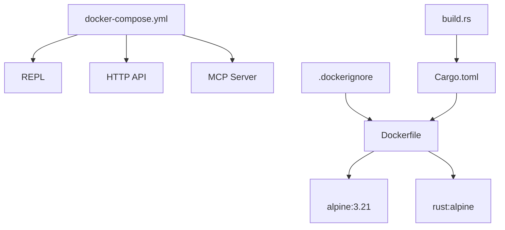
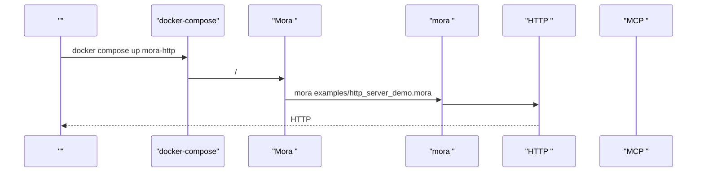
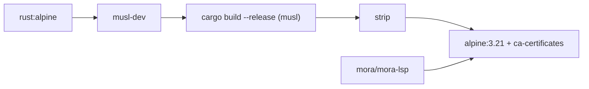

# 

<cite>
****
- [Dockerfile](file://Dockerfile)
- [docker-compose.yml](file://docker-compose.yml)
- [.dockerignore](file://.dockerignore)
- [Cargo.toml](file://Cargo.toml)
- [build.rs](file://build.rs)
- [src/main.rs](file://src/main.rs)
- [src/http_server.rs](file://src/http_server.rs)
- [src/mcp_server.rs](file://src/mcp_server.rs)
</cite>

## 
1. [](#)
2. [](#)
3. [](#)
4. [](#)
5. [](#)
6. [](#)
7. [](#)
8. [](#)
9. [](#)
10. [](#)

## 
 Mora  Docker Alpine Linux  root docker-compose //

## 
Mora 
- Dockerfile +  root 
- docker-compose.yml REPLHTTP APIMCP Server
- .dockerignore
- Cargo.tomlRust moramora-lsp
- build.rs
- src/main.rsCLI  --repl--checkrun 
- src/http_server.rs tokio  HTTP 
- src/mcp_server.rs stdio  MCP Server 




- [Dockerfile:1-42](file://Dockerfile#L1-L42)
- [docker-compose.yml:1-56](file://docker-compose.yml#L1-L56)
- [.dockerignore:1-8](file://.dockerignore#L1-L8)
- [Cargo.toml:18-24](file://Cargo.toml#L18-L24)
- [build.rs:17-22](file://build.rs#L17-L22)


- [Dockerfile:1-42](file://Dockerfile#L1-L42)
- [docker-compose.yml:1-56](file://docker-compose.yml#L1-L56)
- [.dockerignore:1-8](file://.dockerignore#L1-L8)
- [Cargo.toml:18-24](file://Cargo.toml#L18-L24)
- [build.rs:17-22](file://build.rs#L17-L22)

## 
- 
  -  rust:alpine musl-dev  strip 
  -  alpine:3.21 ca-certificates root 
-  root 
  -  adduser  shell  mora /home/mora
- 
  -  CMD  REPL
- 
  - Cargo.toml mora  mora-lsp


- [Dockerfile:7-19](file://Dockerfile#L7-L19)
- [Dockerfile:24-41](file://Dockerfile#L24-L41)
- [Cargo.toml:18-24](file://Cargo.toml#L18-L24)

## 
CLI  REPLHTTP  MCP HTTP  tokio MCP  stdin/stdout 

```mermaid
graph TB
subgraph ""
CLI["CLI <br/>src/main.rs"]
HTTP["HTTP <br/>src/http_server.rs"]
MCP["MCP <br/>src/mcp_server.rs"]
BIN["<br/>/usr/local/bin/mora, mora-lsp"]
end
CLI --> BIN
BIN --> HTTP
BIN --> MCP
```


- [src/main.rs:26-76](file://src/main.rs#L26-L76)
- [src/http_server.rs:70-108](file://src/http_server.rs#L70-L108)
- [src/mcp_server.rs:117-199](file://src/mcp_server.rs#L117-L199)

## 

### 
- 
  - rust:alpine Rust 
  - apk add --no-cache musl-dev musl 
  - cargo build --release --target x86_64-unknown-linux-musl
  - strip 
- 
  - alpine:3.21
  - ca-certificates  HTTPS 
  - adduser -D -s /bin/sh mora USER  root
  - /home/mora
  - CMD ["mora", "--repl"]

```mermaid
flowchart TD
Start([""]) --> Stage1["Stage 1: <br/>rust:alpine + musl-dev"]
Stage1 --> Build["cargo build --release --target musl"]
Build --> Strip["strip "]
Strip --> Stage2["Stage 2: <br/>alpine:3.21 + ca-certificates"]
Stage2 --> User[" root  mora"]
User --> Copy[""]
Copy --> DefaultCmd[" CMD: mora --repl"]
DefaultCmd --> End([""])
```


- [Dockerfile:7-19](file://Dockerfile#L7-L19)
- [Dockerfile:24-41](file://Dockerfile#L24-L41)


- [Dockerfile:7-19](file://Dockerfile#L7-L19)
- [Dockerfile:24-41](file://Dockerfile#L24-L41)

### Alpine Linux 
- 
  - 
  - musl libc 
  - 
- 
  - ca-certificates
  -  root 
  -  read_only: true
  -  .dockerignore 


- [Dockerfile:24-31](file://Dockerfile#L24-L31)
- [.dockerignore:1-8](file://.dockerignore#L1-L8)

###  root 
- adduser -D -s /bin/sh mora shell
- USER mora WORKDIR /home/mora 
- 
  - 
  -  /usr/local/bin 
  -  Podman/Kubernetes 


- [Dockerfile:28-31](file://Dockerfile#L28-L31)

### docker-compose 
- 
  - mora-repl REPL stdin_open  tty
  - mora-http HTTP  3000
  - mora-mcp MCP stdin_open 
  - mora-observe 3001:3000
  - mora-orchestratemora-skillmora-evalmora-memory
- 
  -  compose  environment  volumes
  - 
- 
  -  depends_on LLM 




- [docker-compose.yml:17-22](file://docker-compose.yml#L17-L22)
- [src/http_server.rs:70-108](file://src/http_server.rs#L70-L108)


- [docker-compose.yml:10-56](file://docker-compose.yml#L10-L56)

### CLI 
- 
  - main.rs  --version--help--repl--checkrun 
  -  REPL 
- 
  -  CMD  --repl
  -  compose  command 


- [src/main.rs:26-76](file://src/main.rs#L26-L76)

### HTTP 
- 
  -  tokio::net::TcpListener  tokio::sync::RwLock 
  -  spawn 
- 
  - bind_with_fallback 
- 
  - 


- [src/http_server.rs:70-143](file://src/http_server.rs#L70-L143)
- [src/http_server.rs:145-200](file://src/http_server.rs#L145-L200)

### MCP 
- 
  - JSON-RPC 2.0 over stdin/stdout LSP transport  Content-Length framing
- 
  - ToolRegistry  toolset /
- 
  -  tokio 


- [src/mcp_server.rs:117-199](file://src/mcp_server.rs#L117-L199)

## 
- 
  - rust:alpine  cargo
  - musl-dev 
- 
  - alpine:3.21 
  - ca-certificates  HTTPS 
- 
  - Cargo.toml  tokioureqlibc 
  - build.rs  MORAGIT_VERSION




- [Dockerfile:7-19](file://Dockerfile#L7-L19)
- [Dockerfile:24-26](file://Dockerfile#L24-L26)
- [Cargo.toml:18-24](file://Cargo.toml#L18-L24)
- [build.rs:17-22](file://build.rs#L17-L22)


- [Dockerfile:7-19](file://Dockerfile#L7-L19)
- [Dockerfile:24-26](file://Dockerfile#L24-L26)
- [Cargo.toml:18-24](file://Cargo.toml#L18-L24)
- [build.rs:17-22](file://build.rs#L17-L22)

## 
- 
  - 
  -  musl 
  -  .dockerignore  target/.git/docs 
- 
  - 
  -  ca-certificates HTTPS 
  -  TCP 
- 
  - 
  -  HTTP/MCP CPU/
  - 


- [Dockerfile:7-19](file://Dockerfile#L7-L19)
- [Dockerfile:24-41](file://Dockerfile#L24-L41)
- [.dockerignore:1-8](file://.dockerignore#L1-L8)
- [src/http_server.rs:110-143](file://src/http_server.rs#L110-L143)

## 
- 
  - HTTP 
- 
  -  root 
- 
  -  ca-certificates CA 
- 
  -  Cargo.toml/Cargo.lock  .dockerignore 


- [src/http_server.rs:110-143](file://src/http_server.rs#L110-L143)
- [Dockerfile:28-31](file://Dockerfile#L28-L31)
- [Dockerfile:24-26](file://Dockerfile#L24-L26)

## 
Mora  Alpine  root docker-compose 

## 

### 
- 
  -  docker compose up mora-repl  REPL
  -  docker compose run <service> <script> 
  -  compose  volumes
- 
  - 
  -  LLM API Key
  - 

[]

### 
- 
  -  --build-arg  Dockerfile  ARG 
  -  RUSTFLAGS /
- 
  -  curljq
  - 
  - “”

[]