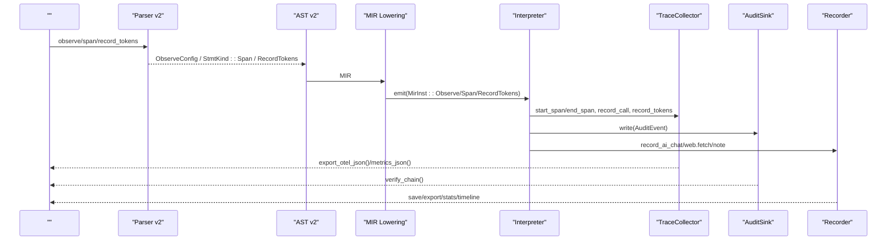
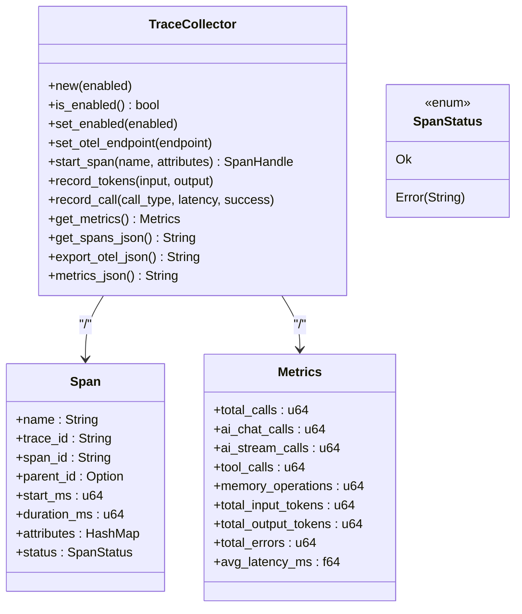
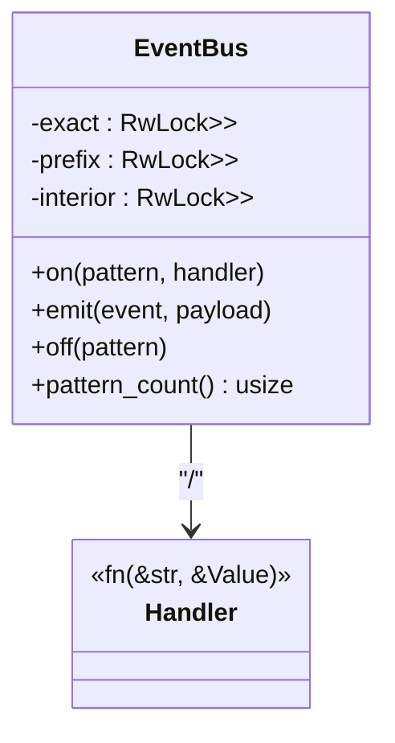
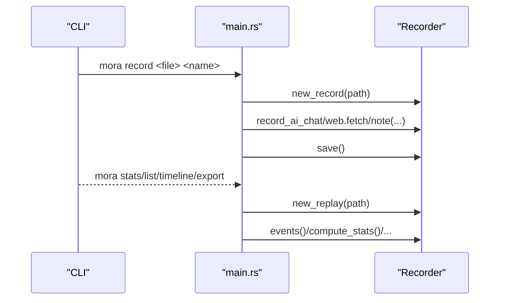
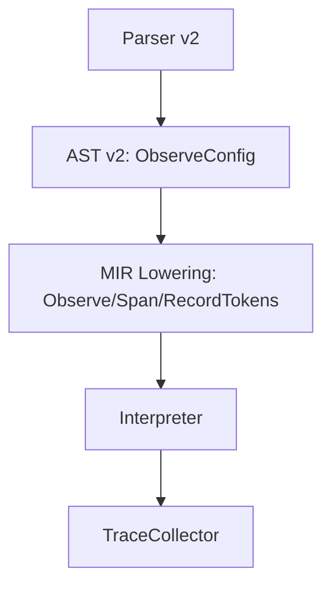
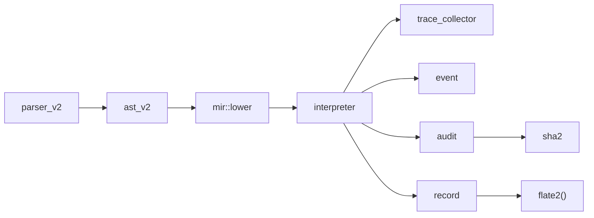

# 

<cite>
****
- [src/trace_collector.rs](file://src/trace_collector.rs)
- [src/audit/mod.rs](file://src/audit/mod.rs)
- [src/event/mod.rs](file://src/event/mod.rs)
- [src/record/mod.rs](file://src/record/mod.rs)
- [src/record/audit.rs](file://src/record/audit.rs)
- [src/interpreter/mod.rs](file://src/interpreter/mod.rs)
- [src/mir/lower.rs](file://src/mir/lower.rs)
- [src/ast_v2.rs](file://src/ast_v2.rs)
- [src/parser_v2/statements.rs](file://src/parser_v2/statements.rs)
- [src/compress/log.rs](file://src/compress/log.rs)
</cite>

## 
1. [](#)
2. [](#)
3. [](#)
4. [](#)
5. [](#)
6. [](#)
7. [](#)
8. [](#)
9. [](#)
10. [](#)

## 
 Mora 
- Trace  OpenTelemetry 
- 
- 
-  Prometheus 
- 
- ELK/Loki
- 
- 

## 
Mora 
- trace_collectorTrace + Metrics  JSON 
- auditSHA-256  JSONL
- event
- record//AI 
- interpreter/mir/lower/ast_v2/parser_v2 observe/span/record_tokens 
- compress/log

```mermaid
graph TB
subgraph ""
AST["AST v2<br/>ObserveConfig"] --> Lower["MIR Lowering<br/>span/observe/record_tokens"]
Parser["Parser v2<br/> observe "] --> AST
end
subgraph ""
IR["Interpreter"] --> TC["TraceCollector"]
IR --> EV["EventBus"]
IR --> AUD["AuditSink(JsonlAuditSink)"]
IR --> REC["Recorder(Record/Replay)"]
end
subgraph ""
TC --> OTel["OpenTelemetry JSON "]
AUD --> File["JSONL ()"]
REC --> Files[".mora/recordings/*.jsonl"]
COMP["LogSubCompressor"] --> Agg["(ELK/Loki)"]
end
Lower --> IR
Parser --> Lower
```


- [src/ast_v2.rs:50-56](file://src/ast_v2.rs#L50-L56)
- [src/parser_v2/statements.rs:1665-1694](file://src/parser_v2/statements.rs#L1665-L1694)
- [src/mir/lower.rs:614-648](file://src/mir/lower.rs#L614-L648)
- [src/interpreter/mod.rs:621-623](file://src/interpreter/mod.rs#L621-L623)
- [src/trace_collector.rs:1-55](file://src/trace_collector.rs#L1-L55)
- [src/audit/mod.rs:1-23](file://src/audit/mod.rs#L1-L23)
- [src/record/mod.rs:1-48](file://src/record/mod.rs#L1-L48)
- [src/compress/log.rs:1-26](file://src/compress/log.rs#L1-L26)


- [src/ast_v2.rs:50-56](file://src/ast_v2.rs#L50-L56)
- [src/parser_v2/statements.rs:1665-1694](file://src/parser_v2/statements.rs#L1665-L1694)
- [src/mir/lower.rs:614-648](file://src/mir/lower.rs#L614-L648)
- [src/interpreter/mod.rs:621-623](file://src/interpreter/mod.rs#L621-L623)
- [src/trace_collector.rs:1-55](file://src/trace_collector.rs#L1-L55)
- [src/audit/mod.rs:1-23](file://src/audit/mod.rs#L1-L23)
- [src/record/mod.rs:1-48](file://src/record/mod.rs#L1-L48)
- [src/compress/log.rs:1-26](file://src/compress/log.rs#L1-L26)

## 
- TraceCollector Span OTel JSON 
- AuditSinkJsonlAuditSink JSONL SHA-256  verify_chain
- EventBus
- Recorder ai.chat/web.fetch/note  JSONL replay/diff/stats/timeline
- LogSubCompressor


- [src/trace_collector.rs:1-55](file://src/trace_collector.rs#L1-L55)
- [src/audit/mod.rs:1-23](file://src/audit/mod.rs#L1-L23)
- [src/event/mod.rs:1-53](file://src/event/mod.rs#L1-L53)
- [src/record/mod.rs:1-48](file://src/record/mod.rs#L1-L48)
- [src/compress/log.rs:1-26](file://src/compress/log.rs#L1-L26)

## 
 observe/span/record_tokens  Trace/Audit/Recorder 




- [src/parser_v2/statements.rs:1665-1694](file://src/parser_v2/statements.rs#L1665-L1694)
- [src/ast_v2.rs:50-56](file://src/ast_v2.rs#L50-L56)
- [src/mir/lower.rs:614-648](file://src/mir/lower.rs#L614-L648)
- [src/interpreter/mod.rs:621-623](file://src/interpreter/mod.rs#L621-L623)
- [src/trace_collector.rs:1-55](file://src/trace_collector.rs#L1-L55)
- [src/audit/mod.rs:1-23](file://src/audit/mod.rs#L1-L23)
- [src/record/mod.rs:1-48](file://src/record/mod.rs#L1-L48)

## 

### Trace TraceCollector
- 
  - Spannametrace_idspan_idduration_msattributesstatus
  - Metricstotal_callsai_chat_callstool_callsmemory_operationstoken 
  - get_spans_jsonexport_otel_jsonmetrics_json
  - is_enabled/set_enabled OTEL endpoint 
- 
  -  start_span end/end_error 
  -  AI  call_type  latency token 
  -  export_otel_json  OpenTelemetry Collector  JSON
- 
  - 
  -  export_otel_json 




- [src/trace_collector.rs:1-55](file://src/trace_collector.rs#L1-L55)
- [src/trace_collector.rs:164-222](file://src/trace_collector.rs#L164-L222)


- [src/trace_collector.rs:1-55](file://src/trace_collector.rs#L1-L55)
- [src/trace_collector.rs:164-222](file://src/trace_collector.rs#L164-L222)

### AuditSink + JsonlAuditSink
-  JSON
  - tsactoractiontargetpayloadtokenprevhash
  - prev  hash prev  genesis
  - hash = SHA-256(canonical_json(event) + prev_hash)
- 
  - 
- 
  - flush  verify_chain  hash  ChainBroken/HashMismatch
- 
  -  tool.invokesandbox.issuefile.write
  -  payload 

```mermaid
flowchart TD
Start([""]) --> New[" JsonlAuditSink(path)"]
New --> Write["write(AuditEvent)"]
Write --> Seal[" prev/hash"]
Seal --> Append[" JSONL"]
Append --> Flush{"?"}
Flush --> || DoFlush["flush()"]
Flush --> || End([""])
DoFlush --> Verify{"?"}
Verify --> || Vc["verify_chain()"]
Verify --> || End
Vc --> Result{"?"}
Result --> || End
Result --> || Err[" ChainBroken/HashMismatch"]
```


- [src/audit/mod.rs:205-385](file://src/audit/mod.rs#L205-L385)


- [src/audit/mod.rs:1-23](file://src/audit/mod.rs#L1-L23)
- [src/audit/mod.rs:205-385](file://src/audit/mod.rs#L205-L385)

### EventBus
- 
  - Arc<RwLock> 
  - exactprefix“.*”interior
  - emit  handler
- 
  - “outer.gui.item.removed”
  - “outer.*”“outer.gui.*”“*”
  - “a.*.c”
- 
  - exactO(1)
  - prefixO(segments)
  - interiorO(patterns) 




- [src/event/mod.rs:1-53](file://src/event/mod.rs#L1-L53)
- [src/event/mod.rs:119-168](file://src/event/mod.rs#L119-L168)


- [src/event/mod.rs:1-53](file://src/event/mod.rs#L1-L53)
- [src/event/mod.rs:119-168](file://src/event/mod.rs#L119-L168)

### Recorder
- 
  - Off
  - Record .mora/recordings/<name>.jsonl
  - Replay (kind, key) 
- 
  - AiChatprompt tokens
  - WebFetchURLbody_len
  - Note
- CLI 
  - list/stats/timeline/export/report/audit 




- [src/main.rs:425-487](file://src/main.rs#L425-L487)
- [src/record/mod.rs:108-315](file://src/record/mod.rs#L108-L315)


- [src/record/mod.rs:1-48](file://src/record/mod.rs#L1-L48)
- [src/record/mod.rs:108-315](file://src/record/mod.rs#L108-L315)
- [src/main.rs:425-487](file://src/main.rs#L425-L487)

### 
- 
  - observe { trace | metrics | otel: endpoint } ... end
  - span name { ... }
  - record_tokens input, output
- 
  - parser_v2  observe  ObserveConfig
  - mir::lower  MirInst::Observe/Span/RecordTokens
- 
  - Interpreter  TraceCollector




- [src/parser_v2/statements.rs:1665-1694](file://src/parser_v2/statements.rs#L1665-L1694)
- [src/ast_v2.rs:50-56](file://src/ast_v2.rs#L50-L56)
- [src/mir/lower.rs:614-648](file://src/mir/lower.rs#L614-L648)
- [src/interpreter/mod.rs:621-623](file://src/interpreter/mod.rs#L621-L623)


- [src/parser_v2/statements.rs:1665-1694](file://src/parser_v2/statements.rs#L1665-L1694)
- [src/ast_v2.rs:50-56](file://src/ast_v2.rs#L50-L56)
- [src/mir/lower.rs:614-648](file://src/mir/lower.rs#L614-L648)
- [src/interpreter/mod.rs:621-623](file://src/interpreter/mod.rs#L621-L623)

### record::audit
- 
  - API KeyBearer Token 
- 
  - sk-/key-/Bearer/ghp_/xoxb-/xoxp-
  -  .moraignore field/path/pattern
  - 


- [src/record/audit.rs:1-193](file://src/record/audit.rs#L1-L193)

## 
- 
  - interpreter  trace_collectoreventauditrecord
  - mir::lower  ast_v2  ObserveConfig 
  - parser_v2  observe/span/record_tokens  AST
- 
  - sha2
  - flate2
  - log crate




- [src/parser_v2/statements.rs:1665-1694](file://src/parser_v2/statements.rs#L1665-L1694)
- [src/ast_v2.rs:50-56](file://src/ast_v2.rs#L50-L56)
- [src/mir/lower.rs:614-648](file://src/mir/lower.rs#L614-L648)
- [src/interpreter/mod.rs:621-623](file://src/interpreter/mod.rs#L621-L623)
- [src/audit/mod.rs:18-23](file://src/audit/mod.rs#L18-L23)
- [src/record/mod.rs:219-235](file://src/record/mod.rs#L219-L235)


- [src/parser_v2/statements.rs:1665-1694](file://src/parser_v2/statements.rs#L1665-L1694)
- [src/ast_v2.rs:50-56](file://src/ast_v2.rs#L50-L56)
- [src/mir/lower.rs:614-648](file://src/mir/lower.rs#L614-L648)
- [src/interpreter/mod.rs:621-623](file://src/interpreter/mod.rs#L621-L623)
- [src/audit/mod.rs:18-23](file://src/audit/mod.rs#L18-L23)
- [src/record/mod.rs:219-235](file://src/record/mod.rs#L219-L235)

## 
- TraceCollector
  -  spans /
  -  set_enabled 
- EventBus
  - emit  O(segments) 
- Recorder
  - 
- LogSubCompressor
  - 

[]

## 
- Trace 
  -  TraceCollector is_enabled start/end
  -  export_otel_json 
- 
  -  verify_chain ChainBroken/HashMismatch
- 
  -  on exact/prefix/interior pattern_count 
- 
  -  Recorder  Recordsave replay  key 
- 
  -  record::audit  .moraignore 


- [src/trace_collector.rs:73-111](file://src/trace_collector.rs#L73-L111)
- [src/audit/mod.rs:333-385](file://src/audit/mod.rs#L333-L385)
- [src/event/mod.rs:195-202](file://src/event/mod.rs#L195-L202)
- [src/record/mod.rs:206-236](file://src/record/mod.rs#L206-L236)
- [src/record/audit.rs:1-193](file://src/record/audit.rs#L1-L193)

## 
Mora “”
- Trace  Metrics  OTel 
-  SHA-256 
- 
- //“”

[]

## 

### Trace 
- /
  -  set_enabled(true/false) 
-  OTEL 
  - set_otel_endpoint("http://collector:4318/v1/traces")
- 
  - export_otel_json()  spans 
  - metrics_json() 
-  AI 
  - record_call("ai.chat"/"tool"/"memory", duration, success)
  - record_tokens(input, output)


- [src/trace_collector.rs:101-111](file://src/trace_collector.rs#L101-L111)
- [src/trace_collector.rs:189-222](file://src/trace_collector.rs#L189-L222)
- [src/trace_collector.rs:139-162](file://src/trace_collector.rs#L139-L162)

### 
- 
  -  JSON tsactoractiontargetpayloadtokenprevhash
- 
  -  JsonlAuditSink 
- 
  - flush  verify_chain 


- [src/audit/mod.rs:205-385](file://src/audit/mod.rs#L205-L385)

### 
- 
  - exact/prefix/interiorRwLock 
- 
  -  + Value 
- 
  - “outer.*”“outer.gui.*”“*”“a.*.c”


- [src/event/mod.rs:1-53](file://src/event/mod.rs#L1-L53)
- [src/event/mod.rs:119-168](file://src/event/mod.rs#L119-L168)

### Prometheus 
- 
  -  metrics_json()  JSON 
- 
  -  HTTP  /metrics  TraceCollector.metrics_json()  Prometheus text 
  -  sidecar  JSON  Prometheus 
- 
  - total_callsai_chat_callstool_callsmemory_operationstotal_input_tokenstotal_output_tokenstotal_errorsavg_latency_ms

[]

### 
- 
  -  ISO-8601  + syslog INFO/WARN/ERROR/DEBUG/FATAL+ JSON 
- 
  - INFO
  - WARN
  - ERROR
  - DEBUG
- 
  - LogSubCompressor 


- [src/compress/log.rs:1-26](file://src/compress/log.rs#L1-L26)

### ELK StackLoki
- ELKElasticsearch + Logstash + Kibana
  -  Filebeat/Fluent Bit  JSONL/ Logstash  ESKibana 
- Loki
  -  Promtail actor/action/model/url Grafana 
- 
  - actoractionmodelurlstatuserrortrace_id

[]

### 
- Prometheus
  - rate(total_errors[5m]) > threshold
  - histogram_quantile(0.95, rate(avg_latency_ms_bucket[5m])) > threshold
  - Token total_input_tokens + total_output_tokens > budget
- 
  - verify_chain 
- 
  - Slack///PagerDuty 

[]

### 
- 
  -  recorder timeline/stats 
  -  export_otel_json  spans 
  -  verify_chain 
- 
  - Trace  span 
  - 
  -  on  emit 
  -  key  replay 


- [src/record/mod.rs:206-315](file://src/record/mod.rs#L206-L315)
- [src/trace_collector.rs:189-222](file://src/trace_collector.rs#L189-L222)
- [src/audit/mod.rs:333-385](file://src/audit/mod.rs#L333-L385)
- [src/event/mod.rs:119-168](file://src/event/mod.rs#L119-L168)