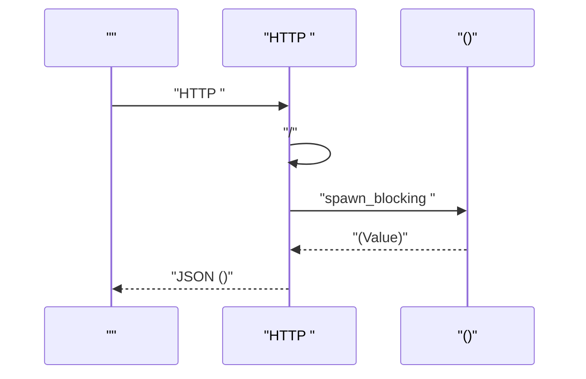
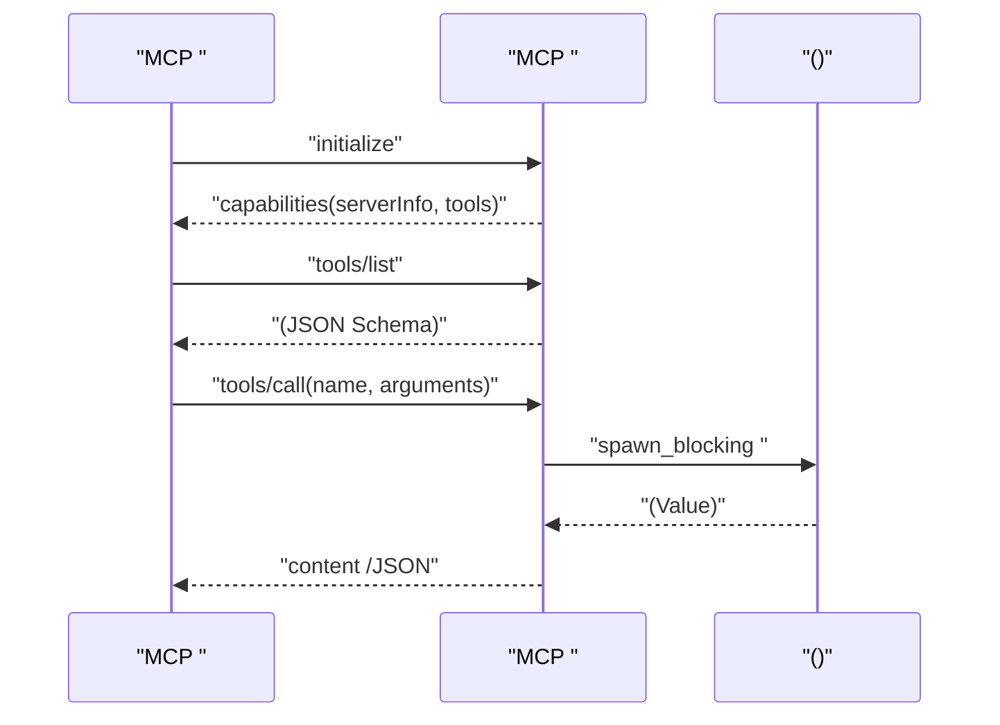
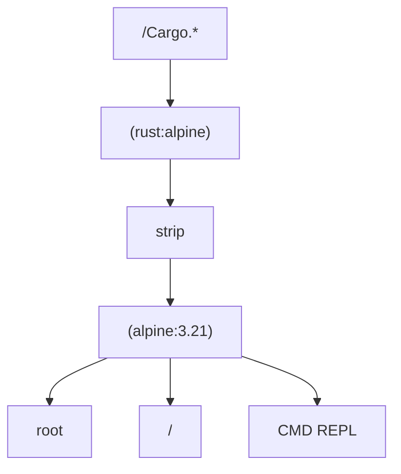
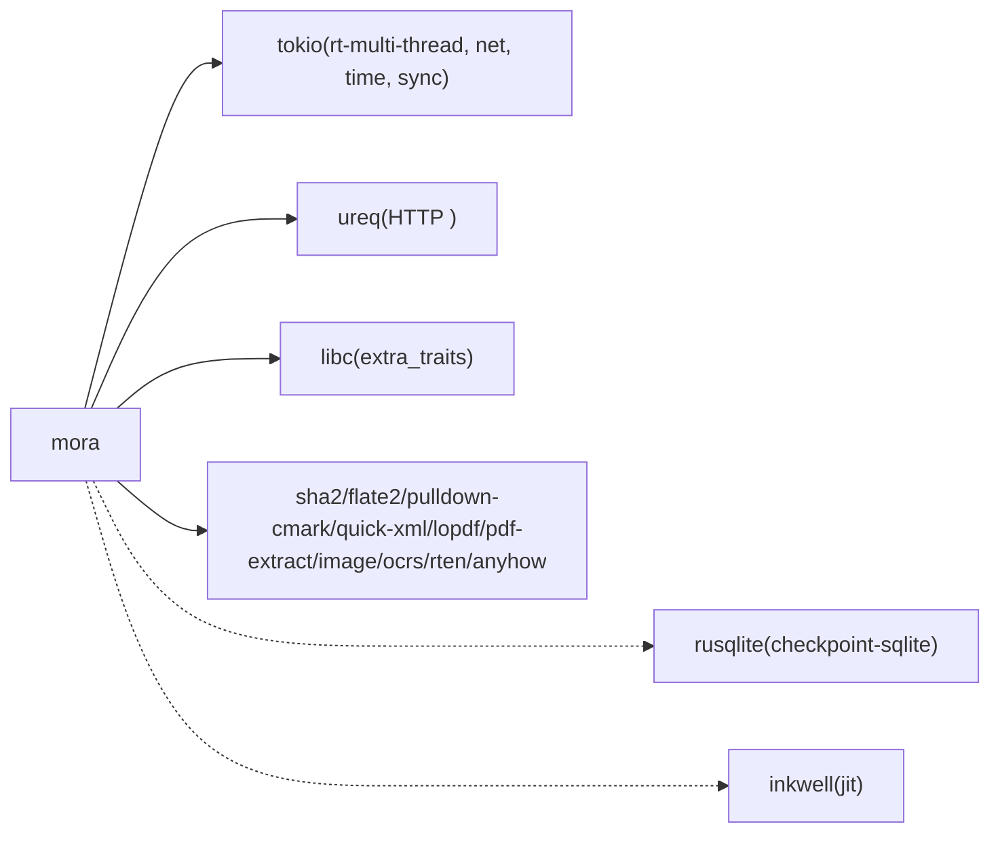

# 

<cite>
****   
- [README.md](file://README.md)
- [Dockerfile](file://Dockerfile)
- [docker-compose.yml](file://docker-compose.yml)
- [Cargo.toml](file://Cargo.toml)
- [src/main.rs](file://src/main.rs)
- [src/http_server.rs](file://src/http_server.rs)
- [src/mcp_server.rs](file://src/mcp_server.rs)
- [.github/workflows/ci.yml](file://.github/workflows/ci.yml)
- [.github/workflows/release.yml](file://.github/workflows/release.yml)
- [examples/mcp_server_demo.mora](file://examples/mcp_server_demo.mora)
</cite>

## 
1. [](#)
2. [](#)
3. [](#)
4. [](#)
5. [](#)
6. [](#)
7. [](#)
8. [](#)
9. [](#)
10. [](#)

## 
 Mora CI/CD Mora  HTTP  MCPModel Context Protocol AI 

## 
 Rust 
- moraCLI + mora-lsp
- HTTP/MCP//
- Dockerfiledocker-compose.yml
- CI/CDGitHub Actions 

```mermaid
graph TB
A[" src/"] --> B[" mora / mora-lsp"]
A --> C[" examples/*.mora"]
D["Dockerfile"] --> E[": alpine + musl "]
F["docker-compose.yml"] --> G[""]
H[".github/workflows/ci.yml"] --> I["///LSP/"]
J[".github/workflows/release.yml"] --> K["++Release"]
```

****
- [Dockerfile:1-42](file://Dockerfile#L1-L42)
- [docker-compose.yml:1-56](file://docker-compose.yml#L1-L56)
- [.github/workflows/ci.yml:1-213](file://.github/workflows/ci.yml#L1-L213)
- [.github/workflows/release.yml:1-201](file://.github/workflows/release.yml#L1-L201)

****
- [README.md:1-338](file://README.md#L1-L338)
- [Cargo.toml:1-102](file://Cargo.toml#L1-L102)

## 
- CLI MIR //
- HTTP  tokio  HTTP/1.1  JSON 
- MCP JSON-RPC 2.0 over stdin/stdouttoolset 
- musl  root Compose 
- CI/CDLSP  Release 

****
- [src/main.rs:1-800](file://src/main.rs#L1-L800)
- [src/http_server.rs:1-419](file://src/http_server.rs#L1-L419)
- [src/mcp_server.rs:1-466](file://src/mcp_server.rs#L1-L466)
- [Dockerfile:1-42](file://Dockerfile#L1-L42)
- [docker-compose.yml:1-56](file://docker-compose.yml#L1-L56)
- [.github/workflows/ci.yml:1-213](file://.github/workflows/ci.yml#L1-L213)
- [.github/workflows/release.yml:1-201](file://.github/workflows/release.yml#L1-L201)

## 
Mora “” serve  API  HTTP  MCP  observe/span 

```mermaid
graph TB
subgraph ""
M["CLI <br/>main.rs"] --> R["HTTP <br/>http_server.rs"]
M --> P["MCP <br/>mcp_server.rs"]
M --> X["/<br/>Interpreter"]
X --> T["/"]
end
subgraph ""
C["/"] --> R
D["Claude Desktop  MCP "] --> P
end
```

****
- [src/main.rs:1-800](file://src/main.rs#L1-L800)
- [src/http_server.rs:1-419](file://src/http_server.rs#L1-L419)
- [src/mcp_server.rs:1-466](file://src/mcp_server.rs#L1-L466)

## 

### HTTP 
-  4  SO_REUSEADDR 
-  dict 
-  60s  30s 
-  JSON 200/404/500/504 CORS 
- 
  - Nginx/Traefik/ LB 80/443 127.0.0.1
  -  CORS 
  - 



****
- [src/http_server.rs:70-108](file://src/http_server.rs#L70-L108)
- [src/http_server.rs:145-223](file://src/http_server.rs#L145-L223)
- [src/http_server.rs:227-255](file://src/http_server.rs#L227-L255)
- [src/http_server.rs:349-418](file://src/http_server.rs#L349-L418)

****
- [src/http_server.rs:1-419](file://src/http_server.rs#L1-L419)
- [README.md:192-228](file://README.md#L192-L228)

### MCP 
- stdin/stdout  JSON-RPC 2.0Content-Length Framing
-  McpServer::new().tool(...)  toolset /ai/json/file/web 
- tools/list tools/call  Value  content 
- 
  -  Claude Desktop
  -  toolset 



****
- [src/mcp_server.rs:117-199](file://src/mcp_server.rs#L117-L199)
- [src/mcp_server.rs:245-293](file://src/mcp_server.rs#L245-L293)
- [src/mcp_server.rs:352-420](file://src/mcp_server.rs#L352-L420)

****
- [src/mcp_server.rs:1-466](file://src/mcp_server.rs#L1-L466)
- [examples/mcp_server_demo.mora:1-17](file://examples/mcp_server_demo.mora#L1-L17)

### Docker 
-  rust:alpine + musl-dev x86_64-unknown-linux-musl strip
- alpine:3.21 ca-certificates root 
-  CMD REPL
- 
  -  musl 
  - 
  -  root 



****
- [Dockerfile:1-42](file://Dockerfile#L1-L42)

****
- [Dockerfile:1-42](file://Dockerfile#L1-L42)

### docker-compose 
-  REPLHTTPMCPSkillEvalMemory 
-  command 
- 

****
- [docker-compose.yml:1-56](file://docker-compose.yml#L1-L56)

### CI/CD 
- CIci.yml
  - cargo check --all-targets
  - lib  all-targets OS/Rust 
  - cargo fmt --check
  - clippy --all-targets --all-features -D warnings
  -  release 
  - LSP  LSP  smoke test 
  - /record listsnapshot 
- release.yml
  - Linux glibc/muslmacOS aarch64/x86_64Windows
  -  tar.gz/zip 
  -  Docker linux/amd64
  -  Tag  GitHub Release SHA256 

****
- [.github/workflows/ci.yml:1-213](file://.github/workflows/ci.yml#L1-L213)
- [.github/workflows/release.yml:1-201](file://.github/workflows/release.yml#L1-L201)

## 
- tokioureqHTTP libcSO_REUSEADDRflate2sha2OCR/PDF/Markdown/HTML SQLite checkpoint
- checkpoint-sqlitejitinkwell
-  MSRVedition 2024MSRV 1.85 ureq 



****
- [Cargo.toml:29-102](file://Cargo.toml#L29-L102)

****
- [Cargo.toml:1-102](file://Cargo.toml#L1-L102)

## 
- HTTP/MCP  tokio  I/O spawn_blocking 
-  30s 60s
- 
-  root 
- 
  - 
  - Pod/VM 
  -  AI 

[]

## 
-  compose 
-  504  60s
-  :param 
- CORS 
- MCP  toolset 
- //
  - record/replay/diff 
  - snapshot 

****
- [src/http_server.rs:110-143](file://src/http_server.rs#L110-L143)
- [src/http_server.rs:145-223](file://src/http_server.rs#L145-L223)
- [src/http_server.rs:396-418](file://src/http_server.rs#L396-L418)
- [src/mcp_server.rs:117-199](file://src/mcp_server.rs#L117-L199)
- [src/main.rs:425-541](file://src/main.rs#L425-L541)

## 
Mora “” Compose  CI/CD // CORS toolset 

[]

## 

### 
- OPENAI_API_KEY AI  mock 
- MORA_AI_MODEL / MORA_AI_BASE_URL
- MORA_NO_TYPECK
- MORA_CORS_ORIGINHTTP  Access-Control-Allow-Origin

****
- [README.md:182-191](file://README.md#L182-L191)
- [src/http_server.rs:404-418](file://src/http_server.rs#L404-L418)

### 
-  LB/Ingress  80/443 127.0.0.1
-  CPU/QPS
-  + 
-  Secret/ConfigMap 

[]

### 
-  OTEL  observe trace/span  Prometheus/Grafana 
- RED/USE
-  stdout/stderr  trace ID 

[]

### 
-  root 
-  VPC/
- 
-  toolset 

[]