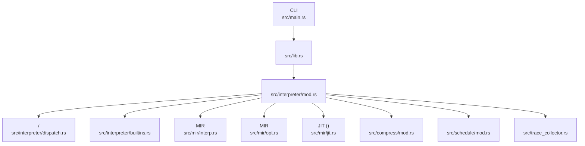
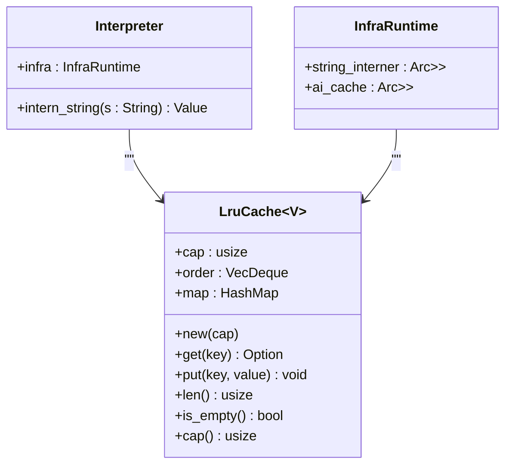
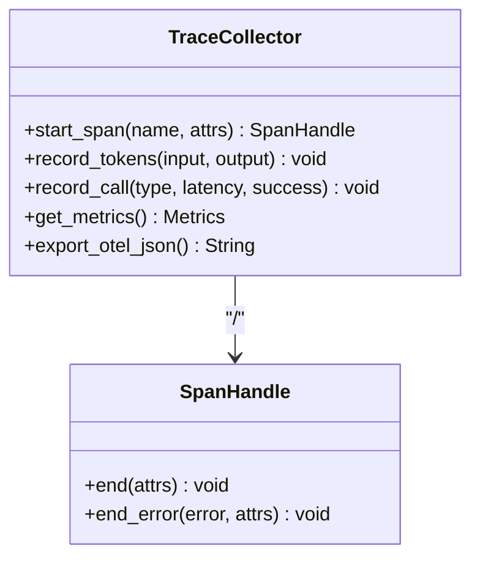
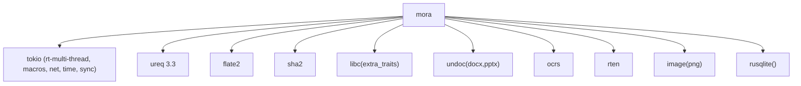

# 

<cite>
****   
- [src/main.rs](file://src/main.rs)
- [src/lib.rs](file://src/lib.rs)
- [Cargo.toml](file://Cargo.toml)
- [src/interpreter/mod.rs](file://src/interpreter/mod.rs)
- [src/interpreter/dispatch.rs](file://src/interpreter/dispatch.rs)
- [src/interpreter/builtins.rs](file://src/interpreter/builtins.rs)
- [src/mir/interp.rs](file://src/mir/interp.rs)
- [src/mir/opt.rs](file://src/mir/opt.rs)
- [src/mir/jit.rs](file://src/mir/jit.rs)
- [src/trace_collector.rs](file://src/trace_collector.rs)
- [src/compress/mod.rs](file://src/compress/mod.rs)
- [src/compress/json.rs](file://src/compress/json.rs)
- [src/schedule/mod.rs](file://src/schedule/mod.rs)
- [src/stress_tests.rs](file://src/stress_tests.rs)
- [examples/compact_demo.mora](file://examples/compact_demo.mora)
</cite>

## 
1. [](#)
2. [](#)
3. [](#)
4. [](#)
5. [](#)
6. [](#)
7. [](#)
8. [](#)
9. [](#)
10. [](#)

## 
 Mora 
- Arena LRU 
- Worker 
- 
- JIT 
- TraceCollector 
- 

## 
Mora “ + ”MIRCLI MIR  Runtime Facade  Trace/Metrics




- [src/main.rs:1-120](file://src/main.rs#L1-L120)
- [src/lib.rs:1-55](file://src/lib.rs#L1-L55)
- [src/interpreter/mod.rs:214-271](file://src/interpreter/mod.rs#L214-L271)
- [src/interpreter/dispatch.rs:14-29](file://src/interpreter/dispatch.rs#L14-L29)
- [src/interpreter/builtins.rs:1318-1322](file://src/interpreter/builtins.rs#L1318-L1322)
- [src/mir/interp.rs:344-354](file://src/mir/interp.rs#L344-L354)
- [src/mir/opt.rs:24-49](file://src/mir/opt.rs#L24-L49)
- [src/mir/jit.rs:24-53](file://src/mir/jit.rs#L24-L53)
- [src/compress/mod.rs:241-309](file://src/compress/mod.rs#L241-L309)
- [src/schedule/mod.rs:49-57](file://src/schedule/mod.rs#L49-L57)
- [src/trace_collector.rs:46-58](file://src/trace_collector.rs#L46-L58)


- [src/main.rs:1-120](file://src/main.rs#L1-L120)
- [src/lib.rs:1-55](file://src/lib.rs#L1-L55)

## 
-  Facade Core/Registry/Infra/Ai/Sandbox/Persist/Orch 
- LRU  AI 
-  Value
-  SubCompressor trait + ContentRouter json/code/html/log/text SmartCrusher  JSON /
-  cron  ID  JSON
- Span/SpanHandle RAII Metrics Token 
-  Workerexec.parallel  + MIR send/receive  worker 
-  JITSSA  + //GVN/CopyProp/LICM//JIT  LLVM 


- [src/interpreter/mod.rs:152-212](file://src/interpreter/mod.rs#L152-L212)
- [src/interpreter/mod.rs:638-653](file://src/interpreter/mod.rs#L638-L653)
- [src/compress/mod.rs:66-84](file://src/compress/mod.rs#L66-L84)
- [src/compress/mod.rs:241-309](file://src/compress/mod.rs#L241-L309)
- [src/schedule/mod.rs:49-57](file://src/schedule/mod.rs#L49-L57)
- [src/trace_collector.rs:46-58](file://src/trace_collector.rs#L46-L58)
- [src/interpreter/builtins.rs:1318-1322](file://src/interpreter/builtins.rs#L1318-L1322)
- [src/mir/interp.rs:344-354](file://src/mir/interp.rs#L344-L354)
- [src/mir/opt.rs:24-49](file://src/mir/opt.rs#L24-L49)
- [src/mir/jit.rs:24-53](file://src/mir/jit.rs#L24-L53)

## 
 CLI MIR 

```mermaid
sequenceDiagram
participant U as ""
participant CLI as "CLI <br/>main.rs"
participant INT as "<br/>interpreter/mod.rs"
participant MIR as "MIR <br/>mir/interp.rs"
participant OPT as "MIR <br/>mir/opt.rs"
participant COMP as "<br/>compress/mod.rs"
participant TR as "<br/>trace_collector.rs"
participant SCH as "<br/>schedule/mod.rs"
U->>CLI : /
CLI->>INT : ++lowering
INT->>OPT :  SSA 
INT->>MIR : run_mir()
MIR-->>TR : /
MIR-->>SCH :  tick
INT->>COMP : compress()/crush_json()
TR-->>U : /
```


- [src/main.rs:370-405](file://src/main.rs#L370-L405)
- [src/mir/opt.rs:24-49](file://src/mir/opt.rs#L24-L49)
- [src/mir/interp.rs:344-354](file://src/mir/interp.rs#L344-L354)
- [src/compress/mod.rs:241-309](file://src/compress/mod.rs#L241-L309)
- [src/trace_collector.rs:77-99](file://src/trace_collector.rs#L77-L99)
- [src/schedule/mod.rs:174-208](file://src/schedule/mod.rs#L174-L208)

## 

### 
- Arena ParserV2  AstArena AST 
- Interpreter.intern_string  LruCache<Value> 
- LRU  LruCache<V>  VecDeque O(1) AI 
- stress tests  OOM 




- [src/interpreter/mod.rs:152-212](file://src/interpreter/mod.rs#L152-L212)
- [src/interpreter/mod.rs:638-653](file://src/interpreter/mod.rs#L638-L653)
- [src/interpreter/mod.rs:214-271](file://src/interpreter/mod.rs#L214-L271)


- [src/interpreter/mod.rs:152-212](file://src/interpreter/mod.rs#L152-L212)
- [src/interpreter/mod.rs:638-653](file://src/interpreter/mod.rs#L638-L653)
- [src/stress_tests.rs:265-289](file://src/stress_tests.rs#L265-L289)

### Worker 
- exec.parallel + 
- MIR send/receive worker_channels/worker_receivers  worker  parallel  worker 
- dispatch.block_on_async  tokio context block_in_place  runtime panic

```mermaid
flowchart TD
Start([" exec.parallel"]) --> ParseArgs["<br/>cmds, max_concurrent, timeout_ms"]
ParseArgs --> InitSem[""]
InitSem --> SpawnWorkers[" N  worker "]
SpawnWorkers --> Acquire[""]
Acquire --> Collect[" stdout/stderr/exit_code/pid/elapsed_ms"]
Collect --> Order[""]
Order --> End([" Value::List[Dict]"])
```


- [src/interpreter/builtins.rs:1318-1322](file://src/interpreter/builtins.rs#L1318-L1322)
- [src/interpreter/builtins.rs:2200-2262](file://src/interpreter/builtins.rs#L2200-L2262)
- [src/interpreter/dispatch.rs:14-29](file://src/interpreter/dispatch.rs#L14-L29)
- [src/mir/interp.rs:344-354](file://src/mir/interp.rs#L344-L354)


- [src/interpreter/builtins.rs:2200-2262](file://src/interpreter/builtins.rs#L2200-L2262)
- [src/interpreter/dispatch.rs:14-29](file://src/interpreter/dispatch.rs#L14-L29)
- [src/mir/interp.rs:344-354](file://src/mir/interp.rs#L344-L354)

### 
- 
  - autoContentRouter  sniff  json/code/html/log/text 
  - jsonSmartCrusher  JSON  topn/top_scores/lossless_compact ID  CSV schema 
  - head_tail/summary/losslessTextSubCompressor 
-  HashMap  LRU 
- top_scores  TopNCSV schema 

```mermaid
flowchart TD
A["compress_top(input, strategy, options)"] --> B{"strategy == 'json'?"}
B --  --> C["SmartCrusher(crush_json)"]
C --> D[" target(max_bytes/target_ratio/N*0.2)"]
D --> E[": topn/top_scores/lossless_compact"]
B --  --> F["extract_text(input)"]
F --> G{"strategy"}
G --> |auto| H["ContentRouter.sniff -> "]
G --> |head_tail/summary/lossless| I["TextSubCompressor.compress"]
H --> J[""]
I --> J
```


- [src/compress/mod.rs:241-309](file://src/compress/mod.rs#L241-L309)
- [src/compress/json.rs:1142-1185](file://src/compress/json.rs#L1142-L1185)


- [src/compress/mod.rs:241-309](file://src/compress/mod.rs#L241-L309)
- [src/compress/json.rs:1142-1185](file://src/compress/json.rs#L1142-L1185)
- [examples/compact_demo.mora:1-28](file://examples/compact_demo.mora#L1-L28)

### JIT 
- SSA → LLVM IR → (O3) → JIT  → native 
-  Cargo feature "jit"  inkwell + LLVM 17
-  LLVM  inkwell 

```mermaid
flowchart TD
S["SSA "] --> T["LLVM IR "]
T --> O["LLVM (O3)"]
O --> J["JIT  native"]
J --> R[""]
```


- [src/mir/jit.rs:1-53](file://src/mir/jit.rs#L1-L53)
- [Cargo.toml:94-102](file://Cargo.toml#L94-L102)


- [src/mir/jit.rs:1-53](file://src/mir/jit.rs#L1-L53)
- [Cargo.toml:94-102](file://Cargo.toml#L94-L102)

### TraceCollector 
- TraceCollectorRAII SpanHandle  spantrace/span id metrics Token  OTel JSON 
- stress_tests  LRU  bench_server.mora  HTTP 




- [src/trace_collector.rs:46-58](file://src/trace_collector.rs#L46-L58)
- [src/trace_collector.rs:77-99](file://src/trace_collector.rs#L77-L99)
- [src/trace_collector.rs:139-162](file://src/trace_collector.rs#L139-L162)
- [src/trace_collector.rs:189-204](file://src/trace_collector.rs#L189-L204)
- [src/stress_tests.rs:265-289](file://src/stress_tests.rs#L265-L289)
- [examples/_legacy/bench_server.mora:1-34](file://examples/_legacy/bench_server.mora#L1-L34)


- [src/trace_collector.rs:46-58](file://src/trace_collector.rs#L46-L58)
- [src/trace_collector.rs:77-99](file://src/trace_collector.rs#L77-L99)
- [src/trace_collector.rs:139-162](file://src/trace_collector.rs#L139-L162)
- [src/trace_collector.rs:189-204](file://src/trace_collector.rs#L189-L204)
- [src/stress_tests.rs:265-289](file://src/stress_tests.rs#L265-L289)
- [examples/_legacy/bench_server.mora:1-34](file://examples/_legacy/bench_server.mora#L1-L34)

## 
- tokioHTTP/MCP server ureq HTTP flate2sha2libcSO_REUSEADDRundoc/ocrs/rten/image OCR rusqlite
- VERSION  build.rs  lib.rs 
- jit  inkwell  LLVM 17




- [Cargo.toml:29-86](file://Cargo.toml#L29-L86)
- [Cargo.toml:94-102](file://Cargo.toml#L94-L102)
- [src/lib.rs:1-13](file://src/lib.rs#L1-L13)


- [Cargo.toml:29-86](file://Cargo.toml#L29-L86)
- [Cargo.toml:94-102](file://Cargo.toml#L94-L102)
- [src/lib.rs:1-13](file://src/lib.rs#L1-L13)

## 
- 
  -  LRU  cap
  -  Arena  AST 
- 
  - exec.parallel  max_concurrent  CPU  IO 
  -  tokio context  runtime dispatch.block_on_async
- 
  - JSON  SmartCrusher head_tail/summary lossless 
  -  HashMap 
-  JIT
  -  SSA  passBasic/Aggressive
  -  LLVM  jit
- 
  -  TraceCollector  Token  metrics_json/export_otel_json 
  -  stress tests ab/wrk

## 
- 
  -  LLVM  JIT  LLVM 17  jit 
  -  tokio runtime panic dispatch.block_on_async 
  - auto  sniff  strategy  compress demo 
- 
  -  TraceCollector  spans/metrics
  -  LRU cap  max_concurrent
  -  schedule.tick 


- [src/mir/jit.rs:49-53](file://src/mir/jit.rs#L49-L53)
- [src/interpreter/dispatch.rs:14-29](file://src/interpreter/dispatch.rs#L14-L29)
- [src/compress/mod.rs:294-309](file://src/compress/mod.rs#L294-L309)
- [src/trace_collector.rs:189-204](file://src/trace_collector.rs#L189-L204)
- [src/schedule/mod.rs:174-208](file://src/schedule/mod.rs#L174-L208)

## 
ArenaLRUWorker JITSSA LLVM TraceCollector Mora 

## 
- 
  - examples/compact_demo.mora
  - HTTP examples/_legacy/bench_server.mora
- 
  - AI 
  - Cargo featuresjit  LLVM 17