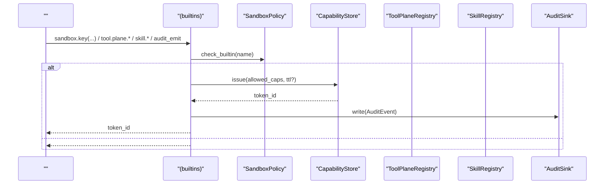
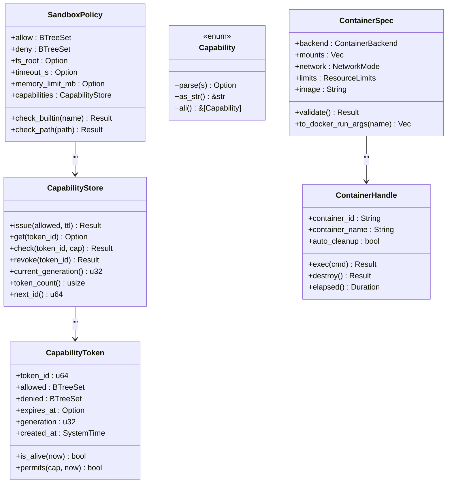
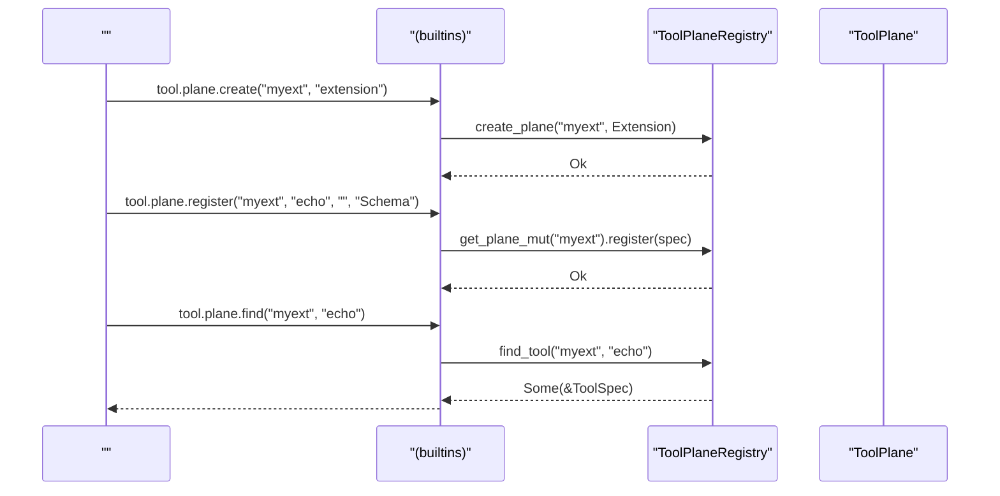
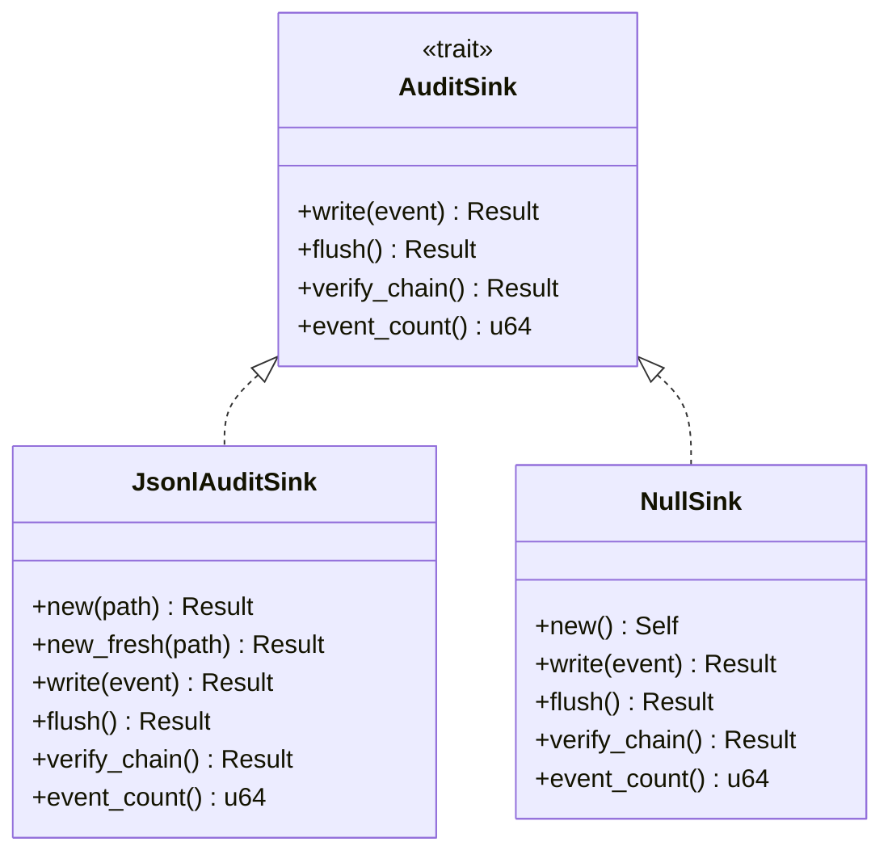
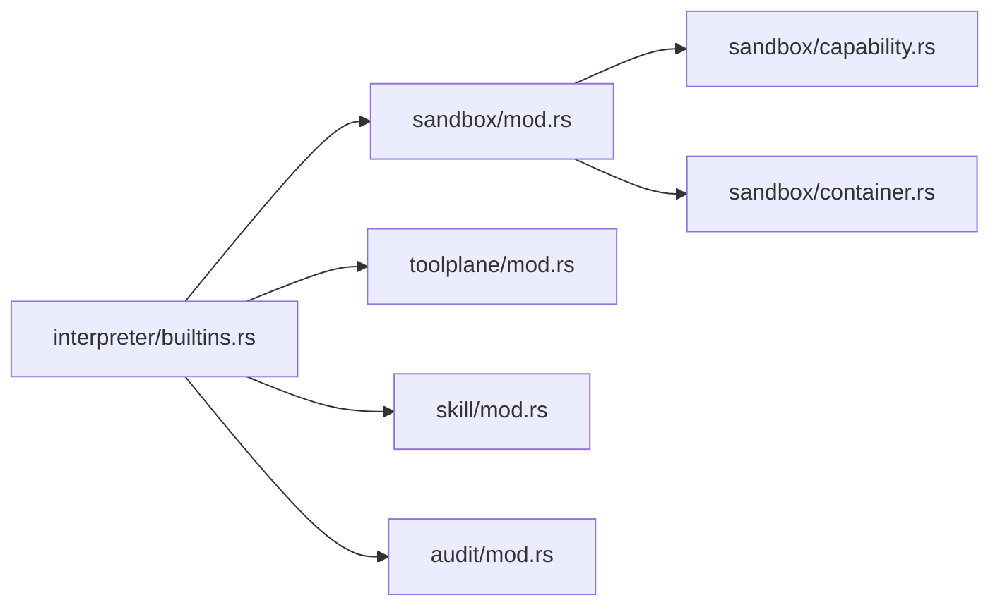

# 

<cite>
****   
- [src/sandbox/mod.rs](file://src/sandbox/mod.rs)
- [src/sandbox/capability.rs](file://src/sandbox/capability.rs)
- [src/sandbox/container.rs](file://src/sandbox/container.rs)
- [src/toolplane/mod.rs](file://src/toolplane/mod.rs)
- [src/interpreter/builtins.rs](file://src/interpreter/builtins.rs)
- [src/audit/mod.rs](file://src/audit/mod.rs)
- [src/skill/mod.rs](file://src/skill/mod.rs)
- [examples/_legacy/skill_demo.mora](file://examples/_legacy/skill_demo.mora)
</cite>

## 
1. [](#)
2. [](#)
3. [](#)
4. [](#)
5. [](#)
6. [](#)
7. [](#)
8. [](#)
9. [](#)
10. [](#)

## 
 Mora 
- CapabilityToken
- ToolPlane 
- Skill 
- 
- 
- 

## 

- sandbox
- toolplane
- interpreter/builtins sandboxtool.planeskillaudit  API
- audit
- skillSKILL.md 

```mermaid
graph TB
subgraph ""
B["builtins.rs<br/>API"]
end
subgraph ""
SMod["sandbox/mod.rs<br/>SandboxPolicy"]
SCap["sandbox/capability.rs<br/>CapabilityStore/Token"]
SCon["sandbox/container.rs<br/>Docker"]
end
subgraph ""
TP["toolplane/mod.rs<br/>ToolPlaneRegistry"]
end
subgraph ""
SK["skill/mod.rs<br/>SkillRegistry/SKILL.md"]
end
subgraph ""
AU["audit/mod.rs<br/>AuditSink/JsonlAuditSink"]
end
B --> SMod
B --> SCap
B --> TP
B --> SK
B --> AU
SMod --> SCap
SMod --> SCon
```


- [src/interpreter/builtins.rs](file://src/interpreter/builtins.rs)
- [src/sandbox/mod.rs](file://src/sandbox/mod.rs)
- [src/sandbox/capability.rs](file://src/sandbox/capability.rs)
- [src/sandbox/container.rs](file://src/sandbox/container.rs)
- [src/toolplane/mod.rs](file://src/toolplane/mod.rs)
- [src/skill/mod.rs](file://src/skill/mod.rs)
- [src/audit/mod.rs](file://src/audit/mod.rs)


- [src/interpreter/builtins.rs](file://src/interpreter/builtins.rs)
- [src/sandbox/mod.rs](file://src/sandbox/mod.rs)
- [src/toolplane/mod.rs](file://src/toolplane/mod.rs)
- [src/skill/mod.rs](file://src/skill/mod.rs)
- [src/audit/mod.rs](file://src/audit/mod.rs)

## 
-  SandboxPolicy allow/deny  builtin 
-  CapabilityToken + CapabilityStore capability 
-  ContainerSpec/Docker Docker 
- ToolPlane Core/Extension 
- Skill  SKILL.md  hub 
-  AuditSink sink  JSONL+SHA-256 


- [src/sandbox/mod.rs](file://src/sandbox/mod.rs)
- [src/sandbox/capability.rs](file://src/sandbox/capability.rs)
- [src/sandbox/container.rs](file://src/sandbox/container.rs)
- [src/toolplane/mod.rs](file://src/toolplane/mod.rs)
- [src/skill/mod.rs](file://src/skill/mod.rs)
- [src/audit/mod.rs](file://src/audit/mod.rs)

## 
Mora “ API”




- [src/interpreter/builtins.rs](file://src/interpreter/builtins.rs)
- [src/sandbox/mod.rs](file://src/sandbox/mod.rs)
- [src/sandbox/capability.rs](file://src/sandbox/capability.rs)
- [src/toolplane/mod.rs](file://src/toolplane/mod.rs)
- [src/skill/mod.rs](file://src/skill/mod.rs)
- [src/audit/mod.rs](file://src/audit/mod.rs)

## 

### 
- SandboxPolicy
  -  allow/deny deny  allow
  -  ..  fs_root 
- CapabilityToken/CapabilityStore
  -  capability  generation 
  - revoke  generation token check  allowed
- 
  -  Docker CPU/best-effort
  -  exec Drop




- [src/sandbox/mod.rs](file://src/sandbox/mod.rs)
- [src/sandbox/capability.rs](file://src/sandbox/capability.rs)
- [src/sandbox/container.rs](file://src/sandbox/container.rs)


- [src/sandbox/mod.rs](file://src/sandbox/mod.rs)
- [src/sandbox/capability.rs](file://src/sandbox/capability.rs)
- [src/sandbox/container.rs](file://src/sandbox/container.rs)

#### 
```mermaid
flowchart TD
Start([" check(token_id, capability)"]) --> GetToken[" token "]
GetToken --> Found{" token?"}
Found --  --> ErrNotFound[" TokenNotFound"]
Found --  --> Revoked{"?"}
Revoked --  --> ErrRevoked[" TokenNotFound"]
Revoked --  --> Alive{"?"}
Alive --  --> ErrExpired[" TokenExpired"]
Alive --  --> Permits{" allowed  denied?"}
Permits --  --> ErrViolation[" CapViolation"]
Permits --  --> Ok[" Ok(())"]
```


- [src/sandbox/capability.rs](file://src/sandbox/capability.rs)

### ToolPlane 
- PlaneKind Core Extension
- ToolPlane name/kind/tools  register/unregister/get
- ToolPlaneRegistry create_plane/find_tool/list_planes 
- tool.plane.create/register/unregister/list/list_tools/info/find/remove




- [src/toolplane/mod.rs](file://src/toolplane/mod.rs)
- [src/interpreter/builtins.rs](file://src/interpreter/builtins.rs)


- [src/toolplane/mod.rs](file://src/toolplane/mod.rs)
- [src/interpreter/builtins.rs](file://src/interpreter/builtins.rs)

### Skill 
- MoraSkillSpec SKILL.md  YAMLname/description/trigger Markdown 
- SkillRegistry + mora-public.json
- skill.list/find/load/install/uninstall/set_hub/refresh_hub

```mermaid
flowchart TD
A[": SKILL.md "] --> B[" --- "]
B --> C{" name  description ?"}
C --  --> E[""]
C --  --> D[" MoraSkillSpec(name, description, trigger?, body, source)"]
D --> F[" SkillRegistry"]
F --> G[" skill.find/list "]
```


- [src/skill/mod.rs](file://src/skill/mod.rs)
- [src/interpreter/builtins.rs](file://src/interpreter/builtins.rs)


- [src/skill/mod.rs](file://src/skill/mod.rs)
- [src/interpreter/builtins.rs](file://src/interpreter/builtins.rs)
- [examples/_legacy/skill_demo.mora](file://examples/_legacy/skill_demo.mora)

### 
- AuditSink traitwrite/flush/verify_chain/event_count
- JsonlAuditSinkJSONL  prev_hash/hash SHA-256  last_hash
- NullSink
- sandbox.audit_emit/audit_flush/audit_verify




- [src/audit/mod.rs](file://src/audit/mod.rs)
- [src/interpreter/builtins.rs](file://src/interpreter/builtins.rs)


- [src/audit/mod.rs](file://src/audit/mod.rs)
- [src/interpreter/builtins.rs](file://src/interpreter/builtins.rs)

## 
-  builtins  sandboxtoolplaneskillaudit 
- sandbox  capability  container 
- audit 




- [src/interpreter/builtins.rs](file://src/interpreter/builtins.rs)
- [src/sandbox/mod.rs](file://src/sandbox/mod.rs)
- [src/sandbox/capability.rs](file://src/sandbox/capability.rs)
- [src/sandbox/container.rs](file://src/sandbox/container.rs)
- [src/toolplane/mod.rs](file://src/toolplane/mod.rs)
- [src/skill/mod.rs](file://src/skill/mod.rs)
- [src/audit/mod.rs](file://src/audit/mod.rs)


- [src/interpreter/builtins.rs](file://src/interpreter/builtins.rs)
- [src/sandbox/mod.rs](file://src/sandbox/mod.rs)
- [src/toolplane/mod.rs](file://src/toolplane/mod.rs)
- [src/skill/mod.rs](file://src/skill/mod.rs)
- [src/audit/mod.rs](file://src/audit/mod.rs)

## 
- revoke  generation  token
-  last_hash
- ToolPlane  HashMap O(1)  list 
-  exec 

[]

## 
- 
  - TokenNotFound revoke  token_id 
  - TokenExpiredTTL  TTL 
  - CapViolation capability  allowed  key 
- 
  - ChainBroken/HashMismatch verify_chain 
  - ParseErrorJSON  payload 
- 
  - / plane  tool 
  -  plane create_plane 
- 
  - SKILL.md name/description
  -  JSON 


- [src/sandbox/capability.rs](file://src/sandbox/capability.rs)
- [src/audit/mod.rs](file://src/audit/mod.rs)
- [src/toolplane/mod.rs](file://src/toolplane/mod.rs)
- [src/skill/mod.rs](file://src/skill/mod.rs)

## 
Mora “”
-  SandboxPolicy  CapabilityToken “ +  + ”
-  ToolPlane  Core/Extension 
- Skill  SKILL.md 
- AuditSink 
- 

[]

## 

### 
- 
  - sandbox.key(file.read, web.fetch, ...) →  token_id
  - sandbox.check_call(token_id, "file.read") → 
  - sandbox.revoke(token_id) → 
- 
  - tool.plane.create("myext", "extension")
  - tool.plane.register("myext", "echo", "", "Schema")
  - tool.plane.find("myext", "echo")
- 
  - skill.install("name", "SKILL.md ")
  - skill.load("/path/to/file.md")
  - /skill.list()/skill.find("name")
  - /skill.set_hub("mora-public.json"), skill.refresh_hub()
- 
  - sandbox.audit_emit(actor, action, target?, payload?)
  - sandbox.audit_flush()
  - sandbox.audit_verify()


- [src/interpreter/builtins.rs](file://src/interpreter/builtins.rs)
- [src/sandbox/capability.rs](file://src/sandbox/capability.rs)
- [src/toolplane/mod.rs](file://src/toolplane/mod.rs)
- [src/skill/mod.rs](file://src/skill/mod.rs)
- [src/audit/mod.rs](file://src/audit/mod.rs)

### 
-  myext  echo 
- 
  1) 
     -  tool.plane.create("myext", "extension")
  2) 
     -  tool.plane.register("myext", "echo", "", '{"type":"object","properties":{"text":{"type":"string"}}}')
  3) 
     -  tool.plane.find("myext", "echo")
  4) 
     -  sandbox.key("file.read")  token_id
     -  sandbox.check_call(token_id, "file.read") 
  5) 
     -  sandbox.audit_emit("plugin.echo", "tool.invoke", "myext.echo", "{\"args\":{...}}")
     -  sandbox.audit_flush()
  6)  SKILL.md 
     -  skill.install("myext-plugin", "<SKILL.md >")
     -  skill.load("/path/to/myext-plugin.md")


- [src/interpreter/builtins.rs](file://src/interpreter/builtins.rs)
- [src/toolplane/mod.rs](file://src/toolplane/mod.rs)
- [src/skill/mod.rs](file://src/skill/mod.rs)
- [src/audit/mod.rs](file://src/audit/mod.rs)

### 
- 
  -  capability TTL  token
- 
  -  revoke revoke  generation token 
- 
  -  fs_root .. 
- 
  - 
- 
  -  emit  flush  verify_chain 
- 
  -  Extension  schema 
  -  Skill 


- [src/sandbox/mod.rs](file://src/sandbox/mod.rs)
- [src/sandbox/capability.rs](file://src/sandbox/capability.rs)
- [src/sandbox/container.rs](file://src/sandbox/container.rs)
- [src/audit/mod.rs](file://src/audit/mod.rs)
- [src/toolplane/mod.rs](file://src/toolplane/mod.rs)
- [src/skill/mod.rs](file://src/skill/mod.rs)