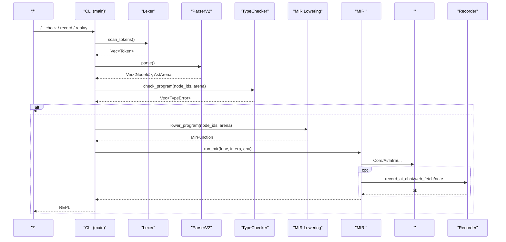
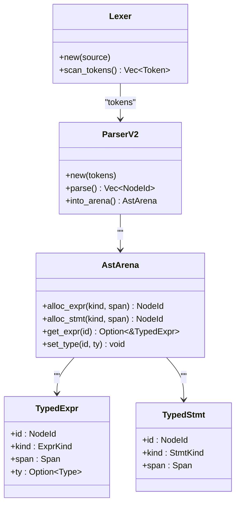
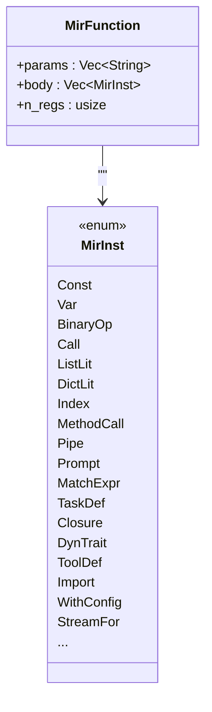
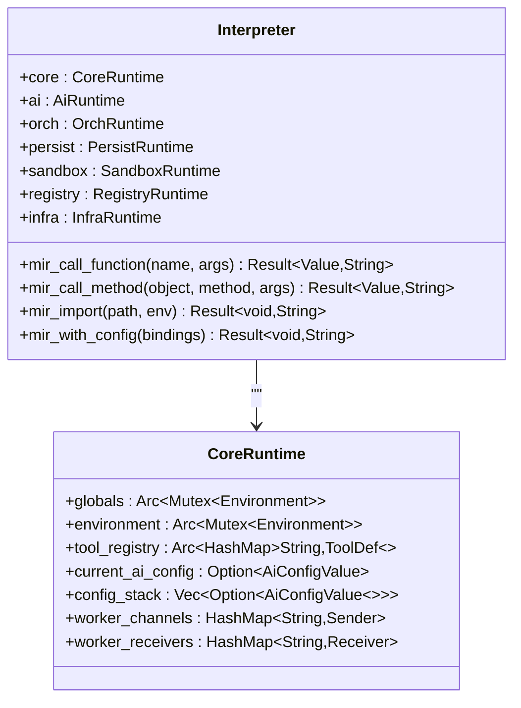
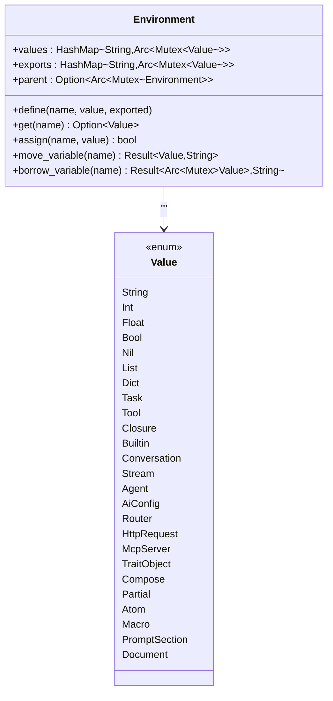
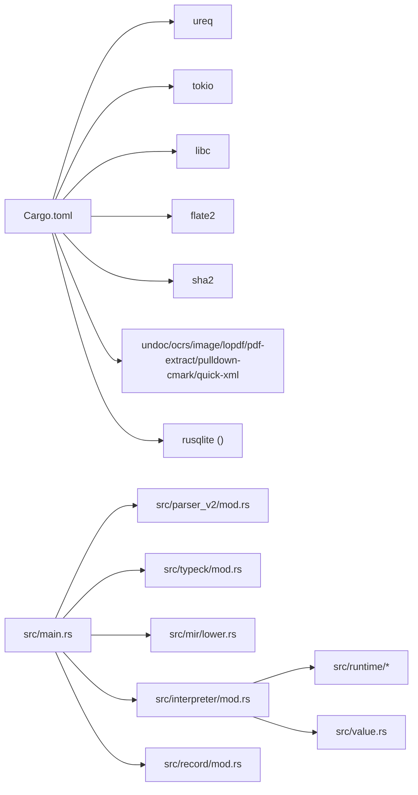

# 

<cite>
****   
- [src/main.rs](file://src/main.rs)
- [src/lib.rs](file://src/lib.rs)
- [README.md](file://README.md)
- [Cargo.toml](file://Cargo.toml)
- [src/lexer.rs](file://src/lexer.rs)
- [src/parser_v2/mod.rs](file://src/parser_v2/mod.rs)
- [src/ast_v2.rs](file://src/ast_v2.rs)
- [src/typeck/mod.rs](file://src/typeck/mod.rs)
- [src/mir/mod.rs](file://src/mir/mod.rs)
- [src/mir/lower.rs](file://src/mir/lower.rs)
- [src/interpreter/mod.rs](file://src/interpreter/mod.rs)
- [src/value.rs](file://src/value.rs)
- [src/runtime/mod.rs](file://src/runtime/mod.rs)
- [src/runtime/core.rs](file://src/runtime/core.rs)
- [src/lsp/mod.rs](file://src/lsp/mod.rs)
- [src/record/mod.rs](file://src/record/mod.rs)
</cite>

## 
1. [](#)
2. [](#)
3. [](#)
4. [](#)
5. [](#)
6. [](#)
7. [](#)
8. [](#)
9. [](#)
10. [](#)

## 
 Mora 
- MIR
- 
-  Arena 
- AI 
- 
- 

## 
Mora “ + ” Rust 
-  cratemora lexerparser_v2ast_v2typeckmirinterpreterruntimelsprecord 
-  moraCLI MIR lowering 
-  mora-lspLSP  IDE 

```mermaid
graph TB
subgraph ""
CLI["CLI: src/main.rs"]
LSP["LSP Server: src/bin/lsp.rs"]
end
subgraph ""
Lexer[": src/lexer.rs"]
Parser[" v2: src/parser_v2/mod.rs"]
AST["AST v2: src/ast_v2.rs"]
TypeCK[": src/typeck/mod.rs"]
MIR["MIR : src/mir/mod.rs"]
Lower["MIR Lowering: src/mir/lower.rs"]
Interp[": src/interpreter/mod.rs"]
Value[": src/value.rs"]
Runtime[": src/runtime/*"]
Record["/: src/record/mod.rs"]
LSPMod["LSP : src/lsp/mod.rs"]
end
CLI --> Lexer --> Parser --> AST --> TypeCK --> Lower --> MIR --> Interp --> Value
CLI --> Record
LSP --> LSPMod
Interp --> Runtime
```


- [src/main.rs:1-120](file://src/main.rs#L1-L120)
- [src/lib.rs:1-55](file://src/lib.rs#L1-L55)
- [src/lsp/mod.rs:1-23](file://src/lsp/mod.rs#L1-L23)


- [src/lib.rs:1-55](file://src/lib.rs#L1-L55)
- [README.md:315-334](file://README.md#L315-L334)

## 
-  Token  p"..." 
-  v2 ast_v2  AstArena 
- AST v2NodeId  +  + Visitor 
- Union/Result/dyn Trait 
- MIR //
-  MIR AI HTTP/MCP
-  FacadeCore/Ai/Orch/Persist/Sandbox/Registry/Infra
- LSP JSON-RPC hover/completion/rename/diagnostics 
- /JSONL 


- [src/lexer.rs:1-154](file://src/lexer.rs#L1-L154)
- [src/parser_v2/mod.rs:1-60](file://src/parser_v2/mod.rs#L1-L60)
- [src/ast_v2.rs:1-120](file://src/ast_v2.rs#L1-L120)
- [src/typeck/mod.rs:1-120](file://src/typeck/mod.rs#L1-L120)
- [src/mir/mod.rs:1-60](file://src/mir/mod.rs#L1-L60)
- [src/interpreter/mod.rs:214-235](file://src/interpreter/mod.rs#L214-L235)
- [src/runtime/mod.rs:1-22](file://src/runtime/mod.rs#L1-L22)
- [src/lsp/mod.rs:1-23](file://src/lsp/mod.rs#L1-L23)
- [src/record/mod.rs:1-60](file://src/record/mod.rs#L1-L60)

## 
Mora “ →  →  → ” Facade 




- [src/main.rs:370-405](file://src/main.rs#L370-L405)
- [src/mir/lower.rs:12-19](file://src/mir/lower.rs#L12-L19)
- [src/interpreter/mod.rs:659-734](file://src/interpreter/mod.rs#L659-L734)
- [src/record/mod.rs:119-161](file://src/record/mod.rs#L119-L161)

## 

### Lexer + ParserV2 + ASTv2
- p"..." 
-  v2  ast_v2AstArena  NodeId
- AST v2  TypedExpr/TypedStmt  Visitor  typeck 




- [src/lexer.rs:163-193](file://src/lexer.rs#L163-L193)
- [src/parser_v2/mod.rs:17-60](file://src/parser_v2/mod.rs#L17-L60)
- [src/ast_v2.rs:562-632](file://src/ast_v2.rs#L562-L632)


- [src/lexer.rs:163-193](file://src/lexer.rs#L163-L193)
- [src/parser_v2/mod.rs:17-60](file://src/parser_v2/mod.rs#L17-L60)
- [src/ast_v2.rs:1-120](file://src/ast_v2.rs#L1-L120)

### TypeChecker
- 
-  UnionResultdyn Traitlist<T>/dict<K,V> 
-  Any Union

```mermaid
flowchart TD
Start([""]) --> Scan["/"]
Scan --> Walk[" AST "]
Walk --> CheckLet[" let  vs hint"]
Walk --> CheckCall[" call/method /"]
Walk --> CheckBin[""]
Walk --> CheckIndex[""]
Walk --> CollectErr[" TypeError"]
CollectErr --> End([""])
```


- [src/typeck/mod.rs:1-120](file://src/typeck/mod.rs#L1-L120)
- [src/typeck/mod.rs:550-630](file://src/typeck/mod.rs#L550-L630)


- [src/typeck/mod.rs:1-120](file://src/typeck/mod.rs#L1-L120)
- [src/typeck/mod.rs:550-630](file://src/typeck/mod.rs#L550-L630)

### MIR Lowering
- MIR //
- Lowering  AST v2  MirFunction Label/Jump/JumpIf
-  MatchExprStreamForWithConfigTraitDef/ImplDefOrchestrate 




- [src/mir/mod.rs:40-120](file://src/mir/mod.rs#L40-L120)
- [src/mir/lower.rs:12-37](file://src/mir/lower.rs#L12-L37)


- [src/mir/mod.rs:1-120](file://src/mir/mod.rs#L1-L120)
- [src/mir/lower.rs:12-37](file://src/mir/lower.rs#L12-L37)

### Interpreter + Runtime Facades
- Interpreter  Core/Ai/Orch/Persist/Sandbox/Registry/Infra  Facade
-  mir_call_function/mir_call_method/mir_import/mir_with_config  MIR 
- CoreRuntime with worker channels 




- [src/interpreter/mod.rs:214-235](file://src/interpreter/mod.rs#L214-L235)
- [src/runtime/core.rs:14-47](file://src/runtime/core.rs#L14-L47)


- [src/interpreter/mod.rs:214-235](file://src/interpreter/mod.rs#L214-L235)
- [src/runtime/core.rs:14-47](file://src/runtime/core.rs#L14-L47)

### Value + Environment
- Value Task/Closure/ToolBuiltinConversationStreamAgentAiConfigRouterHttpRequestMcpServerTraitObjectComposePartialAtomMacroPromptSectionDocument 
- Environment /




- [src/value.rs:142-263](file://src/value.rs#L142-L263)
- [src/value.rs:462-581](file://src/value.rs#L462-L581)


- [src/value.rs:142-263](file://src/value.rs#L142-L263)
- [src/value.rs:462-581](file://src/value.rs#L462-L581)

### LSP 
-  JSON-RPC 
- 


- [src/lsp/mod.rs:1-23](file://src/lsp/mod.rs#L1-L23)

### //Recorder
- Off/Record/Replay JSONL 
-  ai.chat/web.fetch/note  diff  snapshot 

```mermaid
flowchart TD
A[" Recorder(Record/Replay)"] --> B{"?"}
B --> |Record| C[""]
B --> |Replay| D[" JSONL "]
C --> E["save():  JSONL( .gz)"]
D --> F["lookup_ai_chat/web_fetch:  RecordedResponse"]
```


- [src/record/mod.rs:40-60](file://src/record/mod.rs#L40-L60)
- [src/record/mod.rs:119-161](file://src/record/mod.rs#L119-L161)
- [src/record/mod.rs:208-236](file://src/record/mod.rs#L208-L236)


- [src/record/mod.rs:1-60](file://src/record/mod.rs#L1-L60)
- [src/record/mod.rs:119-161](file://src/record/mod.rs#L119-L161)
- [src/record/mod.rs:208-236](file://src/record/mod.rs#L208-L236)

## 
- 
  - ureq HTTP  async runtime
  - tokio HTTP/MCP server 
  - libc SO_REUSEADDR TIME_WAIT 
  - flate2
  - sha2 SHA-256 
  - undoc/ocrs/image/lopdf/pdf-extract/pulldown-cmark/quick-xml OCR 
  - rusqliteCheckpoint 
- 
  - main.rs  parser_v2typeckmirinterpreterrecord
  - interpreter  runtime facadesvaluetrace_collectorflow
  - lsp  AST




- [Cargo.toml:29-86](file://Cargo.toml#L29-L86)
- [src/main.rs:370-405](file://src/main.rs#L370-L405)
- [src/interpreter/mod.rs:214-235](file://src/interpreter/mod.rs#L214-L235)


- [Cargo.toml:29-86](file://Cargo.toml#L29-L86)
- [src/main.rs:370-405](file://src/main.rs#L370-L405)
- [src/interpreter/mod.rs:214-235](file://src/interpreter/mod.rs#L214-L235)

## 
-  Arena 
  - AST v2  AstArena NodeId 
  - intern_string
- 
  -  MIR  AST  MIR 
  - 
- I/O 
  -  ureq  HTTP HTTP 
  -  gzip 
- 
  -  parking_lot::Mutex crossbeam-channel  worker 
- JIT  SSA
  -  SSA/JIT feature jit MIR-ssa 

[]

## 
- 
  - 
  -  MORA_NO_TYPECK=1
- /
  -  .mora/recordings  JSONL 
  -  diff 
- HTTP/MCP 
  -  N+1..N+4 SO_REUSEADDR
- 
  -  observe trace/span  record export 
  -  repl 


- [src/main.rs:370-405](file://src/main.rs#L370-L405)
- [src/record/mod.rs:208-236](file://src/record/mod.rs#L208-L236)
- [README.md:222-228](file://README.md#L222-L228)

## 
Mora //AST//MIR/ Facade /OCR/Recorderobserve/span Arena AI  SSA/JIT

[]

## 
- OPENAI_API_KEYMORA_AI_MODELMORA_AI_BASE_URLMORA_EMBED_MODELMORA_NO_TYPECK
-  build.rs 


- [README.md:182-191](file://README.md#L182-L191)
- [src/lib.rs:6-13](file://src/lib.rs#L6-L13)