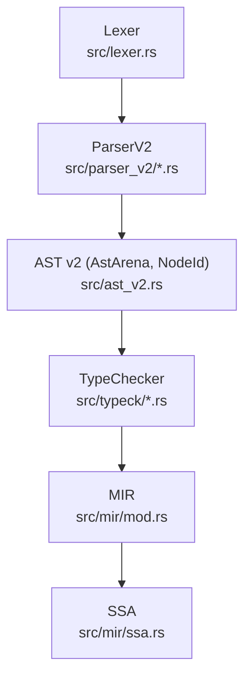
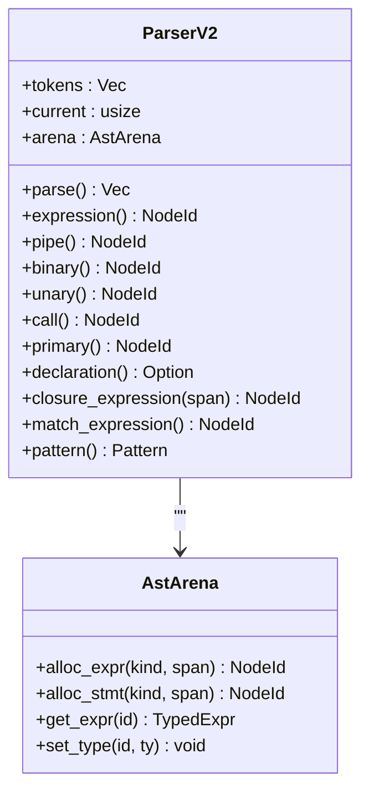
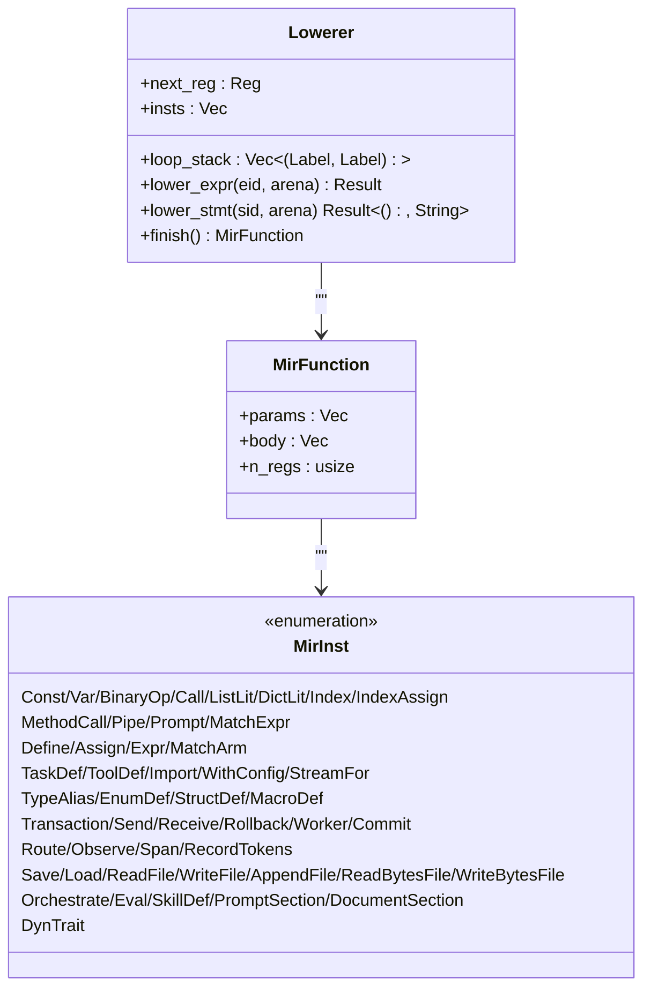
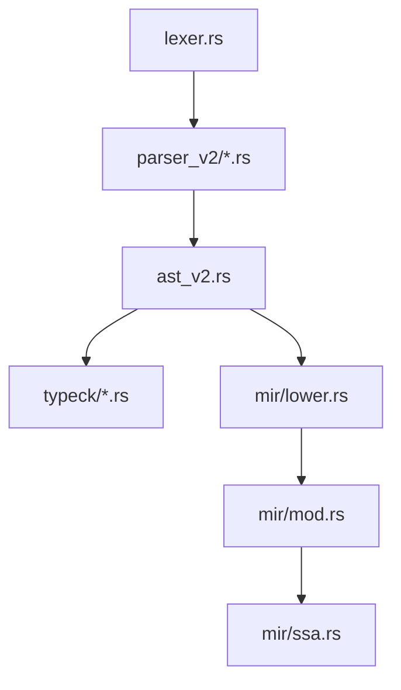

# 

<cite>
****   
- [lexer.rs](file://src/lexer.rs)
- [parser_v2/mod.rs](file://src/parser_v2/mod.rs)
- [parser_v2/expressions.rs](file://src/parser_v2/expressions.rs)
- [parser_v2/statements.rs](file://src/parser_v2/statements.rs)
- [ast_v2.rs](file://src/ast_v2.rs)
- [typeck/mod.rs](file://src/typeck/mod.rs)
- [typeck/check.rs](file://src/typeck/check.rs)
- [mir/mod.rs](file://src/mir/mod.rs)
- [mir/lower.rs](file://src/mir/lower.rs)
- [mir/ssa.rs](file://src/mir/ssa.rs)
</cite>

## 
1. [](#)
2. [](#)
3. [](#)
4. [](#)
5. [](#)
6. [](#)
7. [](#)
8. [](#)
9. [](#)
10. [](#)

## 
 Mora LexerParserV2TypeCheckerMIR SSA 

## 
Mora “ →  →  → ”
-  Token  70+  TokenType 
-  ParserV2  ast_v2 Arena + NodeId
-  + Union/Result/
- AST → MIR lowering  SSA Phi 



**** 
- [lexer.rs:1-154](file://src/lexer.rs#L1-L154)
- [parser_v2/mod.rs:16-45](file://src/parser_v2/mod.rs#L16-L45)
- [ast_v2.rs:568-632](file://src/ast_v2.rs#L568-L632)
- [typeck/mod.rs:554-769](file://src/typeck/mod.rs#L554-L769)
- [mir/mod.rs:41-352](file://src/mir/mod.rs#L41-L352)
- [mir/ssa.rs:140-263](file://src/mir/ssa.rs#L140-L263)

****
- [lexer.rs:1-154](file://src/lexer.rs#L1-L154)
- [parser_v2/mod.rs:16-45](file://src/parser_v2/mod.rs#L16-L45)
- [ast_v2.rs:568-632](file://src/ast_v2.rs#L568-L632)
- [typeck/mod.rs:554-769](file://src/typeck/mod.rs#L554-L769)
- [mir/mod.rs:41-352](file://src/mir/mod.rs#L41-L352)
- [mir/ssa.rs:140-263](file://src/mir/ssa.rs#L140-L263)

## 
- Lexer
  -  TokenType  p"..." 
  - scan_tokens  next_token
- ParserV2
  -  ast_v2  AstArena NodeId 
  -  expressions.rs  statements.rs matchwith/jittrait/implorchestrate/skill/eval 
- TypeChecker
  -  task/closure/tool  let/assign/if/for/match/with 
  -  UnionResultdyn TraitAny Union/
- MIR
  - ///workerstream_fortrait/implorchestrate 
  - lowering  AST  MirFunctiontask/closure/trait method/impl method
- SSA 
  -  MIR-plain  + Phi +  Phi MIR-plain  JIT/

****
- [lexer.rs:1-154](file://src/lexer.rs#L1-L154)
- [parser_v2/mod.rs:16-45](file://src/parser_v2/mod.rs#L16-L45)
- [ast_v2.rs:568-632](file://src/ast_v2.rs#L568-L632)
- [typeck/mod.rs:554-769](file://src/typeck/mod.rs#L554-L769)
- [mir/mod.rs:41-352](file://src/mir/mod.rs#L41-L352)
- [mir/ssa.rs:140-263](file://src/mir/ssa.rs#L140-L263)

## 
Lexer → ParserV2 → AST v2 → TypeChecker → MIR → SSA

```mermaid
sequenceDiagram
participant Src as ""
participant Lex as " Lexer"
participant Par as " ParserV2"
participant Ast as "AST v2 Arena"
participant Ty as " TypeChecker"
participant Mir as "MIR  Lowering"
participant Ssa as "SSA "
Src->>Lex : 
Lex-->>Par : Token 
Par->>Ast : /
Ast-->>Ty :  AST 
Ty-->>Mir :  AST
Mir-->>Ssa :  MIR-plain
Ssa-->>Ssa : /Phi/
```

**** 
- [lexer.rs:180-193](file://src/lexer.rs#L180-L193)
- [parser_v2/mod.rs:33-45](file://src/parser_v2/mod.rs#L33-L45)
- [ast_v2.rs:568-632](file://src/ast_v2.rs#L568-L632)
- [typeck/check.rs:18-230](file://src/typeck/check.rs#L18-L230)
- [mir/lower.rs:13-37](file://src/mir/lower.rs#L13-L37)
- [mir/ssa.rs:140-263](file://src/mir/ssa.rs#L140-L263)

## 

### Lexer
- 
  -  70+  Let/Task/If/Then/Return/For/In/Import/Export/Parallel/Match/WithKeyword/Save/Load/Fn/Into/As/Do/Read/Write/Append/Stream/Tool/Break/Continue/Route/Observe/Span/Traits/Impl/Dyn/Self/Where/Type/Enum/Struct/Worker/Send/Receive/Transaction/Commit/Rollback/Compensation/Macro/Orchestrate/Edges/Loop/MaxRounds/ExitWhen/Rounds/Eval/Skill/Expect/Tolerance/Prompt/Document/State/Node/Channel/Checkpoint/Rewind/Resume/Thread/Dynamic/Map/Reduce/FanIn/FanOut/Interrupt/Before/After/Command/Goto/Update/Add/Last/Merge/Jit 
  - StringCharPromptString(p"...")Int/Float i/u/f 
  -  &/&mut 'a 
  - Error(String) panic parser 
- 
  - scan_tokens  next_token EOF  EOF 
  - next_token →number_from/→identifier_from p"..." →string_from/char_from/prompt_string_from→
  -  prompt  \t/\n/\r
- 
  - 'x' vs 'a
  - i/I/u/U/f/F  Error token
  - -- \n  line/column

```mermaid
flowchart TD
Start([" scan_tokens"]) --> Loop{"?"}
Loop --> || NextTok["next_token()"]
NextTok --> Kind{""}
Kind --> || Num["number_from()"]
Kind --> |/| Id["identifier_from()<br/> p\"...\""]
Kind --> || Str["string_from()/char_from()<br/>prompt_string_from()"]
Kind --> || Op["/"]
Num --> Emit[" Token"]
Id --> Emit
Str --> Emit
Op --> Emit
Emit --> Loop
Loop --> || EOF[" EOF"]
EOF --> End([""])
```

**** 
- [lexer.rs:180-193](file://src/lexer.rs#L180-L193)
- [lexer.rs:267-567](file://src/lexer.rs#L267-L567)
- [lexer.rs:569-743](file://src/lexer.rs#L569-L743)
- [lexer.rs:745-800](file://src/lexer.rs#L745-L800)

****
- [lexer.rs:1-154](file://src/lexer.rs#L1-L154)
- [lexer.rs:180-193](file://src/lexer.rs#L180-L193)
- [lexer.rs:267-567](file://src/lexer.rs#L267-L567)
- [lexer.rs:569-743](file://src/lexer.rs#L569-L743)
- [lexer.rs:745-800](file://src/lexer.rs#L745-L800)

### ParserV2
- 
  - ParserV2  tokenscurrent  AstArenaparse()  Newline declaration() 
  - advance/peek/check/match_token/consume_identifier/span_of_current 
- 
  - expression → pipe → binary → unary → call → primary
  -  |>matchp"..." /
  -  trait expr as dyn Trait<generics>  ExprKind::DynTrait
- 
  - let/task/return/if/for/import/break/continue/match/with/parallel/transaction/macro/route/trait/impl/type/enum/struct/orchestrate/eval/skill/save/load/read/write/append/stream/tool/observe/span/record_tokens/prompt/document 
  - with jit { ... }  lowering  JIT 
  - match  pattern() /when 
- 
  - consume/consume_identifier  panic token  "<unknown>" 
  - format string parse_format_string 



**** 
- [parser_v2/mod.rs:16-45](file://src/parser_v2/mod.rs#L16-L45)
- [parser_v2/expressions.rs:4-154](file://src/parser_v2/expressions.rs#L4-L154)
- [parser_v2/statements.rs:4-116](file://src/parser_v2/statements.rs#L4-L116)
- [ast_v2.rs:568-632](file://src/ast_v2.rs#L568-L632)

****
- [parser_v2/mod.rs:16-45](file://src/parser_v2/mod.rs#L16-L45)
- [parser_v2/expressions.rs:4-154](file://src/parser_v2/expressions.rs#L4-L154)
- [parser_v2/statements.rs:4-116](file://src/parser_v2/statements.rs#L4-L116)

### 
- 
  -  task/tool/struct  Signature hint hint signatures 
  -  trait_registry  impl_registry
- 
  - check_stmt/check_expr  AST let/assign/if/for/match/with/return/index_assign 
  -  Union Union=anyResult<T,E>List<T>/Dict<K,V>dyn Trait
  - TypeError  line/columnexpected/actual/hint IDE 
- Pregel 
  - OrchestrateKind::Pregel  AST  state_schemacheckpointinterrupt_points/

```mermaid
flowchart TD
Start([""]) --> Collect["<br/>task/tool/struct"]
Collect --> CheckStmts["<br/>check_stmt(...)"]
CheckStmts --> CheckExprs["<br/>check_expr(...)"]
CheckExprs --> Infer["<br/>Union/Result/List/Dict/dyn Trait"]
Infer --> Validate["<br/>let/assign/if/for/match/return"]
Validate --> Errors{"?"}
Errors --> || Report[" TypeError<br/>"]
Errors --> || Done([""])
Report --> Done
```

**** 
- [typeck/mod.rs:554-769](file://src/typeck/mod.rs#L554-L769)
- [typeck/check.rs:18-230](file://src/typeck/check.rs#L18-L230)
- [ast_v2.rs:456-545](file://src/ast_v2.rs#L456-L545)

****
- [typeck/mod.rs:554-769](file://src/typeck/mod.rs#L554-L769)
- [typeck/check.rs:18-230](file://src/typeck/check.rs#L18-L230)
- [ast_v2.rs:456-545](file://src/ast_v2.rs#L456-L545)

### MIR lowering
- 
  - Const/Var/BinaryOp/Call/ListLit/DictLit/Index/IndexAssign/MethodCall/Pipe/Prompt/MatchExpr/Closure/DynTrait
  - Define/Assign/Expr/MatchArm/TaskDef/ToolDef/Import/WithConfig/StreamFor/TypeAlias/EnumDef/StructDef/MacroDef
  - Transaction/Send/Receive/Rollback/Worker/Commit/Route/Observe/Span/RecordTokens
  -  I/OSave/Load/ReadFile/WriteFile/AppendFile/ReadBytesFile/WriteBytesFile
  - Orchestrate/Eval/SkillDef/PromptSection/DocumentSection
- AST → MIR lowering
  - lower_program  stmt_idsLowerer  next_reginstsloop_stack
  -  lowering
  - If/For  Label + Jump/JumpIf/JumpIfNot/Break/Continue
  - task/closure/trait method/impl method  Lowerer MirFunction



**** 
- [mir/mod.rs:41-352](file://src/mir/mod.rs#L41-L352)
- [mir/lower.rs:13-37](file://src/mir/lower.rs#L13-L37)
- [mir/lower.rs:77-235](file://src/mir/lower.rs#L77-L235)
- [mir/lower.rs:240-800](file://src/mir/lower.rs#L240-L800)

****
- [mir/mod.rs:41-352](file://src/mir/mod.rs#L41-L352)
- [mir/lower.rs:13-37](file://src/mir/lower.rs#L13-L37)
- [mir/lower.rs:77-235](file://src/mir/lower.rs#L77-L235)
- [mir/lower.rs:240-800](file://src/mir/lower.rs#L240-L800)

### SSA 
- 
  - find_label_targets/find_block_starts  Label Jump/Return/Break/Continue BasicBlock
- 
  - compute_dominators compute_dominance_frontier 
- Phi 
  - insert_phi_nodes  Phirename_variables  DFS 
- 
  - OptLevel None/Basic/Aggressive MORA_OPT types  JIT 

```mermaid
flowchart TD
Start([" MIR-plain"]) --> Blocks[""]
Blocks --> Dom[" idom"]
Dom --> DF[" dom_frontier"]
DF --> Phi[" Phi "]
Phi --> Rename["DFS"]
Rename --> Output[" MIR-ssa"]
```

**** 
- [mir/ssa.rs:140-263](file://src/mir/ssa.rs#L140-L263)
- [mir/ssa.rs:560-694](file://src/mir/ssa.rs#L560-L694)
- [mir/ssa.rs:731-800](file://src/mir/ssa.rs#L731-L800)

****
- [mir/ssa.rs:140-263](file://src/mir/ssa.rs#L140-L263)
- [mir/ssa.rs:560-694](file://src/mir/ssa.rs#L560-L694)
- [mir/ssa.rs:731-800](file://src/mir/ssa.rs#L731-L800)

## 
- 
  - lexer.rs  parser_v2/* Token/TokenType
  - parser_v2/*  ast_v2.rsExprKind/StmtKind/AstArena/NodeId
  - typeck/*  ast_v2.rs  commonBinaryOp/Literal/Span TypeError
  - mir/*  ast_v2.rs  value.rsValuelower.rs  MirFunction
  - ssa.rs  mir/mod.rsMirFunction/MirInst
- 
  - run_mir  mir/mod.rs/
  - lower_program/lower_expr_only/lower_stmt_only  orchestrator/trait_dispatch  evaluate



**** 
- [lexer.rs:1-154](file://src/lexer.rs#L1-L154)
- [parser_v2/mod.rs:1-15](file://src/parser_v2/mod.rs#L1-L15)
- [ast_v2.rs:1-10](file://src/ast_v2.rs#L1-L10)
- [typeck/mod.rs:1-27](file://src/typeck/mod.rs#L1-L27)
- [mir/mod.rs:1-30](file://src/mir/mod.rs#L1-L30)
- [mir/ssa.rs:1-20](file://src/mir/ssa.rs#L1-L20)

****
- [lexer.rs:1-154](file://src/lexer.rs#L1-L154)
- [parser_v2/mod.rs:1-15](file://src/parser_v2/mod.rs#L1-L15)
- [ast_v2.rs:1-10](file://src/ast_v2.rs#L1-L10)
- [typeck/mod.rs:1-27](file://src/typeck/mod.rs#L1-L27)
- [mir/mod.rs:1-30](file://src/mir/mod.rs#L1-L30)
- [mir/ssa.rs:1-20](file://src/mir/ssa.rs#L1-L20)

## 
- 
  - AstArena  NodeId
  - MIR  n_regs 
- 
  - ParserV2  peek/check/match consume 
  - TypeChecker Union/Result 
- MIR  SSA
  - lowering 
  - SSA MORA_OPT MIR-plain Phi  CFG 
- 
  - Lexer 
  - TypeChecker  TypeError  IDE 

[]

## 
- 
  -  Error token “Unexpected character”“Unterminated string”“control character in string literal”line/column
- 
  - consume/consume_identifier “Parse error: ... at line X” Expected ')'Expected '>'
  - format string 
- 
  - TypeError  expected/actual/hint let/assign/return/if/for/match/with  hint 
- MIR/SSA
  - lowering  ExprKind AST  lowering
  - SSA  OptLevel 

****
- [lexer.rs:199-207](file://src/lexer.rs#L199-L207)
- [lexer.rs:569-743](file://src/lexer.rs#L569-L743)
- [parser_v2/mod.rs:273-303](file://src/parser_v2/mod.rs#L273-L303)
- [parser_v2/mod.rs:580-649](file://src/parser_v2/mod.rs#L580-L649)
- [typeck/mod.rs:408-505](file://src/typeck/mod.rs#L408-L505)
- [mir/lower.rs:230-235](file://src/mir/lower.rs#L230-L235)

## 
Mora  SSA Lexer ParserV2  AST v2TypeChecker MIR  SSA  JIT/

[]

## 
- 
  -  [lexer.rs:569-743](file://src/lexer.rs#L569-L743)[lexer.rs:745-800](file://src/lexer.rs#L745-L800)
  -  [parser_v2/expressions.rs:4-154](file://src/parser_v2/expressions.rs#L4-L154)[parser_v2/statements.rs:4-116](file://src/parser_v2/statements.rs#L4-L116)
  -  [typeck/mod.rs:554-769](file://src/typeck/mod.rs#L554-L769)[typeck/check.rs:18-230](file://src/typeck/check.rs#L18-L230)
  - MIR loweringAST  MIR  [mir/lower.rs:13-37](file://src/mir/lower.rs#L13-L37)[mir/lower.rs:77-235](file://src/mir/lower.rs#L77-L235)
  - SSA  Phi  [mir/ssa.rs:140-263](file://src/mir/ssa.rs#L140-L263)[mir/ssa.rs:560-694](file://src/mir/ssa.rs#L560-L694)

[]