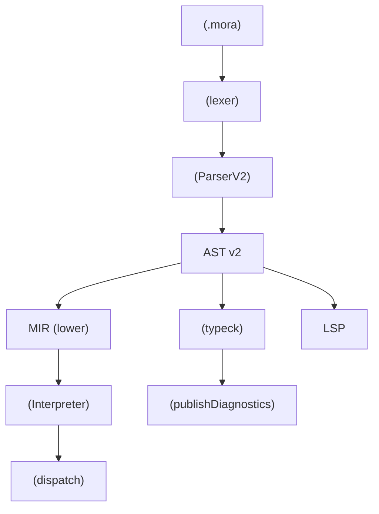
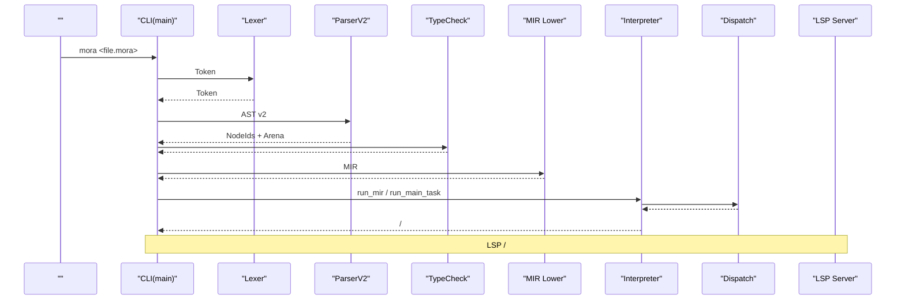
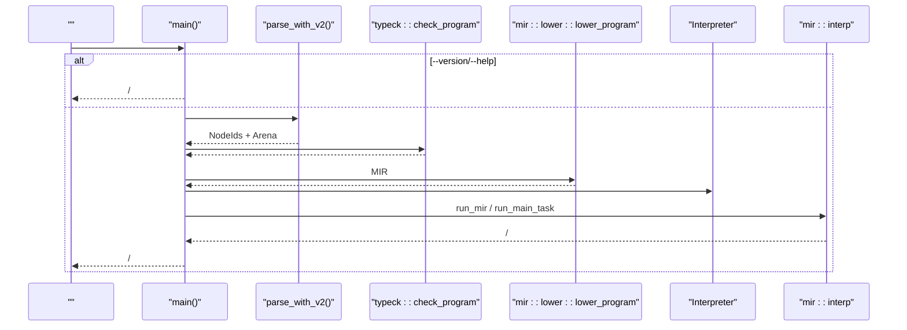
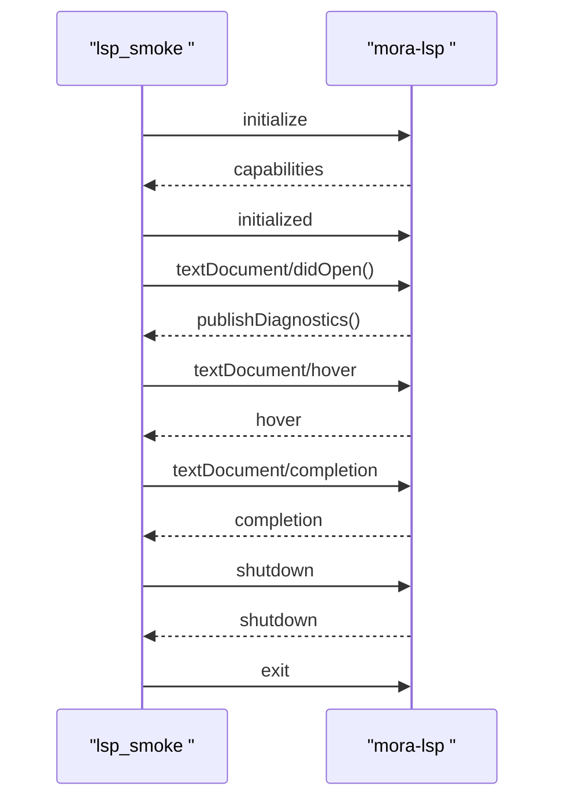
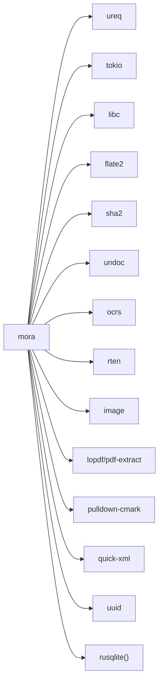

# 

<cite>
****   
- [README.md](file://README.md)
- [Cargo.toml](file://Cargo.toml)
- [build.rs](file://build.rs)
- [src/lib.rs](file://src/lib.rs)
- [src/main.rs](file://src/main.rs)
- [.github/workflows/ci.yml](file://.github/workflows/ci.yml)
- [.github/workflows/release.yml](file://.github/workflows/release.yml)
- [.github/workflows/reusable-rust-ci.yml](file://.github/workflows/reusable-rust-ci.yml)
- [tests/parser_v2_integration.rs](file://tests/parser_v2_integration.rs)
- [tests/tier0_builtin_dispatch.rs](file://tests/tier0_builtin_dispatch.rs)
- [examples/lsp_smoke.rs](file://examples/lsp_smoke.rs)
- [src/interpreter/dispatch.rs](file://src/interpreter/dispatch.rs)
</cite>

## 
1. [](#)
2. [](#)
3. [](#)
4. [](#)
5. [](#)
6. [](#)
7. [](#)
8. [](#)
9. [](#)
10. [](#)

## 
 Mora CI/CD Mora  AI-native  AI HTTP/MCP  Agent  Rust 

## 
“ + ”
- src: CLILSP
- tests: 
- examples:  LSP 
- .github/workflows: CI/CD 
- editors: 
- vendor:  OCR 
- build.rs: 



**** 
- [src/lib.rs:1-55](file://src/lib.rs#L1-L55)
- [src/main.rs:16-24](file://src/main.rs#L16-L24)
- [src/interpreter/dispatch.rs:31-66](file://src/interpreter/dispatch.rs#L31-L66)

****
- [README.md:315-334](file://README.md#L315-L334)
- [src/lib.rs:1-55](file://src/lib.rs#L1-L55)

## 
- CLI REPL//
-  ASTLexer + ParserV2  AST v2 MIR 
- 
- MIR  AST v2  MIR dispatch 
- LSP 
- AI HTTP 

****
- [src/main.rs:26-261](file://src/main.rs#L26-L261)
- [src/main.rs:370-405](file://src/main.rs#L370-L405)
- [src/interpreter/dispatch.rs:31-66](file://src/interpreter/dispatch.rs#L31-L66)
- [README.md:276-298](file://README.md#L276-L298)

## 
 LSP 



**** 
- [src/main.rs:16-24](file://src/main.rs#L16-L24)
- [src/main.rs:370-405](file://src/main.rs#L370-L405)
- [src/interpreter/dispatch.rs:31-66](file://src/interpreter/dispatch.rs#L31-L66)

## 

### 
-  Rust stable  nightlyCI  stable  nightly
-  rustfmtclippy 
- musl-tools musl 
- 
  - cargo build --release
  - cargo run --release --bin mora
  - LSPcargo build --release --bin mora-lsp  mora-lsp

****
- [.github/workflows/ci.yml:20-23](file://.github/workflows/ci.yml#L20-L23)
- [.github/workflows/ci.yml:53-56](file://.github/workflows/ci.yml#L53-L56)
- [.github/workflows/ci.yml:60-65](file://.github/workflows/ci.yml#L60-L65)
- [Cargo.toml:1-12](file://Cargo.toml#L1-L12)

### 
- CI  cargo fmt --all -- --check
- CI  cargo clippy --all-targets --all-features -- -D warnings
-  snake_case UPPER_SNAKE_CASE PascalCase
-  API 
- 

****
- [.github/workflows/ci.yml:75-87](file://.github/workflows/ci.yml#L75-L87)
- [.github/workflows/ci.yml:89-112](file://.github/workflows/ci.yml#L89-L112)
- [AGENTS_CODE_MODIFICATION.md:34-65](file://AGENTS_CODE_MODIFICATION.md#L34-L65)

### 
-  #[cfg(test)]  assert 
- tests 
- examples/lsp_smoke.rs  LSP  initialize/didOpen/hover/completion/shutdown+exit 
- tests/tier0_builtin_dispatch.rs  Tier 0  Tier 1  builtin  AST evaluate

```mermaid
flowchart TD
Start([""]) --> Unit["<br/>cargo test --lib"]
Unit --> AllTargets["<br/>cargo test --all-targets"]
AllTargets --> Integration["<br/>tests/*"]
Integration --> LSPSmoke[" LSP <br/>cargo run --example lsp_smoke"]
LSPSmoke --> End([""])
```

**** 
- [.github/workflows/ci.yml:69-73](file://.github/workflows/ci.yml#L69-L73)
- [.github/workflows/ci.yml:151-179](file://.github/workflows/ci.yml#L151-L179)
- [examples/lsp_smoke.rs:1-102](file://examples/lsp_smoke.rs#L1-L102)

****
- [tests/parser_v2_integration.rs:1-76](file://tests/parser_v2_integration.rs#L1-L76)
- [tests/tier0_builtin_dispatch.rs:1-165](file://tests/tier0_builtin_dispatch.rs#L1-L165)
- [examples/lsp_smoke.rs:1-102](file://examples/lsp_smoke.rs#L1-L102)

### CI/CD 
- push  main  PR  main 
- 
  - checkcargo check --all-targets
  - test ubuntu/windows/macOS  stable  ubuntu  nightly 
  - fmtcargo fmt --all -- --check
  - clippycargo clippy --all-targets --all-features -- -D warnings
  - integration release  mora 
  - lsp mora-lsp  lsp_smoke 
  - record record list  snapshot 
- 
  - linux-gnu/muslmacos x86_64/aarch64windows msvc
  -  zip/tar.gz 
  -  Docker 
  -  GitHub Release SHA-256 

```mermaid
graph TB
subgraph "CI"
A["check"] --> B["test (stable)"]
B --> C["fmt"]
B --> D["clippy"]
D --> E["integration"]
D --> F["lsp smoke"]
D --> G["record cli"]
end
subgraph "Release"
R1[""] --> R2[""]
R2 --> R3["Docker "]
R3 --> R4["GitHub Release"]
end
```

**** 
- [.github/workflows/ci.yml:13-213](file://.github/workflows/ci.yml#L13-L213)
- [.github/workflows/release.yml:13-201](file://.github/workflows/release.yml#L13-L201)

****
- [.github/workflows/ci.yml:13-213](file://.github/workflows/ci.yml#L13-L213)
- [.github/workflows/release.yml:13-201](file://.github/workflows/release.yml#L13-L201)

### 
- 
  -  fmt  clippy
  - ///
  - 
  - 
- 
  -  Cargo.toml  version  MORAGIT_VERSION 
  -  tag v*  release  Docker  Releases

****
- [build.rs:1-23](file://build.rs#L1-L23)
- [Cargo.toml:1-12](file://Cargo.toml#L1-L12)
- [.github/workflows/release.yml:121-201](file://.github/workflows/release.yml#L121-L201)

### CLI  LSP 

#### CLI 


**** 
- [src/main.rs:26-261](file://src/main.rs#L26-L261)
- [src/main.rs:370-405](file://src/main.rs#L370-L405)

#### LSP 


**** 
- [examples/lsp_smoke.rs:16-102](file://examples/lsp_smoke.rs#L16-L102)

## 
- 
  - ureq HTTP 
  - tokioHTTP/MCP rt-multi-threadmacrosnettimesyncio-utilio-std
  - libc SO_REUSEADDR
  - flate2
  - sha2
  - undoc/ocrs/rten/imageOffice  OCR 
  - lopdf/pdf-extract/pulldown-cmark/quick-xml IR 
  - uuid/rusqliteCheckpoint 
- 
  - proptest



**** 
- [Cargo.toml:29-86](file://Cargo.toml#L29-L86)

****
- [Cargo.toml:29-102](file://Cargo.toml#L29-L102)

## 
- HTTP/MCP  tokio 
-  JSON 
-  OCR 
-  MIR 

[]

## 
- 
  - HTTP server  N+1/N+2/N+3 4 
- 
  - 
- //
  -  .mora/recordings .mora/snapshots diff  stats 
- LSP 
  -  lsp_smoke  didOpen  publishDiagnostics 

****
- [README.md:222-227](file://README.md#L222-L227)
- [README.md:255-274](file://README.md#L255-L274)
- [src/main.rs:412-423](file://src/main.rs#L412-L423)
- [src/main.rs:708-719](file://src/main.rs#L708-L719)
- [examples/lsp_smoke.rs:50-68](file://examples/lsp_smoke.rs#L50-L68)

## 
 CI/CD 

[]

## 
- 
  - cargo build --release
  - cargo run --release --bin mora
  - cargo check --all-targets
  - cargo fmt --all -- --check
  - cargo clippy --all-targets --all-features -- -D warnings
  - cargo test --lib && cargo test --all-targets
  - LSP cargo run --example lsp_smoke ./target/release/mora-lsp

****
- [.github/workflows/ci.yml:36-37](file://.github/workflows/ci.yml#L36-L37)
- [.github/workflows/ci.yml:69-73](file://.github/workflows/ci.yml#L69-L73)
- [.github/workflows/ci.yml:86-87](file://.github/workflows/ci.yml#L86-L87)
- [.github/workflows/ci.yml:111-112](file://.github/workflows/ci.yml#L111-L112)
- [.github/workflows/ci.yml:175-179](file://.github/workflows/ci.yml#L175-L179)