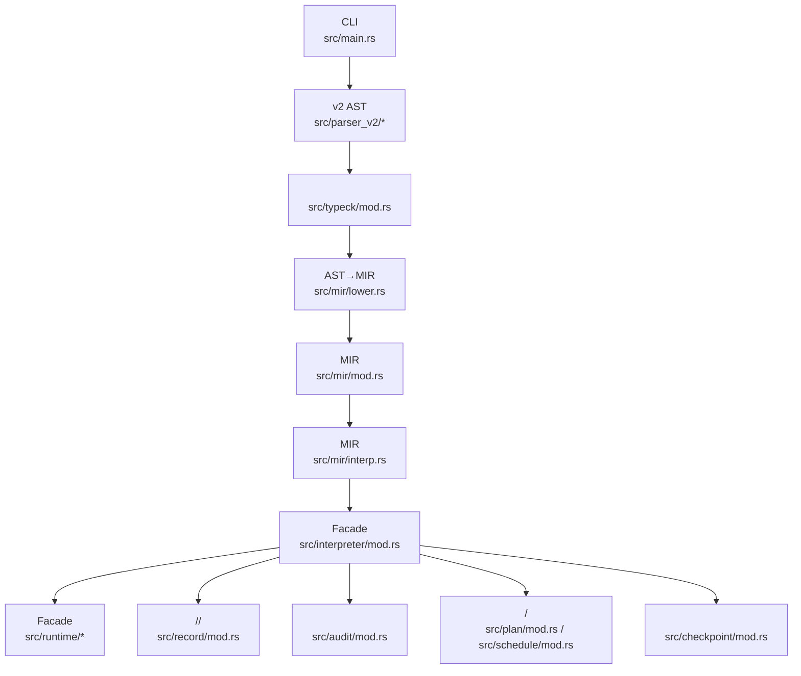
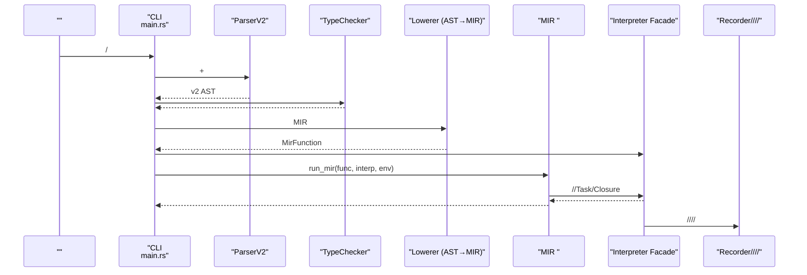
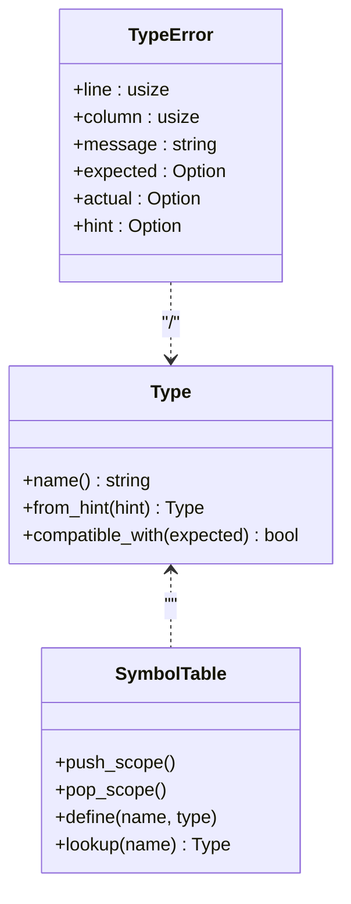
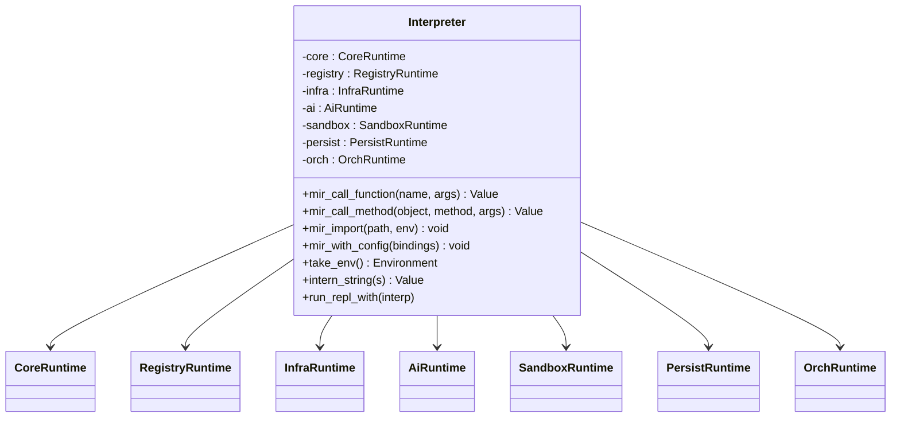
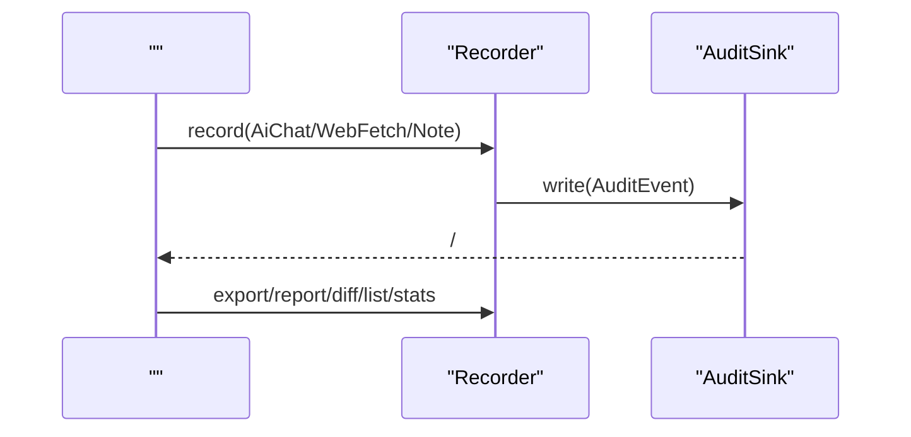
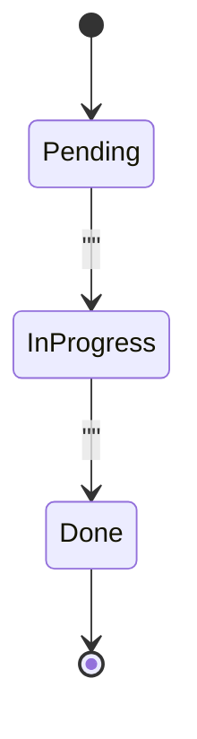
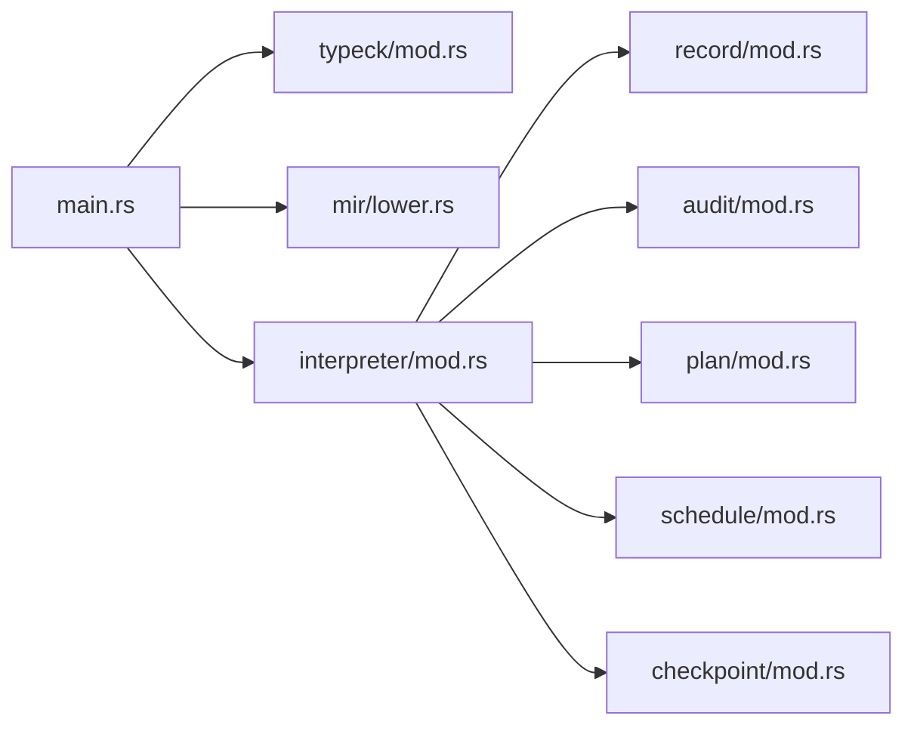

# 

<cite>
****   
- [src/main.rs](file://src/main.rs)
- [src/lib.rs](file://src/lib.rs)
- [src/mir/mod.rs](file://src/mir/mod.rs)
- [src/mir/lower.rs](file://src/mir/lower.rs)
- [src/mir/interp.rs](file://src/mir/interp.rs)
- [src/mir/jit.rs](file://src/mir/jit.rs)
- [src/interpreter/mod.rs](file://src/interpreter/mod.rs)
- [src/typeck/mod.rs](file://src/typeck/mod.rs)
- [src/schedule/mod.rs](file://src/schedule/mod.rs)
- [src/plan/mod.rs](file://src/plan/mod.rs)
- [src/checkpoint/mod.rs](file://src/checkpoint/mod.rs)
- [src/record/mod.rs](file://src/record/mod.rs)
- [src/audit/mod.rs](file://src/audit/mod.rs)
- [README.md](file://README.md)
</cite>

## 
1. [](#)
2. [](#)
3. [](#)
4. [](#)
5. [](#)
6. [](#)
7. [](#)
8. [](#)
9. [](#)
10. [](#)

## 
 Mora MIR JIT/

## 
Mora “ + ” Lexer → ParserV2 → TypeCheck → MIR Lowering →  SSA/JIT  Interpreter  Facade Core/Registry/Infra/Ai/Sandbox/Persist/Orch




- [src/main.rs:26-261](file://src/main.rs#L26-L261)
- [src/mir/mod.rs:1-352](file://src/mir/mod.rs#L1-L352)
- [src/mir/lower.rs:1-200](file://src/mir/lower.rs#L1-L200)
- [src/mir/interp.rs:1-200](file://src/mir/interp.rs#L1-L200)
- [src/interpreter/mod.rs:214-440](file://src/interpreter/mod.rs#L214-L440)
- [src/record/mod.rs:1-200](file://src/record/mod.rs#L1-L200)
- [src/audit/mod.rs:1-200](file://src/audit/mod.rs#L1-L200)
- [src/plan/mod.rs:1-277](file://src/plan/mod.rs#L1-L277)
- [src/schedule/mod.rs:1-375](file://src/schedule/mod.rs#L1-L375)
- [src/checkpoint/mod.rs:1-611](file://src/checkpoint/mod.rs#L1-L611)


- [src/lib.rs:1-55](file://src/lib.rs#L1-L55)
- [README.md:1-200](file://README.md#L1-L200)

## 
- CLI run/repl/check/record/replay/diff/snapshot/mcp MIR 
- ResultUnionTrait/Concrete 
- MIR task/tool/closure/trait/stream/with 
- /Task with/import 
- Recorder  ai.chat/web.fetch  JSONL 
- SHA-256  JSONL
- Plan Scheduler cron-like 
- Pregel BSP /SQLite 


- [src/main.rs:26-261](file://src/main.rs#L26-L261)
- [src/typeck/mod.rs:1-800](file://src/typeck/mod.rs#L1-L800)
- [src/mir/mod.rs:1-352](file://src/mir/mod.rs#L1-L352)
- [src/mir/lower.rs:1-200](file://src/mir/lower.rs#L1-L200)
- [src/mir/interp.rs:1-200](file://src/mir/interp.rs#L1-L200)
- [src/interpreter/mod.rs:214-440](file://src/interpreter/mod.rs#L214-L440)
- [src/record/mod.rs:1-200](file://src/record/mod.rs#L1-L200)
- [src/audit/mod.rs:1-200](file://src/audit/mod.rs#L1-L200)
- [src/plan/mod.rs:1-277](file://src/plan/mod.rs#L1-L277)
- [src/schedule/mod.rs:1-375](file://src/schedule/mod.rs#L1-L375)
- [src/checkpoint/mod.rs:1-611](file://src/checkpoint/mod.rs#L1-L611)

## 





- [src/main.rs:26-261](file://src/main.rs#L26-L261)
- [src/mir/lower.rs:1-200](file://src/mir/lower.rs#L1-L200)
- [src/mir/interp.rs:1-200](file://src/mir/interp.rs#L1-L200)
- [src/interpreter/mod.rs:214-440](file://src/interpreter/mod.rs#L214-L440)
- [src/record/mod.rs:1-200](file://src/record/mod.rs#L1-L200)
- [src/audit/mod.rs:1-200](file://src/audit/mod.rs#L1-L200)
- [src/plan/mod.rs:1-277](file://src/plan/mod.rs#L1-L277)
- [src/schedule/mod.rs:1-375](file://src/schedule/mod.rs#L1-L375)
- [src/checkpoint/mod.rs:1-611](file://src/checkpoint/mod.rs#L1-L611)

## 

### 
- ResultUnionTrait/Concrete  Union  Union  Any 
-  IDE 
-  lettask/closure 




- [src/typeck/mod.rs:1-800](file://src/typeck/mod.rs#L1-L800)


- [src/typeck/mod.rs:1-800](file://src/typeck/mod.rs#L1-L800)

### MIR 
- MIR task/tool/closure/trait/stream/with/import 
- Lowerer  ASTv2  Label/Jump
- / lowering  orchestrator/trait_dispatch 

```mermaid
flowchart TD
Start([": ASTv2"]) --> Walk[""]
Walk --> Expr{"?"}
Expr --> || LowerExpr["lower_expr -> Reg"]
Expr --> || LowerStmt["lower_stmt"]
LowerExpr --> Emit["emit(MirInst)"]
LowerStmt --> Emit
Emit --> Next[""]
Next --> || Walk
Next --> || Finish([" MirFunction"])
```


- [src/mir/lower.rs:1-200](file://src/mir/lower.rs#L1-L200)
- [src/mir/mod.rs:1-352](file://src/mir/mod.rs#L1-L352)


- [src/mir/mod.rs:1-352](file://src/mir/mod.rs#L1-L352)
- [src/mir/lower.rs:1-200](file://src/mir/lower.rs#L1-L200)

###  Facade
- Interpreter  Facade Core/Registry/Infra/Ai/Sandbox/Persist/Orch  call_function/call_method/import/with_config 
- LRU token /
- REPL  run_repl_with 




- [src/interpreter/mod.rs:214-440](file://src/interpreter/mod.rs#L214-L440)


- [src/interpreter/mod.rs:214-440](file://src/interpreter/mod.rs#L214-L440)

### 
- Recorder  Off/Record/Replay JSONL  diff/stats/timeline/export/snapshot
- AuditSink  SHA-256  verify_chain
- observe trace/span/record_tokens 




- [src/record/mod.rs:1-200](file://src/record/mod.rs#L1-L200)
- [src/audit/mod.rs:1-200](file://src/audit/mod.rs#L1-L200)


- [src/record/mod.rs:1-200](file://src/record/mod.rs#L1-L200)
- [src/audit/mod.rs:1-200](file://src/audit/mod.rs#L1-L200)

### 
- Plan Pending/InProgress/Done
- Scheduler  Every/At  Job  JSONtick 




- [src/plan/mod.rs:1-277](file://src/plan/mod.rs#L1-L277)
- [src/schedule/mod.rs:1-375](file://src/schedule/mod.rs#L1-L375)


- [src/plan/mod.rs:1-277](file://src/plan/mod.rs#L1-L277)
- [src/schedule/mod.rs:1-375](file://src/schedule/mod.rs#L1-L375)

### Pregel BSP
- Checkpoint  channel  JSON 
- MemorySaver/SqliteSaver rewind/resume 

```mermaid
flowchart TD
S([""]) --> J[" Checkpoint"]
J --> Store["(/SQLite)"]
Store --> Resume[""]
Resume --> Rewind[""]
```


- [src/checkpoint/mod.rs:1-611](file://src/checkpoint/mod.rs#L1-L611)


- [src/checkpoint/mod.rs:1-611](file://src/checkpoint/mod.rs#L1-L611)

### JIT 
- JIT  feature stub LLVM  LLVM 
- ToolDef  TaskDef 

```mermaid
flowchart TD
A["SSA "] --> B{" JIT?"}
B --> || C["LLVM IR "]
C --> D["JIT  native"]
D --> E[""]
B --> || F[" MIR "]
```


- [src/mir/jit.rs:1-77](file://src/mir/jit.rs#L1-L77)


- [src/mir/jit.rs:1-77](file://src/mir/jit.rs#L1-L77)

## 
- CLI  parser/typeck/lower/interp Facade record/audit/plan/schedule/checkpoint 
-  sha2uuid IDparking_lot serde 




- [src/main.rs:26-261](file://src/main.rs#L26-L261)
- [src/typeck/mod.rs:1-800](file://src/typeck/mod.rs#L1-L800)
- [src/mir/lower.rs:1-200](file://src/mir/lower.rs#L1-L200)
- [src/interpreter/mod.rs:214-440](file://src/interpreter/mod.rs#L214-L440)
- [src/record/mod.rs:1-200](file://src/record/mod.rs#L1-L200)
- [src/audit/mod.rs:1-200](file://src/audit/mod.rs#L1-L200)
- [src/plan/mod.rs:1-277](file://src/plan/mod.rs#L1-L277)
- [src/schedule/mod.rs:1-375](file://src/schedule/mod.rs#L1-L375)
- [src/checkpoint/mod.rs:1-611](file://src/checkpoint/mod.rs#L1-L611)


- [src/lib.rs:1-55](file://src/lib.rs#L1-L55)

## 
- 
  - Interpreter.intern_string 
  - LRU trait  BFS 
  -  serde JSON  GC 
- 
  -  parking_lot::Mutex 
  - Scheduler  AtomicU64  id
  -  Send+Sync
- 
  - Union 
  - / HashMap  (kind,key)→O(1) 
  - /
- 
  -  MIR  SSA/JIT 
  - with/import 

[]

## 
- 
  -  TypeError / hint
- /
  -  diff  ai.chat/web.fetch  prompt_hash/url 
- 
  -  verify_chain  ChainBroken/HashMismatch
- /
  -  step id update  id  At  at_epoch 
- 
  -  thread_id step  JSON 


- [src/typeck/mod.rs:408-505](file://src/typeck/mod.rs#L408-L505)
- [src/record/mod.rs:1-200](file://src/record/mod.rs#L1-L200)
- [src/audit/mod.rs:141-200](file://src/audit/mod.rs#L141-L200)
- [src/plan/mod.rs:102-126](file://src/plan/mod.rs#L102-L126)
- [src/schedule/mod.rs:96-148](file://src/schedule/mod.rs#L96-L148)
- [src/checkpoint/mod.rs:282-346](file://src/checkpoint/mod.rs#L282-L346)

## 
Mora “ + MIR  + ” Facade ///// AI-native  SSA/JIT 

[]

## 

### 
- 
  -  cargo build --release cargo test 
  -  fmt/clippy  CI 
- 
  - ADR
  - /
  -  MIR  lower/interp  SSA/JIT 
- 
  - OPENAI_API_KEY/MORA_AI_MODEL/MORA_AI_BASE_URL  AI 
  - MORA_NO_TYPECK 


- [README.md:1-200](file://README.md#L1-L200)
- [src/main.rs:26-261](file://src/main.rs#L26-L261)
- [src/interpreter/mod.rs:214-440](file://src/interpreter/mod.rs#L214-L440)